# Notion MCP Server Guide

This guide outlines how to use the Notion MCP Server (`github.com/makenotion/notion-mcp-server`) to perform common tasks within the Aurite Teamspace.

## 1. Teamspace Architecture

The Teamspace is organized into two main sections: **Initiatives** and **Resources**.

*   **Resources**: Contains the master databases ("hubs") and high-level guides.
*   **Initiatives**: Contains pages for each core initiative (Framework, Copilot, etc.), which in turn contain their own specific databases and documents.

```mermaid
graph TD
    subgraph "Aurite Teamspace"
        A["🏠 Home"]
        B["🚀 Initiatives"]
        C["📚 Resources"]
    end

    subgraph "Resources"
        C -- contains --> D["📖 Document Hub"]
        C -- contains --> E["🧭 Project Hub"]
        C -- contains --> F["📘 How to Use This Workspace"]
    end

    subgraph "Initiatives"
        B -- contains --> G["🔩 Framework"]
        B -- contains --> H["🤖 Copilot"]
        B -- contains --> I["📥 Clients"]
        B -- contains --> J["🔀 Initiative Integrations"]
    end

    subgraph "Framework Initiative"
        G -- contains --> K["Projects DB"]
        G -- contains --> L["Documents Page"]
    end

    D -- "Related Initiative (Relation)" --> E

    style D fill:#e0e0e0,stroke:#333,stroke-width:1px,color:#000
    style E fill:#e0e0e0,stroke:#333,stroke-width:1px,color:#000
    style K fill:#b0eec0,stroke:#333,stroke-width:1px,color:#000
```



## 2. Core Concepts & IDs

The Notion MCP server provides tools to interact with Notion's API. Key objects have unique IDs which are required for most operations.

### High-Level Pages
*   **Initiatives Page ID:** `220ce1e6-fb6a-81e0-acfb-c009d940c59c`
*   **Resources Page ID:** `220ce1e6-fb6a-819c-a761-f20eaff4c918`

### Hub Databases
*   **Document Hub DB ID:** `220ce1e6-fb6a-810c-a542-fb6cdf7d88d7`
*   **Project Hub DB ID:** `220ce1e6-fb6a-818e-8d09-e1f8ddfb06b4`

### Initiative-Specific Databases
*   **Framework Projects DB ID:** `220ce1e6-fb6a-81fa-9ee6-c9faaa4d51d7`
*   **Copilot Projects DB ID:** `220ce1e6-fb6a-81a6-9bc3-d66aa1547397`
*   **Clients Projects DB ID:** `220ce1e6-fb6a-816b-843b-c0cda6a4f3d6`


## 3. Common Tasks & Tool Usage

### Task: Find a Page or Database

-   **Goal:** Locate a specific page or database.
-   **Tool:** `API-post-search`
-   **Usage:** Provide a `query` with the title. To limit results to only databases, add the `filter` parameter.
    ```json
    {
      "query": "Your Document Title",
      "filter": {
        "value": "database",
        "property": "object"
      }
    }
    ```

### Task: List All Documents in the "Document Hub"

-   **Goal:** Retrieve all pages from the main document database.
-   **Tool:** `API-post-database-query`
-   **Usage:** Use the "Document Hub" database ID.
    ```json
    {
      "database_id": "220ce1e6-fb6a-810c-a542-fb6cdf7d88d7"
    }
    ```

### Task: List All Projects in the "Project Hub"

-   **Goal:** Retrieve all pages from the main project database.
-   **Tool:** `API-post-database-query`
-   **Usage:** Use the "Project Hub" database ID.
    ```json
    {
      "database_id": "220ce1e6-fb6a-818e-8d09-e1f8ddfb06b4"
    }
    ```

### Task: Create a New Document and Link it to a Project

-   **Goal:** Add a new page to the "Document Hub" and correctly associate it with a project from the "Project Hub".
-   **Tool:** `API-post-page`
-   **Usage:** Specify the parent "Document Hub" database ID and set the `Related Initiative` property by providing the ID of the project from the "Project Hub".
    *Note: The property is named "Related Initiative" but it links to the "Project Hub". You may want to rename this for clarity.*
    ```json
    {
      "parent": { "database_id": "220ce1e6-fb6a-810c-a542-fb6cdf7d88d7" },
      "properties": {
        "Name": {
          "title": [{ "text": { "content": "New Document Title" } }]
        },
        "Category": {
          "select": { "name": "Strategy" }
        },
        "Related Initiative": {
          "relation": [{ "id": "PROJECT_ID_FROM_PROJECT_HUB" }]
        }
      }
    }
    ```

### Task: Add Content to a Document

-   **Goal:** Append text or other blocks to an existing page.
-   **Tool:** `API-patch-block-children`
-   **Usage:** Provide the `block_id` (which can be a page ID) and an array of `children` blocks to add.
    ```json
    {
      "block_id": "PAGE_ID_OF_THE_DOCUMENT",
      "children": [
        {
          "object": "block",
          "type": "paragraph",
          "paragraph": {
            "rich_text": [{ "type": "text", "text": { "content": "Your new content here." } }]
          }
        }
      ]
    }
