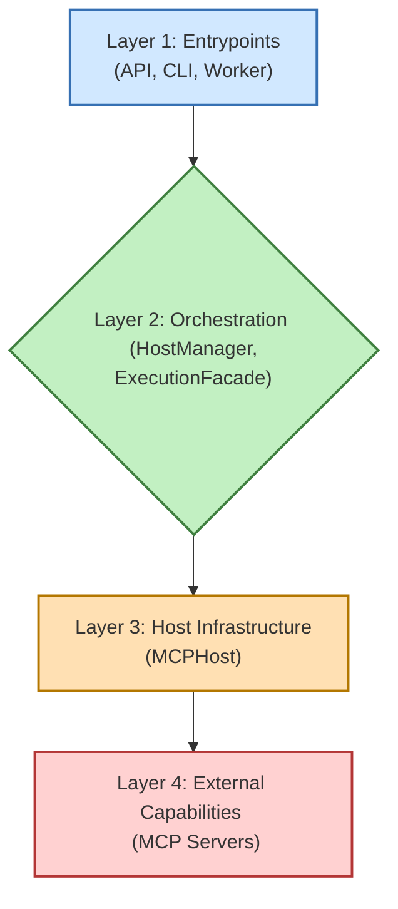

# Aurite Agents Framework

**Aurite Agents** is a Python framework designed for building and orchestrating AI agents. These agents can interact with a variety of external tools, prompts, and resources through the Model Context Protocol (MCP), enabling them to perform complex tasks.

Whether you're looking to create sophisticated AI assistants, automate processes, or experiment with agentic workflows, Aurite Agents provides the building blocks and infrastructure to get you started.

## Getting Started

Follow these steps to set up the Aurite Agents framework on your local machine.

### Prerequisites

*   Python >= 3.12
*   `pip` (Python package installer)
*   `redis-server` (Required if you plan to use the asynchronous task worker)

### Installation

1.  **Clone the Repository:**
    ```bash
    git clone <your-repository-url> aurite-agents
    cd aurite-agents
    ```

2.  **Create and Activate a Virtual Environment (Recommended):**
    ```bash
    python -m venv .venv
    source .venv/bin/activate  # On Windows: .venv\Scripts\activate
    ```

3.  **Install Dependencies:**
    The project uses `pyproject.toml` for dependency management. Install the framework and its dependencies (the `[dev]` is for dev dependencies like pytest) in editable mode:
    ```bash
    pip install -e .[dev]
    ```
    This command allows you to make changes to the source code and have them immediately reflected without needing to reinstall.

## Architecture Overview

The framework follows a layered architecture, illustrated below:



For a comprehensive understanding of the architecture, component interactions, and design principles, please see [`docs/framework_overview.md`](docs/framework_overview.md). Detailed information on each specific layer can also be found in the `docs/layers/` directory.

## Core Concepts for Users

Understanding these concepts will help you configure and use the Aurite Agents framework effectively.

### 1. Projects

A **Project** in Aurite Agents is defined by a JSON configuration file (e.g., `config/projects/default.json`). This file acts as a central manifest for your agentic application, specifying:
*   The name and description of the project.
*   Which LLM configurations to use (`llm_configs`).
*   Which MCP Servers (Clients) to connect to (`clients`).
*   Which Agents, Simple Workflows, and Custom Workflows are part of this project.

The active project configuration tells the `HostManager` what components to load and make available.

### 2. Agentic Components

These are the primary building blocks you'll work with:

*   **Agents (`src/agents/agent.py`):**
    *   LLM-powered entities that can engage in conversations, use tools, and optionally maintain history.
    *   Configured via `AgentConfig` models, typically stored in JSON files (e.g., `config/agents/my_weather_agent.json`) and referenced in your project file.
    *   Key settings include the LLM to use, system prompts, and rules for accessing tools/clients.

    ```mermaid
    graph TD
        Agent["Agent <br/> (src/agents/agent.py)"] --> LLM["LLM <br/> (e.g., Claude, GPT)"];
        Agent --> Clients["MCP Clients <br/> (Connections to Servers)"];

        Clients --> MCP1["MCP Server 1 <br/> (e.g., Weather Tool)"];
        Clients --> MCP2["MCP Server 2 <br/> (e.g., Database)"];
        Clients --> MCP3["MCP Server 3 <br/> (e.g., Custom API)"];

        style Agent fill:#ADD8E6,stroke:#00008B,stroke-width:2px,color:#333333
        style LLM fill:#FFFFE0,stroke:#B8860B,stroke-width:2px,color:#333333
        style Clients fill:#E6E6FA,stroke:#483D8B,stroke-width:2px,color:#333333
        style MCP1 fill:#90EE90,stroke:#006400,stroke-width:2px,color:#333333
        style MCP2 fill:#90EE90,stroke:#006400,stroke-width:2px,color:#333333
        style MCP3 fill:#90EE90,stroke:#006400,stroke-width:2px,color:#333333
    ```

*   **Simple Workflows (`src/workflows/simple_workflow.py`):**
    *   Define a sequence of Agents to be executed one after another.
    *   Configured via `WorkflowConfig` models (e.g., `config/workflows/my_simple_sequence.json`).
    *   Useful for straightforward, multi-step tasks where the output of one agent becomes the input for the next.

    ```mermaid
    graph LR
        Agent1["Agent A"] -->|Input/Output| Agent2["Agent B"];
        Agent2 -->|Input/Output| Agent3["Agent C"];

        style Agent1 fill:#ADD8E6,stroke:#00008B,stroke-width:2px,color:#333333
        style Agent2 fill:#ADD8E6,stroke:#00008B,stroke-width:2px,color:#333333
        style Agent3 fill:#ADD8E6,stroke:#00008B,stroke-width:2px,color:#333333
    ```

*   **Custom Workflows (`src/workflows/custom_workflow.py`):**
    *   Allow you to define complex orchestration logic using custom Python classes.
    *   Configured via `CustomWorkflowConfig` models, pointing to your Python module and class.
    *   Provide maximum flexibility for intricate interactions and conditional logic.

### 3. LLM Configurations

*   Define settings for different Large Language Models (e.g., model name, temperature, max tokens).
*   Managed by `LLMConfig` models, typically stored in `config/llms/default_llms.json` or a custom file.
*   Agents reference these LLM configurations by their `llm_id`, allowing you to easily switch or share LLM settings.
*   The core LLM client abstraction is `src/llm/base_client.py`.

### 4. MCP Servers (as Clients)

*   External processes that provide tools, prompts, or resources according to the Model Context Protocol (MCP).
*   The Aurite framework connects to these servers, referring to them as "Clients."
*   Configured via `ClientConfig` models (e.g., `config/clients/default_clients.json`), specifying the server's path, capabilities, and access rules.
*   An example MCP server is `src/packaged_servers/weather_mcp_server.py`.

## Basic Usage: Running the System

### 1. Environment Variables

Before running the system, you need to set up your environment variables.

1.  **Copy the Example File:** In the project root, copy the `.env.example` file to a new file named `.env`:
    ```bash
    cp .env.example .env
    ```
2.  **Edit `.env`:** Open the newly created `.env` file and fill in your specific configurations and secrets. Pay close attention to comments like `#REPLACE` indicating values you must change.

Key variables you'll need to configure in your `.env` file include:

*   `PROJECT_CONFIG_PATH`: **Crucial!** Set this to the absolute path of the main JSON project configuration file you want the server to load on startup (e.g., `/path/to/your/aurite-agents/config/projects/default.json`).
*   `API_KEY`: A secret key to secure the FastAPI endpoints. Generate a strong random key.
*   `ANTHROPIC_API_KEY` (or other LLM provider keys): Required if your agents use specific LLMs like Anthropic's Claude.

The `.env` file also contains settings for Redis, optional database persistence (`AURITE_ENABLE_DB`, `AURITE_DB_URL`, etc.), and other service configurations. Review all entries marked with `#REPLACE`.

### 2. Running the API Server

The primary way to interact with the framework is through its FastAPI server:
```bash
python -m src.bin.api
```
By default, it starts on `http://0.0.0.0:8000`. You can then send requests to its various endpoints to execute agents, register components, etc. (e.g., using Postman or `curl`).

### 3. Other Entrypoints

*   **Command-Line Interface (`src/bin/cli.py`):** For terminal-based interaction.
    ```bash
    # Example: Execute an agent (ensure API server is running or configure CLI for direct mode if applicable)
    python -m src.bin.cli execute agent "MyAgentName" --message "Hello there!" --api-url http://localhost:8000 --api-key YOUR_API_KEY
    ```
*   **Redis Worker (`src/bin/worker.py`):** For asynchronous task processing (if Redis is set up).
    ```bash
    python -m src.bin.worker
    ```

## Configuration Overview (User Perspective)

*   **Main Project File:** The system loads its entire configuration based on the project file specified by the `PROJECT_CONFIG_PATH` environment variable. This project file (e.g., `config/projects/default.json`) then references other JSON files for specific components like agents, clients, and LLMs.
*   **Component JSON Files:** You'll typically define your agents, LLM settings, client connections, and workflows in separate JSON files within the `config/` subdirectories (e.g., `config/agents/`, `config/llms/`).
*   **Pydantic Models:** All configuration files are validated against Pydantic models defined in `src/config/config_models.py`. This ensures your configurations are correctly structured.
*   **Database Persistence (Optional):** If `AURITE_ENABLE_DB` is set to `true` and database connection variables are provided, the framework can persist agent configurations and conversation history.

## Simplified Directory Structure

Key directories for users:

*   **`config/`**: This is where you'll spend most of your time defining configurations.
    *   `config/projects/`: Contains your main project JSON files.
    *   `config/agents/`: JSON files for Agent configurations.
    *   `config/clients/`: JSON files for MCP Server (Client) configurations.
    *   `config/llms/`: JSON files for LLM configurations.
    *   `config/workflows/`: JSON files for Simple Workflow configurations.
    *   `config/custom_workflows/`: JSON files for Custom Workflow configurations.
*   **`src/bin/`**: Entrypoint scripts (API, CLI, Worker).
*   **`src/agents/`**: Core `Agent` class implementation.
*   **`src/workflows/`**: Implementations for `SimpleWorkflowExecutor` and `CustomWorkflowExecutor`.
*   **`src/packaged_servers/`**: Example MCP server implementations.
*   **`docs/`**: Contains all project documentation.
    *   `docs/framework_overview.md`: For a deep dive into the architecture.
    *   `docs/layers/`: Detailed documentation for each architectural layer.
*   **`tests/`**: Automated tests. See `tests/README.md` for instructions on running tests.
*   **`.env`**: (You create this) For environment variables like API keys and `PROJECT_CONFIG_PATH`.

## Further Documentation

*   **Framework Architecture:** For a detailed understanding of the internal architecture, component interactions, and design principles, please see [`docs/framework_overview.md`](docs/framework_overview.md).
*   **Layer-Specific Details:**
    *   [`docs/layers/1_entrypoints.md`](docs/layers/1_entrypoints.md) (API, CLI, Worker)
    *   [`docs/layers/2_orchestration.md`](docs/layers/2_orchestration.md) (HostManager, ExecutionFacade)
    *   [`docs/layers/3_host.md`](docs/layers/3_host.md) (MCPHost System)
*   **MCP Protocol:** For details on the Model Context Protocol itself, refer to `docs/official-mcp/`.
*   **Testing:** Information on running tests can be found in `tests/README.md`. Testing strategies for each layer are also detailed within their respective documentation in `docs/layers/`.

## Contributing

Contributions are welcome! Please follow standard fork/pull request workflows. Ensure tests pass and documentation is updated for any changes.
