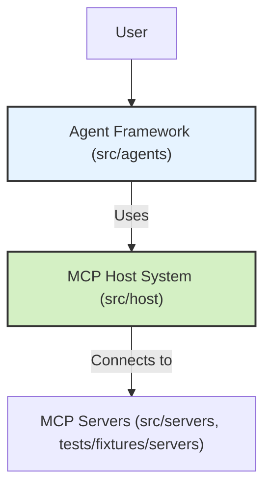

# Aurite Agents Framework

**Aurite Agents** is a Python framework for building AI agents that leverage the Model Context Protocol (MCP) for interacting with tools, prompts, and resources provided by external MCP servers.

It provides two core components:

1.  **MCP Host (`src/host/host.py`)**: Manages connections to MCP servers (clients), handles component registration (tools, prompts, resources), enforces security/access boundaries, and provides a unified interface for interaction via specialized managers.
2.  **Agent Framework (`src/agents/agent.py`)**: Provides a base `Agent` class that orchestrates interactions with Large Language Models (LLMs) like Anthropic's Claude. It uses an `MCPHost` instance to discover and execute tools requested by the LLM during multi-turn conversations.

## Key Concepts

*   **MCP (Model Context Protocol):** A standardized way for AI models/agents to interact with external tools, prompts, and resources. See `docs/official-mcp/` for protocol details.
*   **MCP Host:** The central orchestrator in this framework that connects to and manages various MCP servers.
*   **MCP Server/Client:** An external process implementing the MCP protocol to provide specific capabilities (e.g., a weather tool server, a planning tool server). The Host connects to these servers, referring to them as clients.
*   **Agent:** An AI entity (powered by an LLM) that uses the `MCPHost` to access tools and information to accomplish tasks defined by user messages.

## Architecture

The system separates concerns between the Host (managing MCP interactions) and the Agent (managing LLM interactions and task execution).



For more details, see `docs/architecture_overview.md` and `docs/host/host_implementation.md`.

## Configuration

The framework uses Pydantic models for configuration (`src/host/models.py`):

*   **`HostConfig`**: Defines the overall host setup, primarily a list of clients to connect to.
*   **`ClientConfig`**: Defines settings for connecting to a specific MCP server, including its path, capabilities, roots, and any components to exclude.
*   **`AgentConfig`**: Defines settings for an `Agent` instance, such as LLM parameters (model, temperature, max\_tokens, max\_iterations).

Configuration is typically loaded from JSON files (e.g., `config/agents/aurite_agents.json`, `config/agents/testing_config.json`) via utilities in `src/config.py`. The main FastAPI application (`src/main.py`) uses environment variables (via `.env`) and `ServerConfig` to determine which `HostConfig` JSON file to load on startup.

## Installation

1.  **Prerequisites:** Python >= 3.12, `pip`, `redis-server` (for worker).
2.  **Clone the repository:**
    ```bash
    git clone <repository-url>
    cd aurite-agents
    ```
3.  **Create and activate a virtual environment (recommended):**
    ```bash
    python -m venv .venv
    source .venv/bin/activate # On Windows use `.venv\Scripts\activate`
    ```
4.  **Install dependencies:**
    ```bash
    pip install -e .
    ```
    This installs the package in editable mode along with all dependencies listed in `pyproject.toml`.

## Usage

The framework now provides multiple entrypoints located in `src/bin/`:

### 1. API Server (`src/bin/api.py`)

Runs a FastAPI application providing HTTP endpoints for executing and dynamically registering components.

1.  **Set Environment Variables:** Create a `.env` file in the project root and define required variables, especially:
    *   `API_KEY`: An API key for securing the FastAPI endpoints.
    *   `HOST_CONFIG_PATH`: Path to the desired host configuration JSON file (e.g., `config/agents/testing_config.json`).
    *   `ANTHROPIC_API_KEY`: Required by the `Agent` class for LLM calls.
    *   `AURITE_MCP_ENCRYPTION_KEY` (Optional): For the `SecurityManager`. If not set, a temporary one will be generated.
2.  **Run the server:**
    ```bash
    python -m src.bin.api
    ```
    The server will start (default: `http://0.0.0.0:8000`). You can interact with it using tools like Postman (see `tests/api/main_server.postman_collection.json`) or `curl`.

### 2. Command-Line Interface (`src/bin/cli.py`)

Provides commands to interact with the framework from the terminal.

1.  **Set Environment Variables:** Ensure `ANTHROPIC_API_KEY` is set if executing agents/workflows that use it.
2.  **Run commands:** Requires specifying the host configuration file (`-c` or `--config`).
    ```bash
    # Example: Execute an agent
    python -m src.bin.cli -c config/agents/testing_config.json execute agent "Weather Agent" --message "Weather in London?"

    # Example: Register a client (pass config as JSON string)
    python -m src.bin.cli -c config/agents/testing_config.json register client \
      '{"client_id": "cli_client", "server_path": "tests/fixtures/servers/weather_mcp_server.py", "capabilities": ["tools"], "roots": []}'

    # Example: List commands
    python -m src.bin.cli --help
    python -m src.bin.cli register --help
    python -m src.bin.cli execute --help
    ```

### 3. Redis Worker (`src/bin/worker.py`)

Listens to a Redis stream for tasks (registration or execution requests).

1.  **Prerequisites:** Ensure Redis server is running and accessible.
2.  **Set Environment Variables:**
    *   `HOST_CONFIG_PATH`: Path to the host configuration JSON file.
    *   `ANTHROPIC_API_KEY` (if needed by components).
    *   `REDIS_HOST`, `REDIS_PORT`, `REDIS_DB`, `REDIS_STREAM_NAME` (defaults are provided in `src/config.py` but can be overridden via `.env`).
3.  **Run the worker:**
    ```bash
    python -m src.bin.worker
    ```
    The worker will connect to Redis and wait for messages on the configured stream (default: `aurite:tasks`). Messages should be JSON strings in a field named `task_data`, specifying `action`, `component_type`, and `data`.

### Using the Core Classes Programmatically (Example)

You can still use the core classes directly in your Python scripts:

```python
import asyncio
from pathlib import Path
from src.host.host import MCPHost
from src.host.models import HostConfig, AgentConfig
from src.agents.agent import Agent
from src.config import load_host_config_from_json

async def run_agent_example():
    # 1. Load Host Configuration
    #    (Assuming HOST_CONFIG_PATH points to a valid config like testing_config.json)
    host_config_path = Path("config/agents/testing_config.json") # Example path
    host_config = load_host_config_from_json(host_config_path)

    # 2. Initialize MCPHost
    host = MCPHost(config=host_config)
    await host.initialize()

    # 3. Configure and Initialize Agent
    agent_config = AgentConfig(
        name="ExampleAgent",
        # Optional: Override LLM defaults
        # model="claude-3-haiku-20240307",
        # temperature=0.5,
        max_iterations=8
    )
    agent = Agent(config=agent_config)

    # 4. Execute Agent Task
    user_message = "What is the weather in London and what time is it there?"
    try:
        result = await agent.execute_agent(
            user_message=user_message,
            host_instance=host
        )
        print("Agent execution finished.")
        # Process the result (contains conversation history, final response, etc.)
        if result.get("final_response"):
             final_content = result["final_response"].content
             if final_content and hasattr(final_content[0], 'text'):
                 print("Final Response:", final_content[0].text)
        if result.get("error"):
            print("Error:", result["error"])

    except Exception as e:
        print(f"An error occurred: {e}")
    finally:
        # 5. Shutdown Host
        await host.shutdown()

if __name__ == "__main__":
    # Ensure ANTHROPIC_API_KEY is set in environment
    import os
    if not os.environ.get("ANTHROPIC_API_KEY"):
        print("Error: ANTHROPIC_API_KEY environment variable not set.")
    else:
        asyncio.run(run_agent_example())

```
*(Note: This example assumes `config/agents/testing_config.json` is configured correctly with runnable servers like the weather server).*

## Testing

The project uses `pytest` for testing. Tests are categorized into `unit`, `integration`, and `e2e`.

See `tests/README.md` for detailed instructions on running tests and understanding the testing structure.

## Directory Structure

*   **`src/`**: Contains the core source code.
    *   `src/host/`: Implementation of the MCP Host system and its managers.
    *   `src/agents/`: Implementation of the Agent framework.
    *   `src/servers/`: Example MCP server implementations (e.g., planning, weather).
    *   `src/config.py`: Configuration loading (Server, Host, etc.).
    *   `src/bin/`: Entrypoint scripts (API, CLI, Worker).
*   **`tests/`**: Contains all automated tests.
    *   `tests/host/`: Tests for the MCP Host components.
    *   `tests/agents/`: Tests for the Agent framework.
    *   `tests/servers/`: Tests for the example MCP servers.
    *   `tests/fixtures/`: Reusable pytest fixtures.
    *   `tests/mocks/`: Mock objects for external services (e.g., Anthropic API).
*   **`config/`**: Contains JSON configuration files.
    *   `config/agents/`: Host configurations defining which clients/servers to load.
*   **`docs/`**: Project documentation.

## Contributing

Contributions are welcome. Please follow standard fork/pull request workflows. Ensure tests pass and documentation is updated for any changes.
