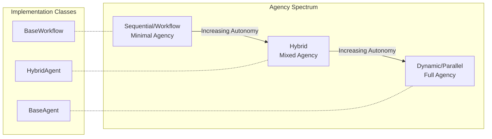
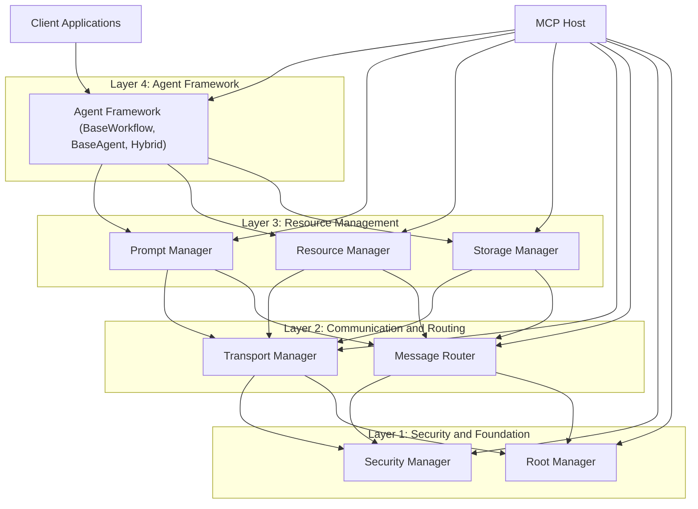
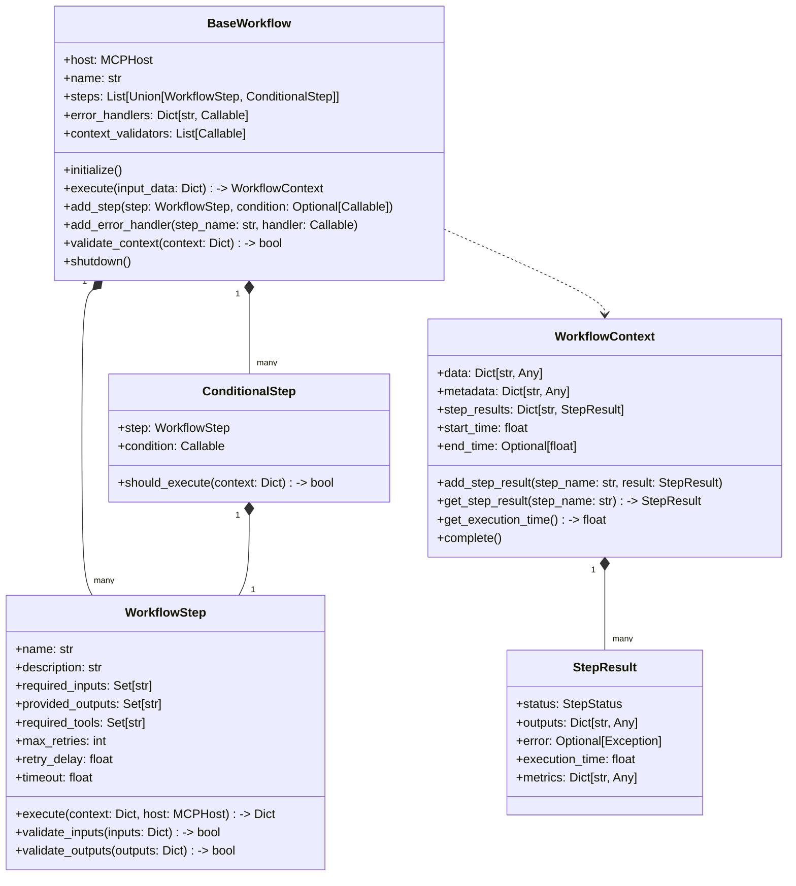
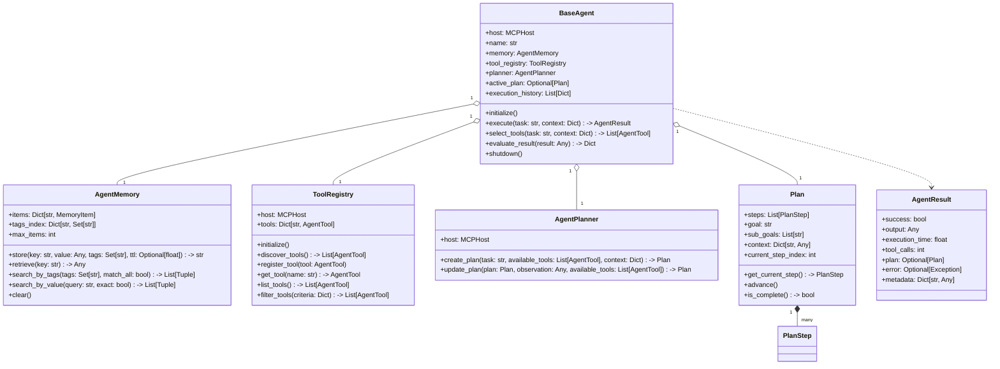
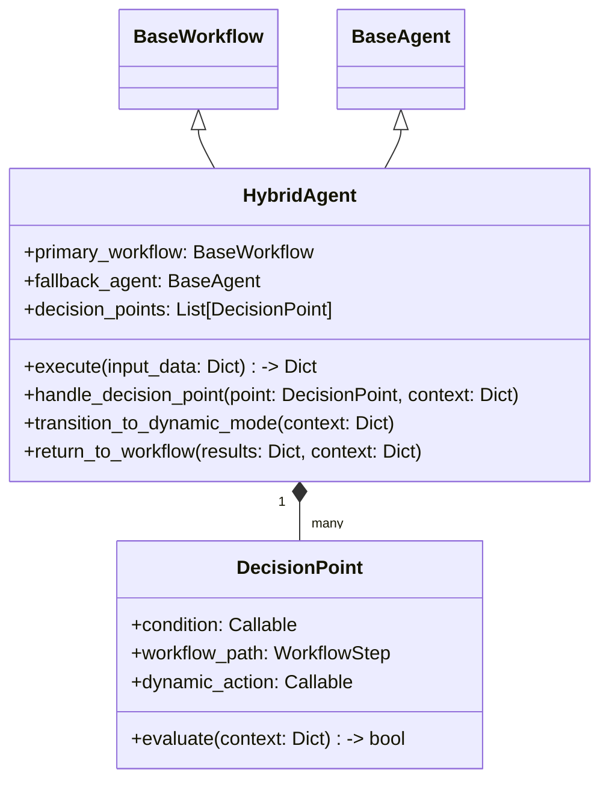

# Aurite Agent Architecture

This document outlines the design for Aurite's agent framework, which implements AI agents across the Agency Spectrum as Layer 4 of the Aurite MCP architecture.

## Overview

Building on the layered architecture of the Aurite MCP Host system, the agent framework provides specialized classes for building AI agents with varying levels of autonomy, as defined in the Agency Spectrum:



The agent framework includes three core architectural components:

1. `BaseWorkflow` - For sequential agents with minimal agency (predefined steps and tools)
2. `BaseAgent` - For dynamic agents with maximum agency (autonomous tool selection)
3. Future hybrid implementations that combine aspects of both approaches

## System Context

The agent framework operates as Layer 4 in the overall Aurite MCP architecture:



## BaseWorkflow Class

The `BaseWorkflow` class implements sequential agents with minimal agency.

### Architectural Characteristics

- **Sequential Execution**: Steps processed in a predefined order
- **Fixed Tool Selection**: Tools are pre-assigned to steps
- **Input/Output Contracts**: Strict data flow between steps
- **High Reliability**: Error handling and retry mechanisms
- **Predictable Execution**: Consistent behavior across runs

### Class Structure



### Implementation Strategy

1. **Step Definition and Execution**
   - Each step is defined with required inputs and provided outputs
   - Steps execute in sequence with shared context
   - Steps can be conditional based on context state

2. **Context Management**
   - Context flows through steps and carries state
   - Each step validates inputs and validates outputs
   - Context validators ensure data consistency

3. **Error Handling**
   - Multiple retry mechanisms with exponential backoff
   - Step-specific error handlers
   - Global error handling policies

4. **Integration with Host System**
   - Uses host.call_tool() for fixed tool execution
   - Validates tool availability before workflow starts
   - Respects security boundaries from Layer 1

## BaseAgent Class

The `BaseAgent` class implements dynamic agents with maximum agency.

### Architectural Characteristics

- **Autonomous Operation**: Self-directed behavior based on goals
- **Dynamic Tool Selection**: Chooses appropriate tools based on task
- **Adaptive Planning**: Creates and modifies plans during execution
- **Memory and Context**: Maintains knowledge across interactions
- **Self-Evaluation**: Assesses results and learns from outcomes

### Class Structure



### Implementation Strategy

1. **Tool Management**
   - Dynamic tool discovery through host system
   - Capability-based tool filtering
   - Tool selection based on task requirements

2. **Memory System**
   - Short and long-term storage mechanisms
   - Tag-based and content-based retrieval
   - Time-to-live for ephemeral information

3. **Planning and Execution**
   - LLM-based plan generation
   - Step-by-step execution with fallbacks
   - Plan adaptation based on outcomes

4. **Integration with Host System**
   - Leverages all layers of the host architecture
   - Respects security boundaries from Layer 1
   - Uses prompts and resources from Layer 3

## Hybrid Agent Design

For agents in the middle of the Agency Spectrum, a hybrid approach is planned:



### Key Design Elements for Hybrid Agents

- **Structured Core**: Primary workflow defines main execution path
- **Decision Points**: Specific points where dynamic behavior is allowed
- **Mode Transitions**: Controlled switching between workflow and dynamic behavior
- **Shared Context**: Consistent state management across modes
- **Guardrails**: Safety mechanisms to prevent undesired behavior

## Example Implementations

The agent framework includes concrete examples that demonstrate its capabilities:

### Document Processor (Workflow Agent)

```python
class DocumentProcessorWorkflow(BaseWorkflow):
    """Workflow for processing and analyzing documents"""
    
    def __init__(self, host: MCPHost):
        super().__init__(host, name="document_processor")
        
        # Add the steps in sequence
        self.add_step(ClassificationStep())
        self.add_step(ExtractionStep())
        self.add_step(SentimentAnalysisStep())
        self.add_step(ReportGenerationStep())
```

### Research Assistant (Dynamic Agent)

```python
class ResearchAssistantAgent(BaseAgent):
    """Research assistant with autonomous capabilities"""
    
    def __init__(self, host: MCPHost):
        super().__init__(host, name="research_assistant")
        
        # Define tool preferences for different tasks
        self.preferred_tools = {
            "search": ["web_search", "document_search"],
            "analysis": ["extract_entities", "analyze_sentiment"],
            "generation": ["generate_text", "create_summary"]
        }
```

## Integration with MCP Host Layers

The agent framework integrates with all layers of the MCP Host architecture:

### Layer 1: Security and Foundation
- Respects access control policies
- Operates within established root boundaries
- Ensures secure tool execution

### Layer 2: Communication and Routing
- Uses transport mechanisms for tool communication
- Leverages message routing for optimal tool selection
- Handles communication failures appropriately

### Layer 3: Resource Management
- Utilizes system prompts for consistent behavior
- Accesses resources based on task requirements
- Manages database connections when needed

## Implementation Roadmap

The agent framework will be implemented in three phases:

### Phase 1: Core Classes
- [x] Implement BaseWorkflow with step execution
- [x] Implement BaseAgent with memory and planning
- [x] Create example implementations
- [x] Integration with MCP Host system

### Phase 2: Extended Capabilities
- [ ] Add advanced memory capabilities to BaseAgent
- [ ] Enhance planning with more sophisticated strategies
- [ ] Implement monitoring and observability
- [ ] Create additional tool integrations

### Phase 3: Hybrid and Advanced Features
- [ ] Implement HybridAgent class
- [ ] Develop decision point system
- [ ] Create transition mechanisms between modes
- [ ] Add learning capabilities for agent improvement

## Conclusion

The agent framework provides a comprehensive Layer 4 for the Aurite MCP architecture, enabling the creation of agents across the full Agency Spectrum. By building on the solid foundation of the layered architecture, these agent classes offer both flexibility and control, allowing developers to create agents with the precise level of autonomy needed for their use cases.