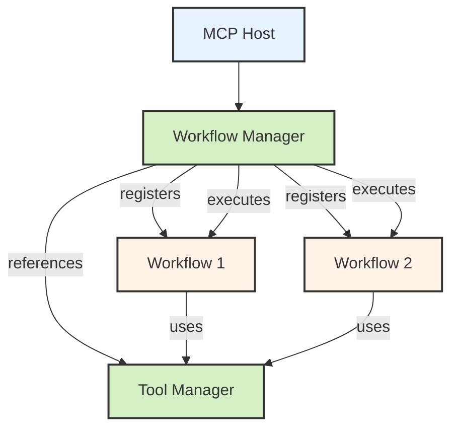

# Workflow Manager

This document describes the Workflow Manager component in the Aurite agent framework, which serves as the central registry and orchestration point for workflows in the host system.

## Overview

The Workflow Manager is a Layer 4 component in the host system that provides centralized management for workflows:



## Key Features

The Workflow Manager provides several key capabilities:

1. **Workflow Registration**: Register workflow classes with the host
2. **Workflow Discovery**: List and retrieve registered workflows
3. **Execution Orchestration**: Execute workflows with proper setup
4. **Lifecycle Management**: Initialize and shutdown workflows
5. **Resource Allocation**: Connect workflows with required resources
6. **Metadata Tracking**: Store and retrieve workflow metadata
7. **Error Handling**: Manage workflow execution errors

## Implementation

### Class Structure

The `WorkflowManager` class is structured as follows:

```python
class WorkflowManager:
    """
    Manages workflow registration, execution, and lifecycle.
    Part of the agent layer of the Host system.
    """
    
    def __init__(
        self, 
        tool_manager: ToolManager, 
        prompt_manager: Optional[PromptManager] = None,
        resource_manager: Optional[ResourceManager] = None
    ):
        # Manager references
        self._tool_manager = tool_manager
        self._prompt_manager = prompt_manager
        self._resource_manager = resource_manager
        
        # Workflow registry
        self._workflows: Dict[str, BaseWorkflow] = {}
        self._workflow_metadata: Dict[str, Dict[str, Any]] = {}
        
        # Active executions
        self._active_executions: Dict[str, asyncio.Task] = {}
```

### Key Methods

#### Registration and Discovery

```python
async def register_workflow(
    self, 
    workflow_class: Type[BaseWorkflow], 
    name: Optional[str] = None, 
    **kwargs
) -> str:
    """
    Register a workflow with the manager.
    
    Args:
        workflow_class: The workflow class to register
        name: Optional name for the workflow (defaults to class's name)
        **kwargs: Additional arguments to pass to the workflow constructor
        
    Returns:
        The registered workflow name
    """
    # Create workflow instance with tool manager instead of host
    workflow = workflow_class(tool_manager=self._tool_manager, **kwargs)
    
    # Use provided name or the workflow's own name
    workflow_name = name or workflow.name
    
    # Store in registry with metadata
    self._workflows[workflow_name] = workflow
    self._workflow_metadata[workflow_name] = {
        "class": workflow_class.__name__,
        "registration_time": time.time(),
        "description": getattr(workflow, "description", ""),
        "custom_args": kwargs
    }
    
    # Initialize the workflow
    await workflow.initialize()
    
    return workflow_name

def list_workflows(self) -> List[Dict[str, Any]]:
    """
    List all registered workflows with metadata.
    
    Returns:
        List of workflows with metadata
    """
    return [
        {
            "name": name,
            "description": self._workflow_metadata[name].get("description", ""),
            "class": self._workflow_metadata[name].get("class", ""),
            "registration_time": self._workflow_metadata[name].get("registration_time", 0),
        }
        for name in self._workflows
    ]

def get_workflow(self, workflow_name: str) -> Optional[BaseWorkflow]:
    """
    Get a workflow by name.
    
    Args:
        workflow_name: The name of the workflow
        
    Returns:
        The workflow if found, None otherwise
    """
    return self._workflows.get(workflow_name)
```

#### Workflow Execution

```python
async def execute_workflow(
    self, 
    workflow_name: str, 
    input_data: Dict[str, Any], 
    metadata: Optional[Dict[str, Any]] = None
) -> AgentContext:
    """
    Execute a registered workflow.
    
    Args:
        workflow_name: The name of the workflow to execute
        input_data: Input data for the workflow
        metadata: Optional metadata for the execution
        
    Returns:
        The final workflow context with results
    """
    # Validate workflow exists
    if workflow_name not in self._workflows:
        raise ValueError(f"Workflow not found: {workflow_name}")
    
    workflow = self._workflows[workflow_name]
    
    # Execute the workflow
    start_time = time.time()
    logger.info(f"Executing workflow: {workflow_name}")
    
    try:
        # Create execution ID for tracking
        execution_id = f"{workflow_name}_{int(start_time)}"
        
        # Execute the workflow
        result_context = await workflow.execute(input_data, metadata)
        
        # Record execution metrics
        execution_time = time.time() - start_time
        logger.info(f"Workflow {workflow_name} completed in {execution_time:.2f} seconds")
        
        return result_context
        
    except Exception as e:
        execution_time = time.time() - start_time
        logger.error(f"Workflow {workflow_name} failed after {execution_time:.2f} seconds: {e}")
        raise
```

#### Lifecycle Management

```python
async def initialize(self):
    """Initialize the workflow manager"""
    logger.info("Initializing workflow manager")
    # No initialization needed beyond the constructor at this point

async def shutdown(self):
    """Shutdown the workflow manager"""
    logger.info("Shutting down workflow manager")
    
    # Cancel any active executions
    for task in self._active_executions.values():
        task.cancel()
    
    # Shutdown all workflows
    for name, workflow in self._workflows.items():
        logger.info(f"Shutting down workflow: {name}")
        try:
            await workflow.shutdown()
        except Exception as e:
            logger.error(f"Error shutting down workflow {name}: {e}")
    
    # Clear registries
    self._workflows.clear()
    self._workflow_metadata.clear()
```

## Integration with MCPHost

The `MCPHost` class integrates the `WorkflowManager` as part of its agent layer:

```python
class MCPHost:
    """The MCP Host orchestration layer"""
    
    def __init__(self, config: HostConfig, encryption_key: Optional[str] = None):
        # ... other layers ...
        
        # Layer 4: Agent layer
        self._workflow_manager = WorkflowManager(
            tool_manager=self._tool_manager,
            prompt_manager=self._prompt_manager,
            resource_manager=self._resource_manager
        )
        
        # Create property accessor
        self.workflows = self._workflow_manager
```

The host provides convenient methods to work with workflows:

```python
async def register_workflow(self, workflow_class, name=None, **kwargs):
    """Register a workflow with the host"""
    return await self._workflow_manager.register_workflow(
        workflow_class, name, **kwargs
    )

async def execute_workflow(self, workflow_name, input_data, metadata=None):
    """Execute a registered workflow"""
    return await self._workflow_manager.execute_workflow(
        workflow_name, input_data, metadata
    )
```

## Design Patterns

The Workflow Manager implements several design patterns:

1. **Registry Pattern**: Maintains a registry of available workflows
2. **Factory Pattern**: Creates workflow instances from classes
3. **Dependency Injection**: Provides resources to workflows rather than having them create their own
4. **Facade Pattern**: Provides a simplified interface to the workflow system
5. **Mediator Pattern**: Coordinates interactions between workflows and resources

## Benefits of Centralized Management

Centralizing workflow management in the host provides several benefits:

1. **Resource Sharing**: Multiple workflows can share the same resources
2. **Lifecycle Management**: Host can properly initialize and shutdown workflows
3. **Monitoring and Metrics**: Central point for tracking workflow execution
4. **Discoverability**: Applications can list available workflows
5. **Consistent Interface**: Common API for workflow registration and execution
6. **Reduced Coupling**: Workflows depend only on the resources they need
7. **Enhanced Testability**: Easier to mock dependencies for testing

## Usage Examples

### Basic Usage

```python
# Create and initialize the host
host = MCPHost(config)
await host.initialize()

# Register a workflow
workflow_name = await host.register_workflow(DataAnalysisWorkflow)

# Execute the workflow
result_context = await host.execute_workflow(
    workflow_name,
    {"dataset_id": "sales_data", "analysis_type": "comprehensive"}
)

# Access results
summary = result_context.summarize_results()
print(f"Success: {summary['success']}")
print(f"Execution time: {summary['execution_time']:.2f} seconds")
```

### Multiple Workflow Registration

```python
# Register multiple workflows with custom names
analysis_workflow = await host.register_workflow(
    DataAnalysisWorkflow, name="data_analysis"
)
research_workflow = await host.register_workflow(
    ResearchAssistantWorkflow, name="research_assistant"
)
document_workflow = await host.register_workflow(
    DocumentProcessorWorkflow, name="document_processor"
)

# List available workflows
workflows = host.list_workflows()
for wf in workflows:
    print(f"Workflow: {wf['name']} - {wf['description']}")
```

### Advanced Configuration

```python
# Register workflow with custom configuration
workflow_name = await host.register_workflow(
    DataAnalysisWorkflow,
    name="custom_analysis",
    default_visualization_type="interactive",
    max_dataset_size=10000,
    include_advanced_metrics=True
)
```

## Future Enhancements

Potential future enhancements for the Workflow Manager include:

1. **Execution History**: Tracking and querying previous workflow executions
2. **Parallel Execution**: Running multiple workflows in parallel with resource management
3. **Workflow Composition**: Combining workflows into meta-workflows
4. **Status Monitoring**: Real-time status updates during workflow execution
5. **Workflow Versioning**: Managing multiple versions of the same workflow
6. **Persistent Storage**: Saving and loading workflow state
7. **Scheduled Execution**: Running workflows on a schedule
8. **Event Triggers**: Executing workflows in response to events

## Conclusion

The Workflow Manager provides a powerful layer of abstraction for working with workflows in the Aurite agent framework. By centralizing registration and execution, it enables better resource management, monitoring, and integration with applications while reducing coupling between components. This design follows modern best practices for dependency injection and separation of concerns, resulting in a more maintainable and testable architecture.