# Aurite Architecture Overview

This document provides a high-level overview of the Aurite architecture, focusing on the relationship between the MCP Host system and the Agent Framework.

## System Architecture

Aurite is built on a layered architecture that provides a clear separation of concerns while enabling powerful agent capabilities:

### Layer 1: Security and Foundation

The foundation layer establishes security boundaries and access control:

- **Security Manager**: Manages credentials, authentication, and authorization
- **Root Manager**: Controls access to URI roots and resources

### Layer 2: Communication and Routing

The communication layer handles message flow:

- **Transport Manager**: Creates and manages communication channels
- **Message Router**: Directs requests to appropriate tool servers

### Layer 3: Resource Management

The resource management layer provides access to data and services:

- **Tool Manager**: Manages tool registration, discovery, and execution across servers
- **Prompt Manager**: Manages system prompts and their execution
- **Resource Manager**: Manages access to files and external resources
- **Storage Manager**: Manages database connections and queries

The Tool Manager provides a unified interface for:
- Tool registration and discovery
- Tool execution with routing
- Capability-based tool selection
- Access control validation through the Root Manager

### Layer 4: Agent Framework

The agent framework provides the building blocks for AI agents:

- **BaseWorkflow**: Sequential workflow execution with fixed tools
  - Type-safe context management
  - Composable workflow steps
  - Error handling and retries
  - Middleware hooks for extensibility
- **BaseAgent**: Dynamic agent execution with autonomous tool selection
- **Hybrid Implementations**: Combined workflow and dynamic behaviors

The BaseWorkflow implementation follows a pipeline pattern:

## The Agency Spectrum

A central concept in Aurite is the Agency Spectrum, which describes the level of autonomy given to AI agents:

```mermaid
graph LR
    A["Sequential/Workflow
    • Fixed steps & tools
    • Predictable execution
    • High reliability"]

    B["Hybrid
    • Decision points
    • Conditional branching
    • Controlled autonomy"]

    C["Dynamic/Parallel
    • Autonomous tool selection
    • Goal-oriented behavior
    • Self-directed planning"]

    A --> B --> C

    style A fill:#e6f3ff,stroke:#333,stroke-width:2px
    style B fill:#fff2e6,stroke:#333,stroke-width:2px
    style C fill:#e6ffe6,stroke:#333,stroke-width:2px
```

Each type of agent serves different use cases:

- **Workflow Agents**: For predictable, repeatable processes with high reliability needs
- **Hybrid Agents**: For processes with decision points that benefit from some autonomy
- **Dynamic Agents**: For complex, open-ended tasks requiring adaptive behavior

## Core Components

The Aurite system is organized around two main components:

### 1. MCP Host System (`host.py`)

The orchestration layer that:
- Manages connections to tool servers
- Initializes and coordinates all managers
- Provides APIs for tool execution and resource access
- Enforces security policies and access control

### 2. Agent Framework

The agent implementation layer that:
- Provides base classes for different agent types
- Implements workflow and planning capabilities
- Manages memory and context
- Interfaces with the host system for tool access

## Implementation Status

Current implementation status:

- **Layer 1**: ✅ Implemented (Security Manager, Root Manager)
- **Layer 2**: ✅ Implemented (Transport Manager, Message Router)
- **Layer 3**: ✅ Implemented
  - ✅ Tool Manager
  - ✅ Prompt Manager
  - ✅ Resource Manager
  - ✅ Storage Manager
- **Layer 4**: 🔄 In Progress
  - ✅ BaseWorkflow implementation
    - ✅ Context management
    - ✅ Step composition
    - ✅ Error handling
    - ✅ Hook system
  - ⏳ BaseAgent implementation (planned)
  - ⏳ Hybrid Agent implementation (planned)

## Roadmap

Future development plans:

### Short-term
1. **Complete agent examples and demos**
   - Document processor example
   - Research assistant example
   - Financial analysis example

2. **Improve testing and documentation**
   - Unit tests for all agent components
   - Integration tests across layers
   - Detailed documentation and tutorials

### Medium-term
1. **Implement hybrid agent capabilities**
   - Decision point framework
   - Controlled transitions between modes
   - Context sharing between sequential and dynamic components

2. **Enhance memory and planning**
   - Advanced memory capabilities for BaseAgent
   - More sophisticated planning strategies
   - Learning from execution history

### Long-term
1. **Multi-agent coordination**
   - Agent-to-agent communication
   - Task delegation and collaboration
   - Shared knowledge and resources

2. **Specialized agent types**
   - Task-specific agent implementations
   - Domain-specific knowledge integration
   - Custom tool development

## Development Approach

When developing within the Aurite architecture:

1. **Respect layer boundaries**: Higher layers should only depend on lower layers, not vice versa
2. **Follow the manager pattern**: New functionality should be encapsulated in specialized managers
3. **Validate security**: All operations should be validated against security policies
4. **Maintain asyncio consistency**: All APIs should be async/await compatible
5. **Design for extensibility**: Components should be designed for extension and customization

## Conclusion

The Aurite architecture provides a comprehensive framework for building AI agents with varying levels of autonomy. By organizing functionality into clear layers and providing specialized components for different concerns, it enables the development of powerful, secure, and reliable agent systems.