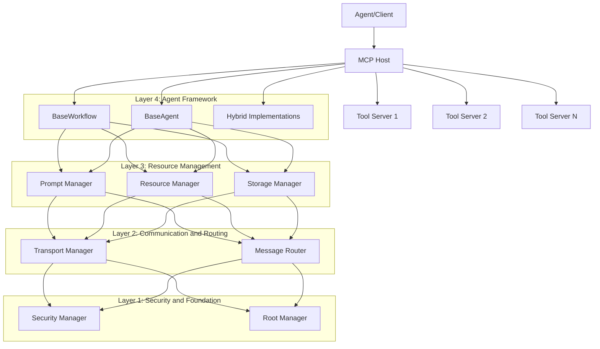
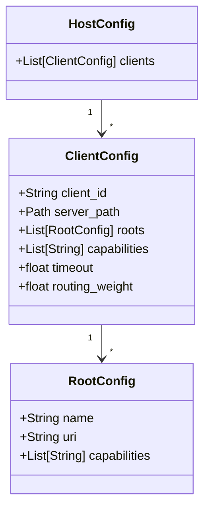

# Aurite MCP Host System Architecture

This document describes the layered architecture and implementation of the host system in the Aurite MCP framework.

## Overview

The MCP Host system serves as the orchestration layer for the Aurite agent framework, enabling communication between agents, tools, and various services. It's built around the Model Context Protocol (MCP) specification, providing a robust framework for managing AI agent interactions.

The architecture follows a layered design where each layer builds upon the capabilities of the layers below it.

## Layered Architecture

The host system is organized into four logical layers, each building on the previous:

### Layer 1: Security and Foundation

The foundation layer establishes security boundaries and access control mechanisms:

#### Security Manager (`security.py`)
- Manages encrypted credentials and sensitive information
- Implements authentication and authorization
- Protects system against unauthorized access
- Provides secure credential storage and retrieval

#### Root Manager (`roots.py`)
- Controls access to URI roots and resources
- Maintains registry of available roots
- Validates access permissions for tools and resources
- Establishes scope boundaries for tool access

### Layer 2: Communication and Routing

The communication layer handles message flow between components:

#### Transport Manager (`transport.py`)
- Creates and manages communication channels
- Supports different transport types (STDIO, SSE)
- Handles lifecycle of connections
- Ensures reliable message delivery

#### Message Router (`routing.py`)
- Directs requests to appropriate tool servers
- Routes tool calls based on capabilities and availability
- Implements weighted routing for load balancing
- Maintains mappings between tools, prompts, and servers

### Layer 3: Resource Management

The resource management layer provides access to data and services:

#### Prompt Manager (`prompts.py`)
- Manages system prompts and their execution
- Validates prompt arguments
- Ensures consistent prompt delivery
- Handles prompt versioning and selection

#### Resource Manager (`resources.py`)
- Manages access to files, data sources, and external resources
- Controls resource subscriptions and updates
- Ensures proper resource allocation and cleanup
- Provides consistent access patterns for resources

#### Storage Manager (`storage.py`)
- Creates and manages database connections
- Executes database queries securely
- Maintains connection pools
- Supports multiple database backends

### Layer 4: Agent Framework

The agent framework layer provides the building blocks for AI agents:

#### BaseWorkflow
- Implements sequential workflow execution
- Provides step-based processing with fixed tools
- Ensures reliable execution with error handling
- Manages workflow context and state

#### BaseAgent
- Implements dynamic agent execution
- Provides autonomous tool selection and planning
- Maintains agent memory and context
- Enables adaptive behavior based on task requirements

#### Hybrid Implementations
- Combines workflow structure with dynamic capabilities
- Provides controlled decision points in workflows
- Enables complex agent behaviors with guardrails
- Supports a spectrum of agency models

## Core Components

### MCPHost (`host.py`)

The central class that coordinates all layers and managers:
- Initializes and manages the lifecycle of all subsystems
- Processes client configurations and connections
- Provides high-level APIs for all layers
- Orchestrates inter-component communication

## Configuration and Initialization

The host is configured through a hierarchical configuration system:

Initialization follows this sequence:
1. Layer 1 managers are initialized (Security, Root)
2. Layer 2 managers are initialized (Transport, Message Router)
3. Layer 3 managers are initialized (Prompt, Resource, Storage)
4. Client configurations are processed
5. Tool servers are started and connected
6. Tools, prompts, and resources are discovered and registered
7. Layer 4 agents are initialized when created by applications

## Usage Examples

### Host System Example

The test file `test_host_security.py` demonstrates the host system:

1. Configure and initialize the host
2. Create database connections (direct or using named configurations)
3. Execute queries using the connection
4. Close connections and shut down the host

### Agent Framework Examples

The examples in `agent_examples.py` show how to use the agent framework:

1. Create workflow agents for sequential processing
2. Create dynamic agents for autonomous tasks
3. Configure agents with the host system
4. Execute tasks and process results

## Key Design Patterns

The system employs several key design patterns:

1. **Layered Architecture**: Components build on capabilities of lower layers
2. **Manager Pattern**: Specialized components handle specific concerns
3. **Dependency Injection**: Managers are injected into the host
4. **Async/Await**: Leverages Python's async capabilities for concurrent operations
5. **Registry Pattern**: Components maintain registries of entities they manage
6. **Strategy Pattern**: Different implementations can be swapped at runtime

## Extending the System

The layered architecture makes the system highly extensible:

1. **New Security Mechanisms**: Extend Layer 1 with additional security capabilities
2. **Alternative Transports**: Add new transport types in Layer 2
3. **Additional Resource Types**: Integrate new resource types in Layer 3
4. **Custom Agent Types**: Build specialized agents at Layer 4

This architecture provides a comprehensive foundation for building AI agents across the full spectrum of agency, from highly constrained workflow agents to fully autonomous dynamic agents.