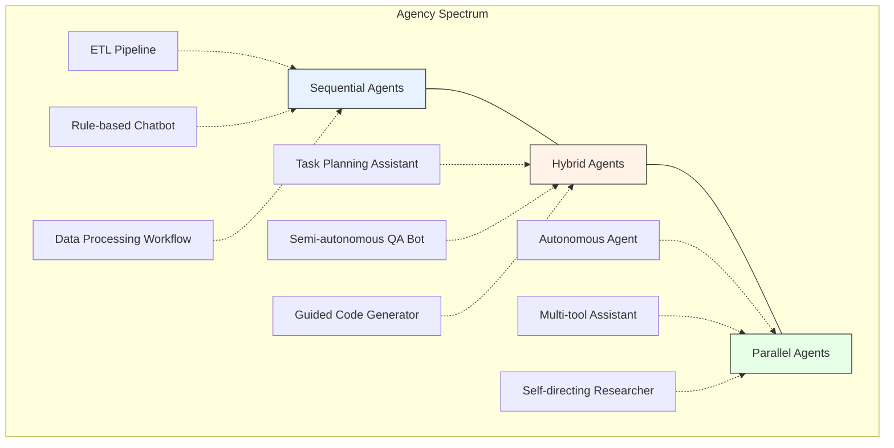

# The Agency Spectrum: Understanding AI Agent Architectures

The Agency Spectrum represents the continuum of AI agent architectures based on their level of autonomy and decision-making capabilities. This spectrum helps us understand the trade-offs between different agent designs and their appropriate use cases.

## Characteristics

### Sequential Agents
- Fixed, predetermined workflow
- Steps executed in a specific order
- Limited or no decision-making capability
- Highly predictable and reliable
- Examples: ETL pipelines, rule-based chatbots, data processing workflows

### Hybrid Agents
- Semi-structured workflows
- Conditional branching based on context
- Limited decision-making in specific scenarios
- Balance between flexibility and predictability
- Examples: Task planning assistants, semi-autonomous QA bots, guided code generators

### Parallel Agents
- Dynamic tool selection and ordering
- High degree of autonomy
- Complex decision-making capabilities
- Adaptable to various contexts
- Examples: Autonomous agents, multi-tool assistants, self-directing researchers

## Trade-offs

1. **Predictability vs. Flexibility**
   - Sequential: High predictability, low flexibility
   - Hybrid: Moderate predictability and flexibility
   - Parallel: High flexibility, lower predictability

2. **Development Complexity**
   - Sequential: Simplest to develop and maintain
   - Hybrid: Most complex due to mixed paradigms
   - Parallel: Complex but with clearer architecture

3. **Use Case Suitability**
   - Sequential: Best for well-defined, repetitive tasks
   - Hybrid: Suitable for semi-structured problems
   - Parallel: Ideal for open-ended, complex tasks