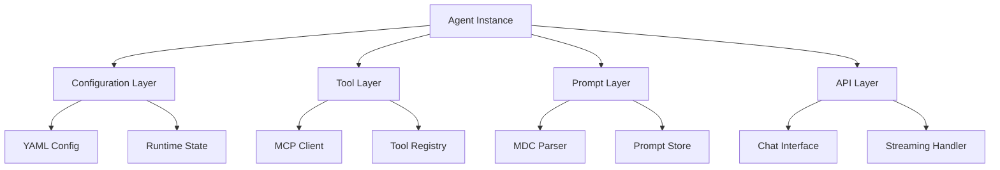
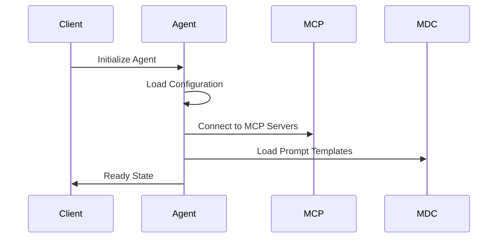
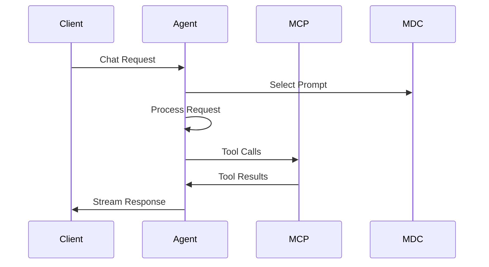

# Agent Design Specification

## Overview

This document describes the complete architecture of agents within the Aurite Agent Orchestrator system. Each agent is a composable entity built from standardized components:

1. Configuration (YAML) - Defines behavior and capabilities
2. Tools (MCP) - Provides interaction capabilities
3. Prompts (MDC) - Supplies context and instructions
4. API Interface (OpenAI-compatible) - Enables frontend communication
5. Workflows - Supports multi-agent collaboration

## Agent Architecture

### Core Components



### Component Integration

1. **Configuration Layer**

   - Loads YAML configuration
   - Manages runtime state
   - Handles rate limiting
   - Controls model parameters

2. **Tool Layer**

   - Connects to MCP servers
   - Discovers available tools
   - Manages tool lifecycle
   - Handles tool errors

3. **Prompt Layer**

   - Processes MDC documents
   - Selects appropriate prompts
   - Manages context injection
   - Tracks prompt performance

4. **API Layer**
   - Implements chat interface
   - Handles streaming
   - Manages conversation state
   - Processes tool calls

## Agent Lifecycle

### 1. Initialization



### 2. Request Processing



## Agent Types

### 1. Research Agent

```python
class ResearchAgent:
    def __init__(self, config: Dict):
        self.search_providers = self._init_search_providers(config)
        self.analysis_config = config['analysis']
        self.mcp_client = MCPClient()
        self.mdc_manager = MDCManager()

    async def research(self, query: str) -> ResearchResult:
        # Search across providers
        results = await self._gather_information(query)
        # Analyze and synthesize
        synthesis = await self._analyze_results(results)
        # Format output
        return self._format_research(synthesis)
```

### 2. Planner Agent

```python
class PlannerAgent:
    def __init__(self, config: Dict):
        self.planning_style = config['planning_style']
        self.templates = self._load_templates(config)
        self.mcp_client = MCPClient()
        self.mdc_manager = MDCManager()

    async def create_plan(self, context: Dict) -> Plan:
        # Select template
        template = await self._select_template(context)
        # Generate plan
        plan = await self._generate_plan(template, context)
        # Create timeline
        timeline = await self._create_timeline(plan)
        return Plan(content=plan, timeline=timeline)
```

## Integration Patterns

### 1. Tool Usage (MCP)

```python
class MCPToolManager:
    async def execute_tool(self, tool_name: str, params: Dict) -> Result:
        # Validate tool availability
        tool = await self.registry.get_tool(tool_name)
        # Check permissions
        await self.auth.validate_access(tool)
        # Execute tool
        result = await tool.execute(params)
        # Process result
        return self._process_result(result)
```

### 2. Prompt Management (MDC)

```python
class MDCPromptManager:
    async def select_prompt(self, context: Dict) -> Prompt:
        # Find matching prompts
        candidates = await self.store.find_prompts(context)
        # Score candidates
        scored = await self._score_candidates(candidates, context)
        # Select best match
        selected = await self._select_best(scored)
        return self._prepare_prompt(selected, context)
```

### 3. Chat Interface

```python
class ChatInterface:
    async def handle_request(self, request: ChatRequest) -> AsyncIterator[ChatResponse]:
        # Initialize conversation
        conversation = await self._init_conversation(request)
        # Process messages
        async for response in self._process_messages(conversation):
            # Handle tool calls
            if response.has_tool_calls:
                tool_results = await self._handle_tool_calls(response.tool_calls)
                response = await self._incorporate_results(response, tool_results)
            # Stream response
            yield response
```

## Workflow Integration

### 1. Agent Communication

```python
class AgentWorkflow:
    async def execute_step(self, step: WorkflowStep) -> StepResult:
        # Get agent instance
        agent = await self._get_agent(step.agent_type)
        # Prepare inputs
        inputs = await self._prepare_inputs(step.inputs)
        # Execute agent task
        result = await agent.execute(inputs)
        # Process outputs
        return await self._process_outputs(result, step.outputs)
```

### 2. State Management

```python
class WorkflowStateManager:
    async def transition(self, workflow: Workflow, event: Event) -> State:
        # Validate transition
        await self._validate_transition(workflow, event)
        # Update state
        new_state = await self._compute_new_state(workflow, event)
        # Persist state
        await self._persist_state(workflow, new_state)
        return new_state
```

## Configuration Examples

### 1. Agent Configuration

```yaml
agent:
  type: research
  config:
    search_providers:
      - name: web_search
        type: mcp_tool
        config:
          max_results: 5
    analysis:
      summarization_style: concise
```

### 2. Workflow Configuration

```yaml
workflow:
  name: research_to_plan
  steps:
    - agent: research
      inputs:
        topic: ${workflow.input.topic}
      outputs:
        - research_summary
    - agent: planner
      inputs:
        research: ${steps[0].outputs.research_summary}
      outputs:
        - project_plan
```

## Security and Performance

### 1. Security Measures

- Tool access control through MCP
- Request signing and verification
- Rate limiting per agent/client
- Secure credential storage
- Audit logging

### 2. Performance Optimization

- Prompt caching and reuse
- Tool result caching
- Parallel tool execution
- Streaming response processing
- Resource pooling

## Monitoring and Observability

### 1. Metrics Collection

- Tool usage statistics
- Prompt performance metrics
- Response times
- Error rates
- Resource utilization

### 2. Logging

- Agent operations
- Tool executions
- Workflow transitions
- Security events
- Performance data

## Next Steps

1. Implement core agent framework
2. Develop standard agent types
3. Create workflow engine
4. Build monitoring system
5. Deploy initial agents

## Open Questions

1. How should we handle agent versioning and updates?
2. What's the optimal strategy for prompt selection?
3. How can we ensure consistent tool behavior across agents?
4. What metrics are most important for agent performance?
5. How should we handle agent recovery and resilience?
