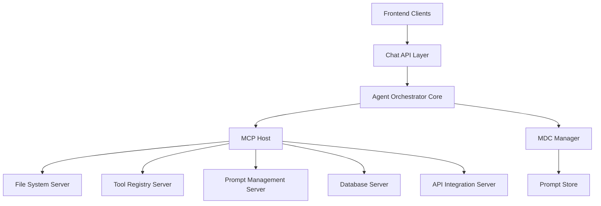

# Aurite Agent Orchestrator Design Specification

## Overview

The Aurite Agent Orchestrator is a standardized system for managing AI agents, providing a unified interface for tool usage, prompt management, and frontend interactions. This system implements three key standards to achieve a flexible and interoperable agent ecosystem, with MCP serving as the core protocol for tool and resource management.

## Core Standards Integration

### 1. Model Context Protocol (MCP) Core

#### Purpose

- Provide standardized tool and resource access for AI agents
- Enable secure remote tool execution through MCP servers
- Facilitate tool sharing and reuse across agent deployments

#### Components

- **MCP Host Layer**

  - Central orchestration of agent interactions
  - Connection management to MCP servers
  - Request routing and response aggregation
  - Security policy enforcement

- **Core MCP Servers**

  - File System Server (workspace access)
  - Tool Registry Server (tool management)
  - Prompt Management Server (MDC integration)
  - Database Access Server (data persistence)
  - API Integration Server (external services)

- **MCP Client Library**
  - Protocol-level communication
  - Connection lifecycle management
  - Error handling and recovery
  - Resource discovery and caching

### 2. Markdown Document with Context (MDC) Integration

#### Purpose

- Define and manage agent prompts with rich context
- Enable dynamic prompt selection through MCP
- Maintain versioned prompt documentation

#### Integration with MCP

- **MDC Resource Server**

  - Expose MDC documents as MCP resources
  - Handle prompt versioning and selection
  - Provide context-aware prompt retrieval
  - Support A/B testing through resource variants

- **Context Processing**
  - Parse YAML frontmatter for metadata
  - Extract contextual information
  - Map prompts to agent capabilities
  - Track prompt performance metrics

### 3. OpenAI-Compatible Chat Endpoint

#### Purpose

- Provide standardized frontend API access
- Enable compatibility with existing chat clients
- Simplify agent integration for developers

#### Integration Points

- **Chat API Layer**

  - OpenAI-compatible `/chat/completions` endpoint
  - Streaming response support
  - Message history management
  - Model backend abstraction

- **MCP Integration**
  - Tool invocation through MCP protocol
  - Resource access for context and history
  - Dynamic prompt loading via MDC
  - Result formatting and streaming

## System Architecture

### High-Level Components

### Data Flow

1. Client request received through OpenAI-compatible endpoint
2. Request processed by orchestrator core
3. Required tools discovered and accessed via MCP
4. Context-aware prompts loaded through MDC
5. Agent execution with tool access via MCP
6. Results streamed back through chat API

## Implementation Phases

### Phase 1: MCP Foundation

- [ ] Implement MCP host infrastructure
- [ ] Develop core MCP servers
- [ ] Create base client library
- [ ] Set up authentication system

### Phase 2: MDC Integration

- [ ] Implement MDC resource server
- [ ] Create prompt management system
- [ ] Develop context processing
- [ ] Build prompt versioning

### Phase 3: Chat API Layer

- [ ] Create OpenAI-compatible endpoint
- [ ] Implement streaming support
- [ ] Build message history system
- [ ] Develop model abstraction

### Phase 4: Integration & Testing

- [ ] Connect all components
- [ ] Implement comprehensive testing
- [ ] Add monitoring and logging
- [ ] Create deployment pipeline

## Technical Requirements

### Backend

- Python 3.10+
- FastAPI for API development
- PostgreSQL for data storage
- Redis for caching and pub/sub
- gRPC for MCP communication

### Frontend

- TypeScript
- React for admin interface
- WebSocket support for streaming
- OpenAPI/Swagger for documentation

### Infrastructure

- Docker containers
- Kubernetes deployment
- Prometheus/Grafana monitoring
- ELK stack for logging

## Security Considerations

### MCP Security

- Server-to-server authentication
- Resource-level access control
- Tool usage permissions
- Request signing and verification

### API Security

- JWT authentication
- Rate limiting per client
- Request validation
- Response sanitization

### Data Protection

- Encryption in transit
- Secure credential storage
- Audit logging
- Data retention policies

## Next Steps

1. Begin MCP host implementation
2. Create core MCP servers
3. Implement MDC resource server
4. Develop chat API endpoint
5. Set up testing infrastructure

## Open Questions

1. How should we handle tool versioning across MCP servers?
2. What's the optimal strategy for prompt caching and invalidation?
3. How should we implement agent-specific rate limiting?
4. What metrics are critical for monitoring agent performance?
5. How should we handle fallbacks for tool failures?
