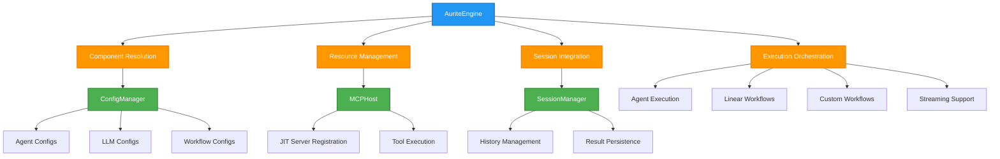

# AuriteEngine Design

**Version:** 1.0
**Date:** 2025-08-02

## Overview

The AuriteEngine is the central execution orchestrator in the Aurite framework, providing a unified interface for executing agents, linear workflows, and custom workflows. It coordinates between the ConfigManager, MCPHost, and SessionManager to handle component resolution, resource management, and execution lifecycle while providing both synchronous and streaming execution modes.

**Key Problem Solved**: Unified execution orchestration with Just-in-Time resource provisioning, session management integration, and comprehensive error handling across all component types.

## Architecture



## Core Responsibilities

<!-- prettier-ignore -->
!!! info "Primary Functions"
    - **Component Resolution**: Retrieves and validates component configurations from ConfigManager with fallback handling
    - **JIT Resource Management**: Dynamically registers MCP servers based on agent requirements through MCPHost integration
    - **Session Orchestration**: Manages conversation history and result persistence through SessionManager integration
    - **Execution Lifecycle**: Coordinates component initialization, execution, and cleanup across all component types
    - **Streaming Support**: Provides real-time event streaming with state management and error handling
    - **Observability Integration**: Langfuse tracing and monitoring for execution analytics
    - **Error Management**: Comprehensive error handling with context preservation and graceful degradation

<!-- prettier-ignore -->
!!! warning "What This Component Does NOT Do"
    - Does not manage configuration discovery or indexing (that's the ConfigManager's responsibility)
    - Does not handle MCP server connections or tool routing (that's the MCPHost's job)
    - Does not implement session storage backends (that's the SessionManager's role)
    - Does not execute LLM calls directly (delegates to Agent and Workflow components)

## Key Design Patterns

=== "JIT MCP Server Registration"

    **Purpose**: Dynamic server registration based on agent requirements to optimize resource usage and startup time.

    **Registration Flow**:
    ```python
    # During agent preparation
    if agent_config_for_run.mcp_servers:
        for server_name in agent_config_for_run.mcp_servers:
            if server_name not in self._host.registered_server_names:
                server_config_dict = self._config_manager.get_config("mcp_server", server_name)
                if not server_config_dict:
                    raise ConfigurationError(f"MCP Server '{server_name}' required by agent '{agent_name}' not found.")
                server_config = ClientConfig(**server_config_dict)
                await self._host.register_client(server_config)
                dynamically_registered_servers.append(server_name)
    ```

    **Key Design Decisions**:
    - **Persistent Registration**: Servers remain active after execution for subsequent use
    - **Lazy Loading**: Servers only loaded when required by specific agents
    - **Early Validation**: Configuration errors caught before execution begins
    - **Graceful Failure**: Missing server configurations result in clear error messages

    > 📋 **Server Registration Details**: See [MCP Server Registration Flow](../flow/mcp_server_registration_flow.md) for complete registration process and error handling patterns.

=== "Session Management Integration"

    **Purpose**: Unified session handling across all execution types with automatic ID generation and history management.

    **Session ID Management**:
    ```python
    # Auto-generation for agents with history enabled
    if effective_include_history:
        if final_session_id:
            if not final_session_id.startswith("agent-") and not final_session_id.startswith("workflow-"):
                final_session_id = f"agent-{final_session_id}"
        else:
            final_session_id = f"agent-{uuid.uuid4().hex[:8]}"
            logger.info(f"Auto-generated session_id for agent '{agent_name}': {final_session_id}")
    ```

    **History Integration**:
    - **Immediate Updates**: Current user message added to history before execution
    - **Result Persistence**: Complete execution results saved with session metadata
    - **Backend Abstraction**: Works with both CacheManager and StorageManager backends
    - **Workflow Support**: Base session ID tracking for workflow step coordination

    **Session Lifecycle**:
    1. **Pre-execution**: Load existing history if `include_history=true`
    2. **During execution**: Add current user message to session
    3. **Post-execution**: Save complete conversation and execution results
    4. **Cleanup**: Session metadata updated with execution statistics

=== "Component Execution Orchestration"

    **Agent Execution Pattern**:
    ```python
    async def run_agent(self, agent_name: str, user_message: str, ...):
        # 1. Component Resolution
        agent_instance, servers_to_unregister = await self._prepare_agent_for_run(...)

        # 2. Execution
        run_result = await agent_instance.run_conversation()

        # 3. Result Processing
        run_result.agent_name = agent_name
        if session_id and self._session_manager:
            self._session_manager.save_agent_result(session_id, run_result, base_session_id)

        return run_result
    ```

    **Workflow Execution Pattern**:
    ```python
    async def run_linear_workflow(self, workflow_name: str, initial_input: Any, ...):
        # 1. Configuration Resolution
        workflow_config = WorkflowConfig(**workflow_config_dict)

        # 2. Session Management
        final_session_id = self._manage_workflow_session_id(session_id, workflow_config)

        # 3. Execution Delegation
        workflow_executor = LinearWorkflowExecutor(config=workflow_config, engine=self)
        result = await workflow_executor.execute(initial_input, final_session_id, base_session_id)

        # 4. Result Persistence
        if result.session_id and self._session_manager:
            self._session_manager.save_workflow_result(result.session_id, result, base_session_id)

        return result
    ```

    **Key Orchestration Features**:
    - **Unified Interface**: Same execution pattern across all component types
    - **Error Context**: Execution errors wrapped with component and operation context
    - **Resource Cleanup**: Proper cleanup even on execution failure
    - **Result Standardization**: Consistent result format with metadata injection

=== "Streaming Architecture"

    **Purpose**: Real-time event streaming with state management and error handling for interactive agent execution.

    **Event Flow Management**:
    ```python
    async def stream_agent_run(self, agent_name: str, user_message: str, ...):
        # Yield session info as first event
        if session_id:
            yield {"type": "session_info", "data": {"session_id": session_id}}

        # Stream agent events
        async for event in agent_instance.stream_conversation():
            yield event
    ```

    **State Management**:
    - **Session Tracking**: Session ID provided as first event for client tracking
    - **History Updates**: Conversation history updated in real-time during streaming
    - **Error Handling**: Errors converted to stream events with graceful termination
    - **Resource Cleanup**: Proper cleanup in finally blocks regardless of stream outcome

    **Integration Features**:
    - **Langfuse Tracing**: Streaming executions tracked with observability metadata
    - **Auto Session Generation**: Automatic session ID creation for agents with history enabled
    - **Event Translation**: Internal agent events translated to standardized API events

=== "Langfuse Integration"

    **Purpose**: Comprehensive observability and tracing for execution analytics and debugging.

    **Trace Creation**:
    ```python
    if self.langfuse:
        trace = self.langfuse.trace(
            name=f"Agent: {agent_name} - Aurite Runtime",
            session_id=session_id,
            user_id=session_id or "anonymous",
            input={"user_message": user_message, "system_prompt": system_prompt},
            metadata={"agent_name": agent_name, "source": "execution-engine"}
        )
        agent_instance.trace = trace
    ```

    **Observability Features**:
    - **Execution Tracing**: Complete execution traces with input/output capture
    - **Session Grouping**: Traces grouped by session ID for conversation analysis
    - **Metadata Enrichment**: Agent names, execution context, and source tracking
    - **Performance Monitoring**: Execution timing and resource usage tracking
    - **Error Tracking**: Exception capture with full context preservation

    **Integration Points**:
    - **Agent Integration**: Traces passed to agent instances for LLM call tracking
    - **Workflow Support**: Workflow executions traced with step-level granularity
    - **Streaming Support**: Streaming executions tracked with real-time updates

## Error Handling Strategy

### Configuration Errors

- **Early Detection**: Configuration validation during preparation phase
- **Clear Messaging**: Specific error messages indicating missing or invalid components
- **Graceful Degradation**: Fallback to default configurations where appropriate
- **Context Preservation**: Full error context maintained through exception chaining

### Execution Errors

- **Component Context**: Errors wrapped with information about which component failed
- **Resource Cleanup**: Proper cleanup of registered servers and sessions on failure
- **State Consistency**: Session state maintained even on execution failure
- **Error Propagation**: Original errors preserved in exception chains

### Streaming Errors

- **Event Conversion**: Errors converted to stream events for client handling
- **Stream Termination**: Clean stream termination with proper resource cleanup
- **Client Recovery**: Error events include information for client reconnection
- **State Preservation**: Session state saved even on streaming failure

## Integration Points

<!-- prettier-ignore -->
!!! tip "Integration with ConfigManager"
    The AuriteEngine serves as the primary consumer of the ConfigManager's configuration services:

    **Component Resolution**: Engine calls `get_config()` to retrieve component configurations with automatic path resolution and validation. The ConfigManager handles all hierarchical priority resolution and context-aware path computation.

    **Configuration Updates**: Engine updates ConfigManager reference when in-memory components are registered, ensuring consistent configuration state across execution cycles.

    **Validation Integration**: Engine relies on ConfigManager's validation system for component integrity, with all configurations validated against Pydantic models before execution.

<!-- prettier-ignore -->
!!! tip "Integration with MCPHost"
    The AuriteEngine coordinates with the MCPHost for dynamic tool and resource provisioning:

    **JIT Registration**: Engine triggers server registration based on agent requirements, calling MCPHost to register servers that aren't already active. This ensures optimal resource usage by only loading servers when needed.

    **Tool Execution**: During agent execution, the engine provides the MCPHost instance to agents for tool execution. The MCPHost handles all tool routing, session management, and security filtering transparently.

    **Resource Management**: Engine leverages MCPHost's component discovery and filtering capabilities, ensuring agents only have access to authorized tools and resources based on their configuration.

<!-- prettier-ignore -->
!!! tip "Integration with SessionManager"
    The AuriteEngine integrates with the SessionManager for comprehensive conversation and result management:

    **History Management**: Engine loads conversation history before execution and saves complete results after execution. The SessionManager handles all backend abstraction and storage optimization.

    **Session Lifecycle**: Engine manages session ID generation, prefixing, and metadata tracking. The SessionManager provides the storage and retrieval interface for session data.

    **Result Persistence**: Engine saves both conversation history and execution results through the SessionManager, enabling comprehensive session analytics and debugging capabilities.

## References

- **Implementation**: `src/aurite/execution/aurite_engine.py`
- **Flow Details**: [AuriteEngine Execution Flow](../flow/aurite_engine_execution_flow.md)
- **Configuration Integration**: [ConfigManager Design](config_manager_design.md)
- **Resource Management**: [MCP Host Design](mcp_host_design.md)
