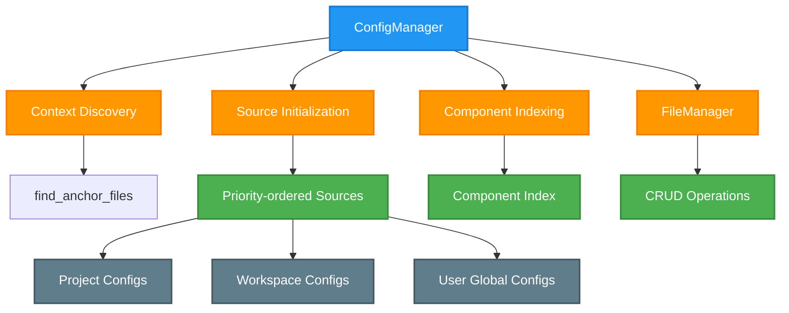

# ConfigManager Design

**Version:** 1.0
**Date:** 2025-08-02

## Overview

The ConfigManager is the central component responsible for discovering, loading, and managing all configuration data in the Aurite framework. It implements a hierarchical configuration system that respects project and workspace boundaries while providing a unified interface for accessing component configurations (agents, LLMs, MCP servers, workflows).

**Key Problem Solved**: Configuration management across complex project structures with automatic discovery, priority-based resolution, and unified CRUD operations.

## Architecture



## Core Responsibilities

<!-- prettier-ignore -->
!!! info "Primary Functions"
    - **Configuration Discovery**: Automatically finds and parses `.aurite` files to understand project/workspace structure
    - **Hierarchical Indexing**: Builds priority-ordered index of components respecting context boundaries
    - **Component CRUD**: Provides create, read, update, delete operations for all component types
    - **Path Resolution**: Resolves relative paths in configurations based on their context
    - **Validation**: Validates component configurations against Pydantic models
    - **LLM Validation Tracking**: Tracks successful LLM validations with timestamps for reliability monitoring
    - **Project Management**: Full CRUD operations for projects within workspaces
    - **In-Memory Registration**: Supports programmatic component registration for testing and notebooks

<!-- prettier-ignore -->
!!! warning "What This Component Does NOT Do"
    - Does not execute or run components (that's the AuriteEngine's job)
    - Does not manage MCP server connections (that's the MCPHost's responsibility)
    - Does not handle component lifecycle or state management

## Key Classes & Interfaces

### ConfigManager Class

Central facade for all configuration operations with hierarchical context discovery and unified interface for component access, validation, and manipulation.

**Core Interface Groups:**

- **Configuration Operations**: Component retrieval, listing, and CRUD operations with automatic path resolution
- **Validation System**: Component validation against Pydantic models with detailed error reporting
- **Project Management**: Full project lifecycle management within workspace contexts
- **LLM Validation Tracking**: Reliability monitoring with timestamp-based validation tracking
- **In-Memory Registration**: Programmatic component registration for testing and notebook environments

### Supporting Components

**`find_anchor_files` Function**: Hierarchical `.aurite` file discovery with proper context establishment and complex project/workspace boundary detection.

**`FileManager` Class**: Low-level file operations with atomic transaction support and multi-format configuration file handling (JSON/YAML).

**Configuration Models**: Pydantic-based validation models for all component types with automatic transport type inference and specialized path field handling.

> 📋 **Implementation Details**: See [Configuration Index Building Flow](../flow/config_index_building_flow.md) for detailed method signatures, usage examples, and implementation specifics.

## Configuration & Dependencies

### Configuration

```python
# Environment configuration
AURITE_CONFIG_FORCE_REFRESH = "true"  # Forces refresh on every operation

# .aurite file structure
[aurite]
type = "project"  # or "workspace"
include_configs = ["config", "shared_config"]
projects = ["project1", "project2"]  # workspace only
description = "Project description"
```

## Priority Resolution System

The ConfigManager implements a sophisticated priority system where the first-found component wins conflicts:

```python
# Priority order (highest to lowest)
1. In-Memory (programmatic registrations) - HIGHEST PRIORITY
2. Current Project (if in project context)
3. Workspace (shared configurations)
4. Other Projects (in workspace order)
5. User Global (~/.aurite) - LOWEST PRIORITY
```

<!-- prettier-ignore -->
!!! note "In-Memory Priority"
    In-memory registrations have the highest priority to support testing and notebook environments where components need to override file-based configurations temporarily.

## Key Design Patterns

=== "Three-Phase Index Building"

    **Process Overview**: The ConfigManager builds its configuration index through three distinct phases for reliable discovery and proper priority resolution.

    **Phase 1: Context Discovery**
    - Find all `.aurite` files by searching upward from start directory
    - Parse TOML content to determine context types (project/workspace)
    - Establish configuration hierarchy with proper priority ordering
    - Build context relationships and boundaries

    **Phase 2: Source Initialization**
    - Extract `include_configs` paths from each `.aurite` file in priority order
    - Resolve paths relative to their `.aurite` file locations
    - Convert relative paths to absolute paths for consistent access
    - Build ordered source list respecting priority hierarchy

    **Phase 3: Component Indexing**
    - Scan configuration directories for JSON/YAML files
    - Parse files as arrays of component configurations
    - Apply first-found-wins conflict resolution
    - Add metadata fields for traceability and path resolution

    > 📋 **Detailed Flow**: See [Configuration Index Building Flow](../flow/config_index_building_flow.md) for complete implementation details and examples.

=== "Component Index Structure"

    **Data Structure**: Three-level nested dictionary: `{component_type: {component_name: {config_data}}}`

    **Component Metadata**: Each indexed component includes metadata fields for traceability and path resolution:
    - `_source_file`: Full path to the configuration file
    - `_context_path`: Root directory of the context (project/workspace)
    - `_context_level`: "project", "workspace", "user", or "programmatic"
    - `_project_name`: Name of the project (if applicable)
    - `_workspace_name`: Name of the workspace (if applicable)

    **Conflict Resolution**: When the same component name exists in multiple locations, the **first occurrence wins** based on the priority order.

    **Example Conflict Resolution**:
    If "Weather Agent" exists in:

    1. `project_bravo/config/agents/agents.json` (when running from project_bravo)
    2. `my_workspace/config/agents/shared_agents.json`
    3. `project_alpha/config/agents/agents.json`

    The version from `project_bravo` will be used because it has the highest priority.

    **Access Patterns**: The ConfigManager provides multiple access methods:
    - **Single Component**: Direct component retrieval with path resolution
    - **By Type**: All components of a specific type with metadata
    - **Full Index**: Complete nested dictionary structure
    - **Flattened View**: Linear list of all components across types

    **Index Refresh**: The index can be rebuilt on-demand or automatically based on force refresh settings.

=== "LLM Validation System"

    **Purpose**: Tracks successful LLM operations with timestamp-based validation for reliability monitoring.

    **Key Features**:
    - Automatic validation timestamp recording after successful LLM operations
    - Validation status included in component configurations
    - Automatic reset when LLM configurations are updated
    - Persistence across ConfigManager refresh operations

    **Integration Points**:
    - **Runtime Integration**: AuriteEngine integration for automatic validation tracking
    - **Configuration Updates**: Timestamps reset when configurations change
    - **Reliability Monitoring**: Validation status available in component metadata
    - **Development Support**: Clear indication of tested vs untested LLM configurations

    **Usage Pattern**:
    ```python
    # After successful LLM operation
    config_manager.validate_llm("gpt4")

    # Validation status automatically included
    llm_config = config_manager.get_config("llm", "gpt4")
    is_validated = llm_config.get("validated_at") is not None
    ```

=== "Path Resolution System"

    **Purpose**: Context-aware path resolution for component configurations based on their configuration context.

    **Resolution Strategy**:
    - **MCP Servers**: Resolves `server_path` relative to component's context directory
    - **Custom Workflows**: Handles both dot-notation module paths and direct file paths
    - **LLM Components**: Injects validation timestamps during resolution
    - **Lazy Resolution**: Paths resolved only when configurations are retrieved

    **Context Awareness**:
    - Paths resolved relative to the configuration file's location
    - Different component types have specialized resolution logic
    - Fallback handling for missing or invalid paths
    - Type-specific resolution for different component categories

    **Performance Optimization**:
    - Resolution occurs only during configuration retrieval
    - Cached resolution results for repeated access
    - Efficient path computation with minimal filesystem operations

=== "Force Refresh Mechanism"

    **Purpose**: Development-time control over when the configuration index is rebuilt for optimal performance.

    **Configuration**:
    ```bash
    # Development: Force refresh on every operation (default)
    export AURITE_CONFIG_FORCE_REFRESH=true

    # Production: Disable for performance
    export AURITE_CONFIG_FORCE_REFRESH=false
    ```

    **Behavior**:
    - **Enabled**: Rebuilds entire configuration index on every operation
    - **Disabled**: Uses cached index until explicit refresh is called
    - **Development**: Useful for seeing configuration changes immediately
    - **Production**: Should be disabled for optimal performance

    <!-- prettier-ignore -->
    !!! warning "Performance Impact"
        Force refresh rebuilds the entire configuration index on every operation. Useful for development but should be disabled in production for optimal performance.

    **Use Cases**:
    - **Development**: Immediate reflection of configuration file changes
    - **Testing**: Ensure tests see latest configuration state
    - **Production**: Optimized performance with cached index
    - **Debugging**: Force refresh to troubleshoot configuration issues

## Integration Points

<!-- prettier-ignore -->
!!! tip "Integration with AuriteEngine"
    The ConfigManager serves as the primary configuration provider for the AuriteEngine:

    **Component Resolution**: Engine calls `get_config()` to retrieve component configurations for agents, LLMs, MCP servers, and workflows. The ConfigManager handles all path resolution and validation automatically.

    **JIT Registration**: Engine uses ConfigManager to get MCP server configurations for dynamic registration. When an agent requires specific MCP servers, the engine queries the ConfigManager to retrieve their configurations and passes them to the MCP Host for registration.

    **Validation**: Engine relies on ConfigManager's validation system for component integrity. All configurations are validated against Pydantic models before being used, ensuring type safety and completeness.

    **Priority Resolution**: The hierarchical priority system ensures that project-specific configurations override workspace and global settings, allowing for proper development isolation and shared resource management.

## References

- **Implementation**: `src/aurite/lib/config/config_manager.py`
- **Flow Details**: [Configuration Index Building Flow](../flow/config_index_building_flow.md)
- **Usage Examples**: [Configuration Examples Reference](../reference/config_examples.md)
