# ConfigManager Design

**Version:** 1.0
**Date:** 2025-08-02

## 1. Overview

The ConfigManager is the central component responsible for discovering, loading, and managing all configuration data in the Aurite framework. It implements a hierarchical configuration system that respects project and workspace boundaries while providing a unified interface for accessing component configurations (agents, LLMs, MCP servers, workflows).

The ConfigManager solves the problem of configuration management across complex project structures by automatically discovering `.aurite` anchor files, building a priority-ordered index of configuration sources, and providing both read and write operations for component configurations.

## 2. Architecture

The ConfigManager follows a layered discovery and indexing approach:


## 3. Core Responsibilities

<!-- prettier-ignore -->
!!! info "Primary Functions"
    - **Configuration Discovery**: Automatically finds and parses `.aurite` files to understand project/workspace structure
    - **Hierarchical Indexing**: Builds priority-ordered index of components respecting context boundaries
    - **Component CRUD**: Provides create, read, update, delete operations for all component types
    - **Path Resolution**: Resolves relative paths in configurations based on their context
    - **Validation**: Validates component configurations against Pydantic models
    - **LLM Validation Tracking**: Tracks successful LLM validations with timestamps for reliability monitoring
    - **Project Management**: Full CRUD operations for projects within workspaces
    - **In-Memory Registration**: Supports programmatic component registration for testing and notebooks

<!-- prettier-ignore -->
!!! warning "What This Component Does NOT Do"
    - Does not execute or run components (that's the AuriteEngine's job)
    - Does not manage MCP server connections (that's the MCPHost's responsibility)
    - Does not handle component lifecycle or state management

## 4. Key Classes & Interfaces

### Core Implementation

<!-- prettier-ignore -->
??? abstract "Source code in `lib/config/config_manager.py`"

    **`ConfigManager` Class:**

    - Central facade for all configuration operations
    - Manages hierarchical context discovery and source prioritization
    - Provides unified interface for component access and manipulation
    - Handles automatic refresh and caching based on environment settings

    **Key Methods:**

    ```python
    # Core Configuration Operations
    def get_config(self, component_type: str, component_id: str) -> Optional[Dict[str, Any]]
    def list_configs(self, component_type: str) -> List[Dict[str, Any]]
    def create_component(self, component_type: str, component_config: Dict[str, Any], **kwargs) -> Optional[Dict[str, Any]]
    def update_component(self, component_type: str, component_name: str, new_config: Dict[str, Any]) -> bool
    def delete_config(self, component_type: str, component_name: str) -> bool

    # Validation Operations
    def validate_component(self, component_type: str, component_id: str) -> Tuple[bool, List[str]]
    def validate_all_components(self) -> List[Dict[str, Any]]

    # LLM Validation Tracking
    def validate_llm(self, llm_name: str) -> None
    def get_llm_validation(self, llm_name: str) -> Optional[datetime]

    # Project Management
    def list_projects(self) -> List[Dict[str, Any]]
    def get_project_info(self, project_name: str) -> Optional[Dict[str, Any]]
    def create_project(self, name: str, description: Optional[str] = None) -> bool
    def delete_project(self, name: str) -> Tuple[bool, Optional[str]]
    def update_project(self, name: str, updates: Dict[str, Any]) -> bool
    def get_workspace_info(self) -> Optional[Dict[str, Any]]
    def get_active_project(self) -> Optional[Dict[str, Any]]

    # In-Memory Registration
    def register_component_in_memory(self, component_type: str, config: Dict[str, Any]) -> None

    # File Management Operations
    def list_config_sources(self) -> List[Dict[str, Any]]
    def list_config_files(self, source_name: str) -> List[str]
    def get_file_content(self, source_name: str, relative_path: str) -> Optional[str]
    def create_config_file(self, source_name: str, relative_path: str, content: str) -> bool
    def update_config_file(self, source_name: str, relative_path: str, content: str) -> bool
    def delete_config_file(self, source_name: str, relative_path: str) -> bool
    ```

<!-- prettier-ignore -->
??? abstract "Source code in `lib/config/config_utils.py`"

    **`find_anchor_files` Function:**

    - Searches upward from start directory to find `.aurite` files
    - Returns ordered list of anchor file paths for context establishment
    - Handles edge cases like nested projects and workspace boundaries

<!-- prettier-ignore -->
??? abstract "Source code in `lib/config/file_manager.py`"

    **`FileManager` Class:**

    - Handles low-level file operations for configuration management
    - Manages source directory mappings and file path resolution
    - Provides atomic file operations with proper error handling
    - Supports JSON and YAML configuration file formats

<!-- prettier-ignore -->
??? abstract "Source code in `lib/models/config/components.py`"

    **Configuration Models:**

    - **Pydantic Models**: `AgentConfig`, `LLMConfig`, `ClientConfig`, `WorkflowConfig`, `CustomWorkflowConfig`
    - **Transport Type Inference**: Automatic detection for MCP servers (stdio/http_stream/local)
    - **Field Validation**: Complex validation logic with `@model_validator` decorators
    - **Path Field Handling**: Special handling for `server_path` and `module_path` fields

    **Model Validation Integration:**

    ```python
    def _validate_component_config(self, component_type: str, config: Dict[str, Any]) -> Tuple[bool, List[str]]:
        """Validates component configuration against Pydantic models."""
        model_map = {
            "agent": AgentConfig,
            "llm": LLMConfig,
            "mcp_server": ClientConfig,
            "linear_workflow": WorkflowConfig,
            "custom_workflow": CustomWorkflowConfig,
        }

        model_class = model_map.get(component_type)
        if not model_class:
            return False, [f"No validation model found for component type '{component_type}'"]

        try:
            # Remove internal fields before validation
            clean_config = {k: v for k, v in config.items() if not k.startswith("_")}
            model_class(**clean_config)
            return True, []
        except Exception as e:
            # Parse Pydantic validation errors
            errors = []
            if hasattr(e, "errors"):
                for error in e.errors():
                    field_path = " -> ".join(str(loc) for loc in error["loc"])
                    errors.append(f"Field '{field_path}': {error['msg']}")
            else:
                errors.append(f"Validation error: {str(e)}")
            return False, errors
    ```

## 5. Configuration & Dependencies

### Configuration

The ConfigManager is configured through environment variables and `.aurite` files:

```python
# Environment configuration
AURITE_CONFIG_FORCE_REFRESH = "true"  # Forces refresh on every operation

# .aurite file structure
[aurite]
type = "project"  # or "workspace"
include_configs = ["config", "shared_config"]
projects = ["project1", "project2"]  # workspace only
description = "Project description"
```

### Dependencies

- **TOML Libraries**: `tomllib` (Python 3.11+) or `tomli` for parsing `.aurite` files
- **YAML Library**: `pyyaml` for YAML configuration file support
- **Pydantic Models**: For configuration validation (imported from `config_models`)
- **FileManager**: For low-level file operations and path management

## 6. Integration Points

### Initialization Flow

```mermaid
sequenceDiagram
    participant A as 🚀 AuriteKernel
    participant CM as ⚙️ ConfigManager
    participant FA as 🔍 find_anchor_files
    participant FM as 📁 FileManager

    Note over A,FM: Phase 1: Context Discovery
    A->>+CM: __init__(start_dir)
    CM->>+FA: find_anchor_files(start_dir)
    Note right of FA: Searches upward for<br/>.aurite files
    FA-->>-CM: List[Path] (anchor files)

    Note over CM: Phase 2: Source Initialization
    CM->>CM: _initialize_sources()
    Note right of CM: Builds priority-ordered<br/>configuration sources

    Note over CM: Phase 3: Component Indexing
    CM->>CM: _build_component_index()
    Note right of CM: Scans config files<br/>and builds index

    Note over CM,FM: Phase 4: FileManager Setup
    CM->>+FM: FileManager(sources)
    FM-->>-CM: Initialized FileManager

    CM-->>-A: ✅ Initialized ConfigManager

    Note over A,FM: Ready for Configuration Operations
```



### Key Integration Patterns

<!-- prettier-ignore -->
!!! tip "Integration with AuriteEngine"
    The ConfigManager serves as the primary configuration provider for the AuriteEngine:

    - **Component Resolution**: Engine calls `get_config()` to retrieve component configurations
    - **JIT Registration**: Engine uses ConfigManager to get MCP server configs for dynamic registration
    - **Validation**: Engine relies on ConfigManager's validation for component integrity

## 7. Implementation Notes

### Design Decisions

<!-- prettier-ignore -->
!!! note "Key Design Patterns"
    - **Priority-First Indexing**: Components are indexed in priority order, with first-found winning conflicts
    - **Lazy Path Resolution**: Relative paths are resolved only when configurations are retrieved
    - **Context-Aware Operations**: All operations respect the hierarchical project/workspace structure
    - **Atomic File Operations**: Configuration changes are atomic to prevent corruption

### Performance Considerations

- **Caching Strategy**: In-memory index with optional force-refresh for development
- **File System Optimization**: Recursive glob operations are minimized during indexing
- **Validation Caching**: LLM validation timestamps are cached to avoid repeated validation

### Priority Resolution System

The ConfigManager implements a sophisticated priority system:

```python
# Priority order (highest to lowest)
1. In-Memory (programmatic registrations) - HIGHEST PRIORITY
2. Current Project (if in project context)
3. Workspace (shared configurations)
4. Other Projects (in workspace order)
5. User Global (~/.aurite) - LOWEST PRIORITY
```

<!-- prettier-ignore -->
!!! note "In-Memory Priority"
    In-memory registrations have the highest priority to support testing and notebook environments where components need to override file-based configurations temporarily.

### Component Index Structure

The internal component index follows a three-level nested dictionary structure:

```python
_component_index: Dict[str, Dict[str, Dict[str, Any]]]
# Structure: {component_type: {component_name: {config_data}}}

# Actual implementation example:
{
    "agent": {
        "weather_agent": {
            "name": "weather_agent",
            "type": "agent",
            "llm_config_id": "gpt4",
            "mcp_servers": ["weather_server", "location_server"],
            "system_prompt": "You are a weather assistant",
            "_source_file": "/path/to/config/agents/agents.json",
            "_context_path": "/path/to/project",
            "_context_level": "project",
            "_project_name": "weather_project",
            "_workspace_name": "my_workspace"
        }
    },
    "llm": {
        "gpt4": {
            "name": "gpt4",
            "type": "llm",
            "provider": "openai",
            "model": "gpt-4",
            "temperature": 0.7,
            "max_tokens": 2000,
            "validated_at": "2025-08-02T10:30:00Z",
            "_source_file": "/path/to/config/llms/llms.yaml",
            "_context_path": "/path/to/workspace",
            "_context_level": "workspace",
            "_workspace_name": "my_workspace"
        }
    },
    "mcp_server": {
        "weather_server": {
            "name": "weather_server",
            "type": "mcp_server",
            "transport_type": "stdio",
            "server_path": "/path/to/weather_server.py",
            "capabilities": ["tools"],
            "timeout": 10.0,
            "_source_file": "/path/to/config/mcp_servers/servers.json",
            "_context_path": "/path/to/project",
            "_context_level": "project"
        }
    }
}
```

<!-- prettier-ignore -->
!!! note "Index Access Patterns"
    The ConfigManager provides multiple ways to access this index:

    - **Single Component**: `get_config(component_type, component_id)` → `Optional[Dict[str, Any]]`
    - **By Type**: `list_configs(component_type)` → `List[Dict[str, Any]]`
    - **Full Index**: `get_all_configs()` → `Dict[str, Dict[str, Dict[str, Any]]]`
    - **Flattened View**: `get_component_index()` → `List[Dict[str, Any]]`

### LLM Validation System

The ConfigManager includes a sophisticated LLM validation tracking system:

```python
# Internal validation tracking
llm_validations: Dict[str, Optional[datetime]] = {}

# Validation workflow
def validate_llm(self, llm_name: str) -> None:
    """Mark an LLM as successfully validated with current timestamp"""
    self.llm_validations[llm_name] = datetime.now()

def get_llm_validation(self, llm_name: str) -> Optional[datetime]:
    """Get the last successful validation timestamp for an LLM"""
    return self.llm_validations.get(llm_name, None)
```

<!-- prettier-ignore -->
!!! tip "LLM Validation Integration"
    - **Automatic Reset**: When an LLM configuration is updated, its validation timestamp is reset to `None`
    - **Runtime Integration**: The AuriteEngine calls `validate_llm()` after successful LLM operations
    - **Reliability Monitoring**: Applications can check validation status to determine LLM reliability
    - **Persistence**: Validation timestamps are preserved across ConfigManager refresh operations

### Path Resolution System

The ConfigManager implements sophisticated path resolution for component configurations:

```python
def _resolve_paths_in_config(self, config_data: Dict[str, Any]) -> Dict[str, Any]:
    """Resolves relative paths in component configurations based on their context."""
    context_path_str = config_data.get("_context_path")
    if not context_path_str:
        return config_data

    context_path = Path(context_path_str)
    resolved_data = config_data.copy()
    component_type = resolved_data.get("type")

    # MCP Server path resolution
    if component_type == "mcp_server":
        if "server_path" in resolved_data and resolved_data["server_path"]:
            path = Path(resolved_data["server_path"])
            if not path.is_absolute():
                resolved_data["server_path"] = (context_path / path).resolve()

    # Custom Workflow path resolution
    elif component_type == "custom_workflow":
        if "module_path" in resolved_data and resolved_data["module_path"]:
            # Convert module dot-path to file path if needed
            module_str = resolved_data["module_path"]
            if "." in module_str and not module_str.endswith(".py"):
                # e.g., "custom_workflows.my_workflow" -> custom_workflows/my_workflow.py
                module_as_path = Path(module_str.replace(".", "/")).with_suffix(".py")
                path = context_path / module_as_path
                if path.exists():
                    resolved_data["module_path"] = path.resolve()
            else:
                # Direct file path
                path = Path(module_str)
                if not path.is_absolute():
                    resolved_data["module_path"] = (context_path / path).resolve()

    # LLM validation timestamp injection
    elif component_type == "llm":
        resolved_data["validated_at"] = self.llm_validations.get(resolved_data["name"], None)

    return resolved_data
```

<!-- prettier-ignore -->
!!! tip "Path Resolution Features"
    - **Context-Aware**: Paths are resolved relative to the component's configuration context (project/workspace)
    - **Lazy Resolution**: Path resolution occurs only when configurations are retrieved via `get_config()`
    - **Type-Specific**: Different component types have specialized path resolution logic
    - **Fallback Handling**: Graceful handling of missing or invalid paths

### Force Refresh Mechanism

The ConfigManager supports development-time force refresh via environment variables:

```python
# Environment variable control
AURITE_CONFIG_FORCE_REFRESH = "true"  # Default: forces refresh on every operation
AURITE_CONFIG_FORCE_REFRESH = "false" # Disables automatic refresh for performance

# Implementation in core methods
def get_config(self, component_type: str, component_id: str) -> Optional[Dict[str, Any]]:
    if self._force_refresh:
        self.refresh()  # Rebuild entire index

    config = self._component_index.get(component_type, {}).get(component_id)
    if config:
        return self._resolve_paths_in_config(config)
    return None

def list_configs(self, component_type: str) -> List[Dict[str, Any]]:
    if self._force_refresh:
        self.refresh()  # Rebuild entire index

    configs = self._component_index.get(component_type, {}).values()
    return [self._resolve_paths_in_config(c) for c in configs]
```

<!-- prettier-ignore -->
!!! warning "Performance Impact"
    Force refresh rebuilds the entire configuration index on every operation. This is useful for development but should be disabled in production environments for optimal performance.

### Error Handling

```python
# Graceful degradation patterns
try:
    config = self.get_config("agent", "my_agent")
    if not config:
        logger.warning(f"Agent 'my_agent' not found, using fallback")
        config = self._get_fallback_config("agent")
except Exception as e:
    logger.error(f"Configuration error: {e}")
    return None
```

## 8. Examples

### Basic Usage

=== "Python API"

    ```python
    # Initialize ConfigManager
    config_manager = ConfigManager(start_dir=Path("/path/to/project")) # (1)

    # Retrieve component configuration
    agent_config = config_manager.get_config("agent", "weather_agent") # (2)
    if agent_config:
        print(f"Found agent: {agent_config['name']}")

    # List all components of a type
    all_llms = config_manager.list_configs("llm") # (3)
    print(f"Available LLMs: {[llm['name'] for llm in all_llms]}")
    ```

    1. :material-folder-open: Automatically discovers `.aurite` files and builds configuration index
    2. :material-cog: Returns resolved configuration with paths and validation status
    3. :material-format-list-bulleted: Returns all components of specified type with metadata

=== "CLI Usage"

    ```bash
    # List all available agents
    aurite list agents # (1)

    # List all components (shows the component index)
    aurite list # (2)

    # Show specific component configuration
    aurite show weather_agent # (3)

    # Show all components of a type
    aurite show agent # (4)

    # Show full configuration details
    aurite show weather_agent --full # (5)
    ```

    1. :material-console: Lists all agents in current context
    2. :material-format-list-bulleted: Shows the complete component index
    3. :material-file-document: Shows specific component configuration
    4. :material-folder-multiple: Shows all components of specified type
    5. :material-file-document-outline: Shows detailed configuration with all fields

=== "Configuration Files"

    ```json title="config/agents/weather_agents.json"
    [
      {
        "name": "weather_agent", // (1)
        "type": "agent",
        "llm_config_id": "gpt4", // (2)
        "system_prompt": "You are a weather assistant", // (3)
        "mcp_servers": ["weather_server", "location_server"] // (4)
      }
    ]
    ```

    1. :material-tag: Unique identifier for the agent
    2. :material-brain: References an LLM configuration
    3. :material-message-text: Instructions for the agent's behavior
    4. :material-server: MCP servers this agent can use

### Advanced Configuration Management

```python
# Create new component with context selection
new_agent = {
    "name": "data_processor",
    "type": "agent",
    "llm_config_id": "gpt4",
    "system_prompt": "You are a data processing assistant",
    "mcp_servers": ["database_server", "file_server"]
}

result = config_manager.create_component(
    component_type="agent",
    component_config=new_agent,
    project="analytics_project"  # Specify target project
)

if result:
    print(f"Created agent in: {result['component']['file_path']}")
```

### Validation and Error Handling

```python
# Validate all components
validation_errors = config_manager.validate_all_components()

for error in validation_errors:
    print(f"Component {error['component_id']} ({error['component_type']}):")
    for err_msg in error['errors']:
        print(f"  - {err_msg}")

# Validate specific component
is_valid, errors = config_manager.validate_component("llm", "openai_gpt4")
if not is_valid:
    print(f"LLM validation failed: {errors}")

# Example validation errors from Pydantic models
invalid_mcp_server = {
    "name": "broken_server",
    "type": "mcp_server",
    # Missing required transport configuration
}

config_manager.register_component_in_memory("mcp_server", invalid_mcp_server)
is_valid, errors = config_manager.validate_component("mcp_server", "broken_server")
# Output: False, ["Could not determine transport type. Please provide one of: 'server_path' (for stdio), 'http_endpoint' (for http_stream), or 'command' (for local)."]

# Check for duplicate component names across types
validation_errors = config_manager.validate_all_components()
duplicate_errors = [e for e in validation_errors if e['component_type'] == 'multiple']
for error in duplicate_errors:
    print(f"Duplicate name '{error['component_id']}': {error['errors'][0]}")
```

### Project Management

```python
# List all projects in workspace
projects = config_manager.list_projects()
for project in projects:
    print(f"Project: {project['name']} ({'active' if project['is_active'] else 'inactive'})")

# Create new project
success = config_manager.create_project(
    name="new_analytics_project",
    description="Advanced analytics and reporting"
)

# Update project configuration
config_manager.update_project("analytics_project", {
    "description": "Updated description",
    "include_configs": ["config", "shared", "analytics_config"]
})

# Get detailed project information
project_info = config_manager.get_project_info("analytics_project")
if project_info:
    print(f"Project path: {project_info['path']}")
    print(f"Created: {project_info['created_at']}")
    print(f"Active: {project_info['is_active']}")

# Delete project (with safety check)
success, error_msg = config_manager.delete_project("old_project")
if not success:
    print(f"Failed to delete project: {error_msg}")
```

### LLM Validation Tracking

```python
# Track LLM validation after successful operations
try:
    # Simulate successful LLM call
    response = await llm_client.generate("Hello world")

    # Mark LLM as validated
    config_manager.validate_llm("gpt4")
    print("LLM validation recorded")

except Exception as e:
    print(f"LLM call failed: {e}")
    # Validation timestamp remains unchanged

# Check LLM validation status
validation_time = config_manager.get_llm_validation("gpt4")
if validation_time:
    print(f"LLM last validated: {validation_time}")
else:
    print("LLM has not been validated yet")

# List all LLMs with validation status
llms = config_manager.list_configs("llm")
for llm in llms:
    validation_time = llm.get("validated_at")
    status = "✓ Validated" if validation_time else "⚠ Not validated"
    print(f"{llm['name']}: {status}")
```

### In-Memory Registration

```python
# Register components programmatically (highest priority)
test_agent = {
    "name": "test_agent",
    "type": "agent",
    "llm_config_id": "test_llm",
    "system_prompt": "You are a test agent for unit testing"
}

config_manager.register_component_in_memory("agent", test_agent)

# This will now return the in-memory component
agent_config = config_manager.get_config("agent", "test_agent")
assert agent_config["_source_file"] == "in-memory"
assert agent_config["_context_level"] == "programmatic"

# Useful for Jupyter notebooks and testing
notebook_llm = {
    "name": "notebook_llm",
    "type": "llm",
    "provider": "openai",
    "model": "gpt-3.5-turbo",
    "api_key": "sk-test-key"
}

config_manager.register_component_in_memory("llm", notebook_llm)
```

## 9. Testing

### Test Strategy

<!-- prettier-ignore -->
!!! info "Testing Approach"
    - **Unit Tests**: Testing individual methods like `get_config`, `create_component`, validation
    - **Integration Tests**: Testing full discovery and indexing flows with mock file systems
    - **File System Tests**: Testing actual file operations with temporary directories
    - **Priority Tests**: Validating configuration priority resolution across contexts

### Key Test Scenarios

```python
# Example test case
def test_hierarchical_config_resolution():
    # Setup: Create workspace with multiple projects
    workspace_dir = create_test_workspace({
        "workspace_config": {"shared_llm": "gpt-4"},
        "project1_config": {"project_llm": "claude"},
        "project2_config": {"project_llm": "gemini"}
    })

    # Test: ConfigManager from project1 context
    config_manager = ConfigManager(start_dir=workspace_dir / "project1")

    # Verify: Project config takes priority
    project_llm = config_manager.get_config("llm", "project_llm")
    assert project_llm["model"] == "claude"

    # Verify: Workspace config is accessible
    shared_llm = config_manager.get_config("llm", "shared_llm")
    assert shared_llm["model"] == "gpt-4"

def test_component_crud_operations():
    config_manager = ConfigManager(start_dir=test_project_dir)

    # Create
    new_agent = {"name": "test_agent", "type": "agent", "llm_config_id": "default"}
    result = config_manager.create_component("agent", new_agent)
    assert result is not None

    # Read
    retrieved = config_manager.get_config("agent", "test_agent")
    assert retrieved["name"] == "test_agent"

    # Update
    updated_config = retrieved.copy()
    updated_config["system_prompt"] = "Updated prompt"
    success = config_manager.update_component("agent", "test_agent", updated_config)
    assert success

    # Delete
    success = config_manager.delete_config("agent", "test_agent")
    assert success
    assert config_manager.get_config("agent", "test_agent") is None

def test_llm_validation_tracking():
    config_manager = ConfigManager(start_dir=test_project_dir)

    # Initially no validation
    validation_time = config_manager.get_llm_validation("test_llm")
    assert validation_time is None

    # Mark as validated
    config_manager.validate_llm("test_llm")
    validation_time = config_manager.get_llm_validation("test_llm")
    assert validation_time is not None
    assert isinstance(validation_time, datetime)

    # Update LLM config should reset validation
    llm_config = {"name": "test_llm", "type": "llm", "provider": "openai", "model": "gpt-4"}
    config_manager.update_component("llm", "test_llm", llm_config)
    validation_time = config_manager.get_llm_validation("test_llm")
    assert validation_time is None

def test_project_management():
    config_manager = ConfigManager(start_dir=workspace_dir)

    # List projects
    projects = config_manager.list_projects()
    initial_count = len(projects)

    # Create new project
    success = config_manager.create_project("test_project", "Test project description")
    assert success

    # Verify project exists
    projects = config_manager.list_projects()
    assert len(projects) == initial_count + 1

    project_info = config_manager.get_project_info("test_project")
    assert project_info is not None
    assert project_info["name"] == "test_project"
    assert project_info["description"] == "Test project description"

    # Update project
    success = config_manager.update_project("test_project", {
        "description": "Updated description",
        "include_configs": ["config", "test_config"]
    })
    assert success

    # Delete project
    success, error_msg = config_manager.delete_project("test_project")
    assert success
    assert error_msg is None

def test_in_memory_registration():
    config_manager = ConfigManager(start_dir=test_project_dir)

    # Register in-memory component
    test_component = {
        "name": "memory_agent",
        "type": "agent",
        "llm_config_id": "test_llm",
        "system_prompt": "In-memory test agent"
    }

    config_manager.register_component_in_memory("agent", test_component)

    # Verify highest priority
    retrieved = config_manager.get_config("agent", "memory_agent")
    assert retrieved is not None
    assert retrieved["_source_file"] == "in-memory"
    assert retrieved["_context_level"] == "programmatic"
    assert retrieved["system_prompt"] == "In-memory test agent"

    # Should override file-based configs with same name
    file_agent = {"name": "memory_agent", "type": "agent", "system_prompt": "File-based agent"}
    config_manager.create_component("agent", file_agent)

    # In-memory should still win
    retrieved = config_manager.get_config("agent", "memory_agent")
    assert retrieved["system_prompt"] == "In-memory test agent"
```

### Performance Benchmarks

- **Index Building**: < 100ms for typical project structures (< 50 config files)
- **Component Retrieval**: < 1ms for cached lookups
- **File Operations**: < 10ms for single component CRUD operations
- **Memory Usage**: < 5MB for typical configuration indexes
