# ConfigManager Design

**Version:** 1.0
**Date:** 2025-08-02

## 1. Overview

The ConfigManager is the central component responsible for discovering, loading, and managing all configuration data in the Aurite framework. It implements a hierarchical configuration system that respects project and workspace boundaries while providing a unified interface for accessing component configurations (agents, LLMs, MCP servers, workflows).

The ConfigManager solves the problem of configuration management across complex project structures by automatically discovering `.aurite` anchor files, building a priority-ordered index of configuration sources, and providing both read and write operations for component configurations.

## 2. Architecture

The ConfigManager follows a layered discovery and indexing approach:


## 3. Core Responsibilities

<!-- prettier-ignore -->
!!! info "Primary Functions"
    - **Configuration Discovery**: Automatically finds and parses `.aurite` files to understand project/workspace structure
    - **Hierarchical Indexing**: Builds priority-ordered index of components respecting context boundaries
    - **Component CRUD**: Provides create, read, update, delete operations for all component types
    - **Path Resolution**: Resolves relative paths in configurations based on their context
    - **Validation**: Validates component configurations against Pydantic models
    - **LLM Validation Tracking**: Tracks successful LLM validations with timestamps for reliability monitoring
    - **Project Management**: Full CRUD operations for projects within workspaces
    - **In-Memory Registration**: Supports programmatic component registration for testing and notebooks

<!-- prettier-ignore -->
!!! warning "What This Component Does NOT Do"
    - Does not execute or run components (that's the AuriteEngine's job)
    - Does not manage MCP server connections (that's the MCPHost's responsibility)
    - Does not handle component lifecycle or state management

## 4. Key Classes & Interfaces

### Core Implementation

**`ConfigManager` Class:**

- Central facade for all configuration operations with hierarchical context discovery
- Provides unified interface for component access, validation, and manipulation
- Manages priority-ordered configuration sources and automatic refresh capabilities

**Core Interface Groups:**

- **Configuration Operations**: Component retrieval, listing, and CRUD operations with automatic path resolution
- **Validation System**: Component validation against Pydantic models with detailed error reporting
- **Project Management**: Full project lifecycle management within workspace contexts
- **LLM Validation Tracking**: Reliability monitoring with timestamp-based validation tracking
- **In-Memory Registration**: Programmatic component registration for testing and notebook environments

> 📋 **Implementation Details**: See [Configuration Index Building Flow](../flow/config_index_building_flow.md#component-operations) for detailed method signatures, usage examples, and implementation specifics.

**Supporting Components:**

**`find_anchor_files` Function:**

- Hierarchical `.aurite` file discovery with proper context establishment
- Handles complex project/workspace boundary detection

**`FileManager` Class:**

- Low-level file operations with atomic transaction support
- Multi-format configuration file handling (JSON/YAML)

**Configuration Models:**

- Pydantic-based validation models for all component types
- Automatic transport type inference and complex field validation
- Specialized path field handling for relative path resolution

> 🔧 **Validation Details**: See [Component Validation](../flow/config_index_building_flow.md#validation-workflows) for detailed validation processes and error handling examples.

## 5. Configuration & Dependencies

### Configuration

The ConfigManager is configured through environment variables and `.aurite` files:

```python
# Environment configuration
AURITE_CONFIG_FORCE_REFRESH = "true"  # Forces refresh on every operation

# .aurite file structure
[aurite]
type = "project"  # or "workspace"
include_configs = ["config", "shared_config"]
projects = ["project1", "project2"]  # workspace only
description = "Project description"
```

### Dependencies

- **TOML Libraries**: `tomllib` (Python 3.11+) or `tomli` for parsing `.aurite` files
- **YAML Library**: `pyyaml` for YAML configuration file support
- **Pydantic Models**: For configuration validation (imported from `config_models`)
- **FileManager**: For low-level file operations and path management

## 6. Integration Points

### Initialization Flow

```mermaid
sequenceDiagram
    participant A as 🚀 AuriteKernel
    participant CM as ⚙️ ConfigManager
    participant FA as 🔍 find_anchor_files
    participant FM as 📁 FileManager

    Note over A,FM: Phase 1: Context Discovery
    A->>+CM: __init__(start_dir)
    CM->>+FA: find_anchor_files(start_dir)
    Note right of FA: Searches upward for<br/>.aurite files
    FA-->>-CM: List[Path] (anchor files)

    Note over CM: Phase 2: Source Initialization
    CM->>CM: _initialize_sources()
    Note right of CM: Builds priority-ordered<br/>configuration sources

    Note over CM: Phase 3: Component Indexing
    CM->>CM: _build_component_index()
    Note right of CM: Scans config files<br/>and builds index

    Note over CM,FM: Phase 4: FileManager Setup
    CM->>+FM: FileManager(sources)
    FM-->>-CM: Initialized FileManager

    CM-->>-A: ✅ Initialized ConfigManager

    Note over A,FM: Ready for Configuration Operations
```



### Key Integration Patterns

<!-- prettier-ignore -->
!!! tip "Integration with AuriteEngine"
    The ConfigManager serves as the primary configuration provider for the AuriteEngine:

    - **Component Resolution**: Engine calls `get_config()` to retrieve component configurations
    - **JIT Registration**: Engine uses ConfigManager to get MCP server configs for dynamic registration
    - **Validation**: Engine relies on ConfigManager's validation for component integrity

## 7. Implementation Notes

### Design Decisions

<!-- prettier-ignore -->
!!! note "Key Design Patterns"
    - **Priority-First Indexing**: Components are indexed in priority order, with first-found winning conflicts
    - **Lazy Path Resolution**: Relative paths are resolved only when configurations are retrieved
    - **Context-Aware Operations**: All operations respect the hierarchical project/workspace structure
    - **Atomic File Operations**: Configuration changes are atomic to prevent corruption

### Performance Considerations

- **Caching Strategy**: In-memory index with optional force-refresh for development
- **File System Optimization**: Recursive glob operations are minimized during indexing
- **Validation Caching**: LLM validation timestamps are cached to avoid repeated validation

### Priority Resolution System

The ConfigManager implements a sophisticated priority system:

```python
# Priority order (highest to lowest)
1. In-Memory (programmatic registrations) - HIGHEST PRIORITY
2. Current Project (if in project context)
3. Workspace (shared configurations)
4. Other Projects (in workspace order)
5. User Global (~/.aurite) - LOWEST PRIORITY
```

<!-- prettier-ignore -->
!!! note "In-Memory Priority"
    In-memory registrations have the highest priority to support testing and notebook environments where components need to override file-based configurations temporarily.

### Component Index Structure

The internal component index uses a three-level nested dictionary structure: `{component_type: {component_name: {config_data}}}`. Each indexed component includes metadata fields (`_source_file`, `_context_path`, `_context_level`, etc.) for traceability and path resolution.

<!-- prettier-ignore -->
!!! note "Index Access Patterns"
    The ConfigManager provides multiple access methods for different use cases:

    - **Single Component**: Direct component retrieval with path resolution
    - **By Type**: All components of a specific type with metadata
    - **Full Index**: Complete nested dictionary structure
    - **Flattened View**: Linear list of all components across types

> 📋 **Implementation Details**: See [Component Index Structure](../flow/config_index_building_flow.md#component-indexing) for detailed data structure examples and access patterns.

### LLM Validation System

The ConfigManager tracks successful LLM operations with timestamp-based validation to provide reliability monitoring. Validation timestamps are automatically reset when LLM configurations are updated, ensuring accuracy.

<!-- prettier-ignore -->
!!! tip "LLM Validation Integration"
    - **Automatic Reset**: Configuration updates reset validation timestamps
    - **Runtime Integration**: AuriteEngine integration for automatic validation tracking
    - **Reliability Monitoring**: Validation status available in component configurations
    - **Persistence**: Timestamps preserved across ConfigManager refresh operations

> 🔧 **Implementation Details**: See [LLM Validation Tracking](../flow/config_index_building_flow.md#llm-validation-tracking) for detailed validation workflows and integration examples.

### Path Resolution System

The ConfigManager implements context-aware path resolution for component configurations, handling relative paths based on their configuration context (project/workspace). Resolution is lazy (occurs only when configurations are retrieved) and type-specific for different component types.

<!-- prettier-ignore -->
!!! tip "Path Resolution Features"
    - **Context-Aware**: Paths resolved relative to component's configuration context
    - **Lazy Resolution**: Path resolution occurs only during configuration retrieval
    - **Type-Specific**: Different component types have specialized resolution logic
    - **Fallback Handling**: Graceful handling of missing or invalid paths

> 🔧 **Path Resolution Details**: See [Path Resolution Process](../flow/config_index_building_flow.md#path-resolution) for detailed algorithms and component-specific resolution logic.

### Force Refresh Mechanism

The ConfigManager supports development-time force refresh via environment variables, allowing control over when the configuration index is rebuilt for optimal performance in different environments.

<!-- prettier-ignore -->
!!! warning "Performance Impact"
    Force refresh rebuilds the entire configuration index on every operation. Useful for development but should be disabled in production for optimal performance.

> ⚡ **Performance Details**: See [Force Refresh Control](../flow/config_index_building_flow.md#force-refresh-control) for implementation details and performance impact analysis.

## 8. Examples

### Basic Usage

=== "Python API"

    ```python
    # Initialize ConfigManager
    config_manager = ConfigManager(start_dir=Path("/path/to/project")) # (1)

    # Retrieve component configuration
    agent_config = config_manager.get_config("agent", "weather_agent") # (2)
    if agent_config:
        print(f"Found agent: {agent_config['name']}")

    # List all components of a type
    all_llms = config_manager.list_configs("llm") # (3)
    print(f"Available LLMs: {[llm['name'] for llm in all_llms]}")
    ```

    1. :material-folder-open: Automatically discovers `.aurite` files and builds configuration index
    2. :material-cog: Returns resolved configuration with paths and validation status
    3. :material-format-list-bulleted: Returns all components of specified type with metadata

=== "CLI Usage"

    ```bash
    # List all available agents
    aurite list agents # (1)

    # List all components (shows the component index)
    aurite list # (2)

    # Show specific component configuration
    aurite show weather_agent # (3)

    # Show all components of a type
    aurite show agent # (4)

    # Show full configuration details
    aurite show weather_agent --full # (5)
    ```

    1. :material-console: Lists all agents in current context
    2. :material-format-list-bulleted: Shows the complete component index
    3. :material-file-document: Shows specific component configuration
    4. :material-folder-multiple: Shows all components of specified type
    5. :material-file-document-outline: Shows detailed configuration with all fields

=== "Configuration Files"

    ```json title="config/agents/weather_agents.json"
    [
      {
        "name": "weather_agent", // (1)
        "type": "agent",
        "llm_config_id": "gpt4", // (2)
        "system_prompt": "You are a weather assistant", // (3)
        "mcp_servers": ["weather_server", "location_server"] // (4)
      }
    ]
    ```

    1. :material-tag: Unique identifier for the agent
    2. :material-brain: References an LLM configuration
    3. :material-message-text: Instructions for the agent's behavior
    4. :material-server: MCP servers this agent can use

> 🚀 **Advanced Usage Examples**: See [Advanced Configuration Management](../flow/config_index_building_flow.md#advanced-usage) for detailed examples of component creation with context selection, validation workflows, project management operations, LLM validation tracking, and in-memory registration patterns.

## 9. Testing

### Test Strategy

<!-- prettier-ignore -->
!!! info "Testing Approach"
    - **Unit Tests**: Testing individual methods like `get_config`, `create_component`, validation
    - **Integration Tests**: Testing full discovery and indexing flows with mock file systems
    - **File System Tests**: Testing actual file operations with temporary directories
    - **Priority Tests**: Validating configuration priority resolution across contexts

### Key Test Scenarios

<!-- prettier-ignore -->
!!! note "Critical Test Areas"
    - **Hierarchical Resolution**: Verify priority-based configuration resolution across project/workspace boundaries
    - **Component CRUD**: Test complete lifecycle operations for all component types
    - **LLM Validation**: Validate timestamp tracking and automatic reset behavior
    - **Project Management**: Test project creation, updates, and deletion with proper safety checks
    - **In-Memory Registration**: Verify highest-priority override behavior for programmatic components
    - **File System Integration**: Test actual file operations with temporary directory structures
    - **Priority Resolution**: Validate complex priority scenarios across multiple contexts

> 🧪 **Detailed Test Implementations**: See [Testing Scenarios](../flow/config_index_building_flow.md#testing-scenarios) for complete test case implementations, mock setups, and validation patterns.

### Performance Benchmarks

- **Index Building**: < 100ms for typical project structures (< 50 config files)
- **Component Retrieval**: < 1ms for cached lookups
- **File Operations**: < 10ms for single component CRUD operations
- **Memory Usage**: < 5MB for typical configuration indexes

> ⚡ **Performance Testing**: See [Performance Benchmarks](../flow/config_index_building_flow.md#performance-testing) for detailed performance test implementations and optimization strategies.
