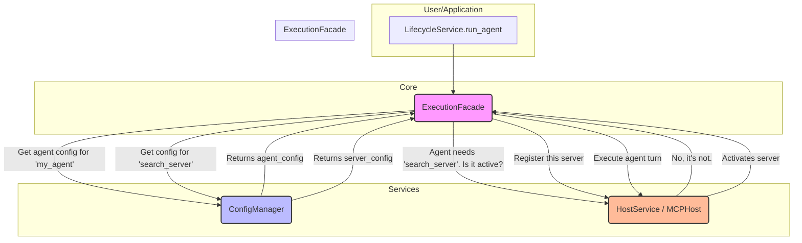

# Design Document: Configuration & Lifecycle System

**Version:** 1.1
**Date:** 2025-07-06
**Author(s):** Gemini, Ryan
**Status:** Active

## 1. Overview & Goals

This document outlines the architecture of the Aurite framework's configuration and application lifecycle management systems.

The primary goals of this architecture are:

1.  **Flexibility & Extensibility:** Support for hierarchical configuration loading across user, workspace, and project contexts, using multiple file formats (JSON, YAML).
2.  **Single Responsibility Principle (SRP):** Decompose the application into smaller, focused services, each with a single, clear purpose.
3.  **Efficiency & Performance:** Implement Lazy / Just-in-Time (JIT) component registration to avoid costly upfront loading and to activate components only when they are needed.

## 2. Core Services

The architecture is composed of three distinct, loosely coupled services, orchestrated by an `ExecutionFacade`.

### 2.1. The `ConfigManager`

*   **Responsibility:** To be the single source of truth for discovering, loading, parsing, and providing access to raw configuration data. It understands the hierarchical relationship between workspaces, projects, and the user's global settings, but does not manage runtime state.
*   **Key Features:**
    *   **Hierarchical Context Discovery:** The `ConfigManager` searches upwards from the current directory for `.aurite` anchor files. These files define the context:
        *   `type = "project"`: Marks the root of a single project.
        *   `type = "workspace"`: Marks the root of a workspace, which can contain multiple projects.
    *   **Configuration Source Inclusion:** The `.aurite` files specify which directories to scan for configurations using the `include_configs = ["path/to/config"]` key. This allows for flexible organization of component files.
    *   **Priority-Based Loading:** Configurations are loaded with the following precedence (lowest to highest):
        1.  User global config (`~/.aurite/`)
        2.  Workspace config (from workspace `.aurite`)
        3.  Project config (from project `.aurite`)
        A component defined in a project will override one with the same name from a workspace.
    *   **Component Indexing:** The manager scans all `.json` and `.yaml` files in the source directories. It intelligently parses them to identify all defined components (e.g., `agents`, `llms`) and builds an in-memory index.
    *   **Dynamic Reloading:** An environment variable, `AURITE_CONFIG_FORCE_REFRESH=true` (default), forces the configuration index to be rebuilt on every access, which is ideal for development.
*   **Core API:**
    *   `get_config(component_type: str, component_id: str) -> Optional[Dict[str, Any]]`
    *   `list_configs(component_type: str) -> List[Dict[str, Any]]`
    *   `refresh()`

### 2.2. The `HostService` (`MCPHost`)

*   **Responsibility:** To manage the lifecycle and interaction of **active** MCP servers and their runtime components (tools, prompts, resources). It is the core runtime engine.
*   **Key Features:**
    *   **Dynamic Registration:** Exposes a clear API to register and unregister MCP servers on the fly.
    *   **Decoupled from Configuration:** It has no knowledge of configuration files or loading logic. It only accepts fully-formed `ClientConfig` objects for registration.
*   **Core API:**
    *   `register_client(client_config: ClientConfig)`
    *   `unregister_client(client_id: str)`
    *   `execute_tool(...)`
    *   `get_prompt(...)`
    *   `read_resource(...)`

### 2.3. The Lifecycle Service (`Aurite` class)

*   **Responsibility:** To be the primary, simplified, and user-facing entrypoint for the application. It initializes and holds references to the other services and delegates all complex operations.
*   **Key Features:**
    *   **Service Initialization:** Its primary constructor role is to instantiate the `ConfigManager`, `HostService`, and `ExecutionFacade`.
    *   **Execution Delegation:** It exposes the main user-facing methods (`run_agent`, `run_workflow`) but immediately passes these calls to the `ExecutionFacade`.
    *   **Minimal Logic:** It contains almost no business logic itself, acting as a clean composition root for the framework's services.
*   **Core API:**
    *   `run_agent(...)`
    *   `run_workflow(...)`
    *   `shutdown()`

## 3. The `ExecutionFacade`: The JIT Engine

The `ExecutionFacade` is the central hub for implementing Just-in-Time (JIT) registration, bridging the gap between configuration and runtime.

*   **Responsibility:** Before executing a component (e.g., an Agent), the facade ensures all of that component's dependencies (e.g., its required MCP servers) are actively registered with the `HostService`.
*   **Execution Workflow:**
    1.  A call to `LifecycleService.run_agent("my_agent", ...)` is made.
    2.  The call is immediately delegated to `ExecutionFacade.run_agent("my_agent", ...)`.
    3.  The `ExecutionFacade` uses the `ConfigManager` to fetch the raw configuration for the component with ID `"my_agent"`.
    4.  It inspects the agent's configuration to identify its list of required MCP servers (e.g., `["search_server", "database_server"]`).
    5.  For each required server ID, it queries the `HostService` to check if that server is already registered and active.
    6.  If a server is **not** active, the facade requests the server's configuration from the `ConfigManager` and uses it to call `HostService.register_client(...)`, activating it just-in-time.
    7.  Once all dependencies are confirmed to be active in the `HostService`, the `ExecutionFacade` proceeds with the agent execution turn.

## 4. Architectural Flow Diagram

This diagram illustrates the JIT registration and execution flow for an agent run.

