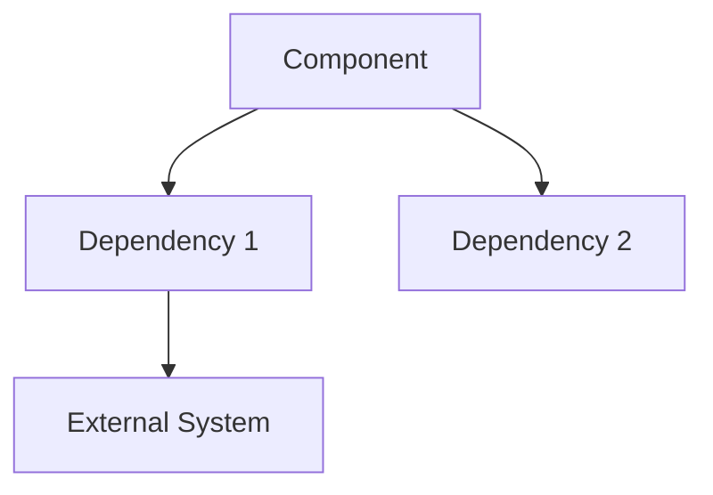
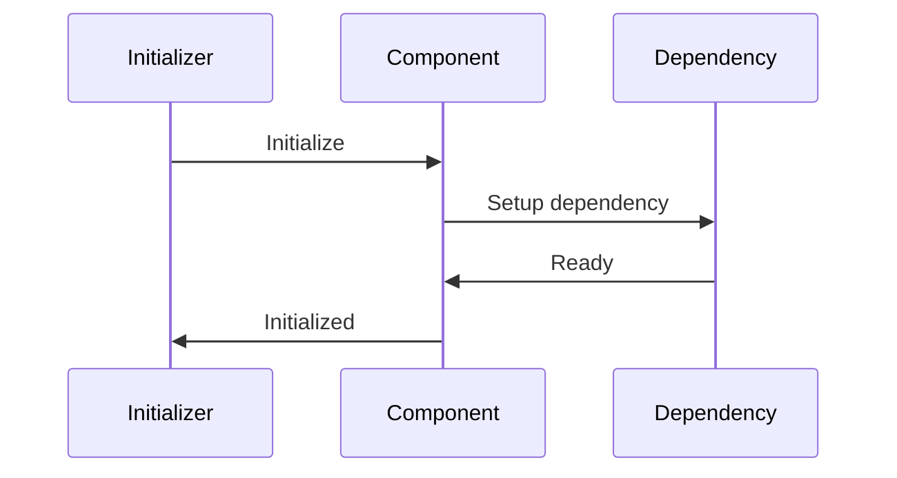

# [Component Name] Design

**Version:** 1.0
**Date:** YYYY-MM-DD

## 1. Overview

Brief description of the component's purpose and role in the framework. Explain what problem this component solves and its position in the overall architecture.

## 2. Architecture

High-level component structure diagram and key relationships.



## 3. Core Responsibilities

<!-- prettier-ignore -->
!!! info "Primary Functions"
    - **Responsibility 1**: What this component does
    - **Responsibility 2**: Another key function
    - **Responsibility 3**: Additional capability

<!-- prettier-ignore -->
!!! warning "What This Component Does NOT Do"
    - Clarify boundaries and limitations
    - Prevent common misconceptions

## 4. Key Classes & Interfaces

### Core Implementation

??? abstract "Source code in `path/to/main/file.py`"

    **`[MainClassName]` Class:**

    - Purpose and role in the component
    - Key responsibilities and behavior
    - Integration points with other classes

    **Key Methods:**

    ```python
    def key_method(self, param: Type) -> ReturnType:
        """Brief description of what this method does."""
        pass

    async def async_method(self, param: Type) -> ReturnType:
        """Description of async method."""
        pass
    ```

??? abstract "Source code in `path/to/supporting/file.py`"

    **`[SupportingClassName]` Class:**

    - Supporting functionality description
    - How it integrates with the main class
    - Specific responsibilities

### Supporting Components

??? abstract "Source code in `path/to/helper/file.py`"

    **`[HelperClassName]` Class:**

    - Helper functionality description
    - When and how it's used
    - Key methods and properties

## 5. Configuration & Dependencies

### Configuration

How the component is configured:

```python
# Example configuration
config = {
    "setting_1": "value",
    "setting_2": 42,
    "nested_config": {
        "option": True
    }
}
```

### Dependencies

- **[Dependency 1]**: What it provides and how it's used
- **[Dependency 2]**: Another dependency description
- **Optional Dependencies**: Components that enhance functionality when available

## 6. Integration Points

### Initialization Flow



### Key Integration Patterns

<!-- prettier-ignore -->
!!! tip "Integration with [Other Component]"
    Describe how this component integrates with other parts of the framework.

    - **Data flow**: How information moves between components
    - **Method calls**: Key interaction patterns
    - **Event handling**: How events are processed

## 7. Implementation Notes

### Design Decisions

<!-- prettier-ignore -->
!!! note "Key Design Patterns"
    - **Pattern 1**: Why this pattern was chosen and its benefits
    - **Pattern 2**: Another important design decision
    - **Trade-offs**: What was sacrificed for what benefits

### Performance Considerations

- **Optimization 1**: Performance improvement and its impact
- **Memory usage**: How the component manages memory
- **Scalability**: How it handles increased load

### Error Handling

```python
# Example error handling pattern
try:
    result = component.operation()
except SpecificError as e:
    logger.error(f"Operation failed: {e}")
    # Graceful degradation
    result = fallback_operation()
```

## 8. Examples

### Basic Usage

```python
# Initialize the component
component = ComponentClass(config)

# Basic operation
result = await component.main_operation(input_data)

# Handle result
if result.success:
    process_result(result.data)
```

### Advanced Usage

```python
# Advanced configuration
advanced_config = {
    "feature_flags": {"advanced_mode": True},
    "performance_tuning": {"cache_size": 1000}
}

component = ComponentClass(advanced_config)

# Complex operation with error handling
try:
    async with component.context_manager() as ctx:
        result = await ctx.complex_operation(
            param1=value1,
            param2=value2
        )
except ComponentError as e:
    handle_component_error(e)
```

## 9. Testing

### Test Strategy

- **Unit Tests**: Testing individual methods and classes
- **Integration Tests**: Testing component interactions
- **Performance Tests**: Validating performance requirements

### Key Test Scenarios

```python
# Example test case
async def test_main_functionality():
    component = ComponentClass(test_config)
    result = await component.main_operation(test_input)
    assert result.success
    assert result.data == expected_output
```
