# MCP Host Design

**Version:** 1.0
**Date:** 2025-08-02

## Overview

The MCP Host is a core execution layer component that provides a secure, unified interface for accessing distributed tools, prompts, and resources from external MCP (Model Context Protocol) servers. It solves the problem of distributed tool and resource management through Just-in-Time (JIT) server registration, unified component access, and comprehensive security filtering.

**Key Problem Solved**: Distributed tool and resource management with dynamic server registration, unified component access, and comprehensive security filtering.

## Architecture

```mermaid
graph TD
    A[MCPHost] --> B[Foundation Layer]
    A --> C[Resource Layer]
    A --> D[Session Management]

    B --> E[SecurityManager]
    B --> F[MessageRouter]
    B --> G[RootManager]
    B --> H[FilteringManager]

    C --> I[ToolManager]
    C --> J[PromptManager]
    C --> K[ResourceManager]

    D --> L[ClientSessions]
    D --> M[AsyncExitStack]
    D --> N[Component Discovery]

    style A fill:#2196F3,stroke:#1976D2,stroke-width:2px,color:#fff
    style B fill:#FF9800,stroke:#F57C00,stroke-width:2px,color:#fff
    style C fill:#FF9800,stroke:#F57C00,stroke-width:2px,color:#fff
    style D fill:#FF9800,stroke:#F57C00,stroke-width:2px,color:#fff
    style E fill:#4CAF50,stroke:#388E3C,stroke-width:2px,color:#fff
    style F fill:#4CAF50,stroke:#388E3C,stroke-width:2px,color:#fff
    style G fill:#4CAF50,stroke:#388E3C,stroke-width:2px,color:#fff
    style H fill:#4CAF50,stroke:#388E3C,stroke-width:2px,color:#fff
    style I fill:#607D8B,stroke:#455A64,stroke-width:2px,color:#fff
    style J fill:#607D8B,stroke:#455A64,stroke-width:2px,color:#fff
    style K fill:#607D8B,stroke:#455A64,stroke-width:2px,color:#fff
    style L fill:#9C27B0,stroke:#7B1FA2,stroke-width:2px,color:#fff
    style M fill:#9C27B0,stroke:#7B1FA2,stroke-width:2px,color:#fff
    style N fill:#9C27B0,stroke:#7B1FA2,stroke-width:2px,color:#fff
```

## Core Responsibilities

<!-- prettier-ignore -->
!!! info "Primary Functions"
    - **Session Management**: Manages MCP client session lifecycles with proper resource cleanup
    - **Just-in-Time Registration**: Dynamically registers servers based on agent requirements
    - **Component Discovery**: Automatically discovers and indexes tools, prompts, and resources
    - **Security & Filtering**: Enforces access control based on agent configurations and global rules
    - **Unified Interface**: Provides consistent API for tool execution and component access
    - **Transport Abstraction**: Supports multiple transport types (stdio, local, http_stream)
    - **Error Handling**: Comprehensive timeout and error management with graceful degradation

<!-- prettier-ignore -->
!!! warning "What This Component Does NOT Do"
    - Does not manage component configurations (that's the ConfigManager's job)
    - Does not execute agents or workflows (that's the AuriteEngine's responsibility)
    - Does not handle LLM communications directly

## Key Components

### Foundation Layer

=== "SecurityManager"

    **Purpose**: Manages encryption keys and credential resolution from multiple sources

    **Key Features**:
    - Environment variable substitution with placeholder resolution
    - GCP Secret Manager integration for secure credential storage
    - Encrypted storage support for sensitive configuration data
    - Multi-source credential resolution with fallback mechanisms

    **Integration**: Used during Phase 1 (Configuration Resolution) to resolve encrypted credentials and environment variables in server configurations.

=== "MessageRouter"

    **Purpose**: Maintains component-to-session mappings for efficient request routing

    **Key Features**:
    - Component-to-session mapping registry for fast lookup
    - Efficient routing during tool execution with O(1) lookup time
    - Session lifecycle tracking for proper cleanup
    - Support for dynamic component registration and unregistration

    **Integration**: Updated during Phase 5 (Component Registration) and used during tool execution for session routing.

=== "RootManager"

    **Purpose**: Enforces hierarchical access control for MCP resources

    **Key Features**:
    - URI pattern-based access control validation
    - Hierarchical resource permission checking
    - Resource access policy enforcement
    - Integration with agent-specific access rules

    **Integration**: Used during Phase 4 (Component Discovery) to validate resource access permissions before registration.

=== "FilteringManager"

    **Purpose**: Applies filtering rules to ensure proper access control

    **Key Features**:
    - Global filtering rules from ClientConfig
    - Agent-specific filtering rules from AgentConfig
    - Component-level access control enforcement
    - Dynamic filtering rule application

    **Integration**: Applied throughout the registration process and during component access to enforce security policies.

### Resource Layer

=== "ToolManager"

    **Purpose**: Manages tool discovery, registration, and execution

    **Key Features**:
    - Tool discovery and metadata extraction from MCP servers
    - Server prefix application for unique tool naming
    - Timeout handling and execution management
    - LLM-compatible tool formatting for agent consumption

    **Integration**: Handles tool registration during Phase 4 and provides tool execution interface for agents.

=== "PromptManager"

    **Purpose**: Stores and manages discovered prompt definitions

    **Key Features**:
    - Prompt template storage and lifecycle management
    - Parameter substitution support for dynamic prompts
    - Server prefix application for unique prompt naming
    - Filtering and access control integration

    **Integration**: Manages prompt registration during Phase 4 and provides prompt access interface for agents.

=== "ResourceManager"

    **Purpose**: Manages resource discovery with access control validation

    **Key Features**:
    - Resource discovery and metadata extraction
    - URI-based access control validation through RootManager
    - Resource lifecycle management and cleanup
    - Integration with agent-specific resource permissions

    **Integration**: Handles resource registration during Phase 4 with proper access control validation.

## Core Concepts

=== "Registration Triggers"

    **Static Registration**: Servers registered during MCPHost initialization

    - Occurs during system startup or explicit initialization
    - Pre-loads commonly used servers for immediate availability
    - Reduces latency for frequently accessed tools and resources
    - Suitable for core infrastructure servers

    **Just-in-Time (JIT) Registration**: Servers registered dynamically when needed by agents

    - Triggered by agent execution requirements
    - Optimizes resource usage by loading only needed servers
    - Enables dynamic scaling based on actual usage patterns
    - Supports agent-specific server configurations

=== "Transport Types"

    **STDIO Transport**: Local Python subprocess communication via stdin/stdout

    - Best for: Local Python-based MCP servers
    - Communication: Direct subprocess stdin/stdout streams
    - Performance: Low latency, high throughput
    - Use cases: File system tools, local data processing, development servers

    **Local Command Transport**: Execute local commands with environment variable substitution

    - Best for: Non-Python local executables (Node.js, Go, Rust, etc.)
    - Communication: Command execution with argument passing
    - Performance: Medium latency, good throughput
    - Use cases: System utilities, compiled tools, cross-language integration

    **HTTP Stream Transport**: Remote server communication via HTTP streaming protocols

    - Best for: Remote MCP servers, cloud services, distributed systems
    - Communication: HTTP with Server-Sent Events (SSE) for streaming
    - Performance: Higher latency, network-dependent throughput
    - Use cases: Cloud APIs, remote databases, distributed microservices

=== "Component Discovery"

    After successful registration, the system automatically discovers and indexes:

    **Tools**: Executable functions with timeout and metadata support

    - Discovered via `session.list_tools()` MCP protocol call
    - Prefixed with server name to prevent naming conflicts
    - Enhanced with timeout metadata for execution management
    - Formatted for LLM consumption with proper schemas

    **Prompts**: Reusable prompt templates with parameter substitution

    - Discovered via `session.list_prompts()` MCP protocol call
    - Support dynamic parameter substitution for flexible usage
    - Managed with lifecycle tracking and filtering
    - Integrated with agent-specific access controls

    **Resources**: File and data resources with URI-based access control

    - Discovered via `session.list_resources()` MCP protocol call
    - Validated through RootManager for hierarchical access control
    - Support various URI schemes (file://, http://, custom protocols)
    - Integrated with agent-specific resource permissions

## Server Registration Process

The MCP Host uses a comprehensive five-phase registration process to establish connections with external MCP servers and discover their capabilities. This process ensures reliable server registration, proper component discovery, and robust error handling.

**Registration Phases Overview**:

1. **Configuration Resolution**: Retrieve and validate server configuration with credential resolution
2. **Transport Establishment**: Establish appropriate transport connection based on server configuration
3. **MCP Session Initialization**: Create MCP client session and perform protocol handshake
4. **Component Discovery**: Query MCP server for available tools, prompts, and resources
5. **Component Registration**: Register discovered components with internal registries and update routing tables

Each phase must complete successfully before proceeding to the next phase, ensuring reliable server registration and proper error handling.

> 📋 **Detailed Registration Process**: See [MCP Server Registration Flow](../flow/mcp_server_registration_flow.md) for complete implementation details, phase-by-phase breakdowns, code examples, and error handling patterns.

## Key Design Patterns

### Session Lifecycle Management

The MCPHost uses AsyncExitStack for robust session lifecycle management with guaranteed cleanup on failure. Sessions are stored with their exit stacks for proper resource management.

### Component Registration

Registration creates multiple data structures:

- Component storage (by type): `{tools: {name: Tool}, prompts: {name: Prompt}, resources: {name: Resource}}`
- Session routing (for execution): `{tool_to_session: {name: ClientSession}}`
- MessageRouter mappings for fast lookup during tool execution

### Unregistration Process

Dynamic server unregistration removes all components from the server and cleans up all associated resources through the stored AsyncExitStack.

## Error Handling

The MCP Host implements comprehensive error handling patterns following the framework's standardized patterns:

- **Timeout Errors**: Registration timeouts, tool execution timeouts, and session initialization timeouts
- **Connection Errors**: Transport establishment failures, network connectivity issues, and server startup failures
- **Configuration Errors**: Invalid transport configurations, missing required fields, and credential resolution failures
- **Resource Cleanup Errors**: Session cleanup failures and AsyncExitStack management

## Configuration Integration

The MCP Host consumes server configurations provided by the ConfigManager. All configuration examples, validation patterns, and integration scenarios are documented in the ConfigManager flow documentation.

> 📋 **Configuration Reference**: See [Configuration Examples Reference](../reference/config_examples.md) for comprehensive configuration examples, transport-specific patterns, and validation examples.

## Integration Points

<!-- prettier-ignore -->
!!! tip "Integration with AuriteEngine"
    The MCP Host serves as the primary tool and resource provider for the AuriteEngine, enabling dynamic agent capabilities:

    **Just-in-Time Registration**: The AuriteEngine triggers server registration based on agent requirements. When an agent is executed, the engine analyzes the agent's `mcp_servers` configuration and calls the MCP Host to register any servers that aren't already active. This ensures optimal resource usage by only loading servers when needed.

    **Tool Execution**: During agent execution, the AuriteEngine calls the MCP Host to execute tools with proper session routing. The MCP Host's MessageRouter provides O(1) lookup to route tool calls to the correct MCP server session, handling timeout management and error recovery transparently.

    **Resource Access**: Agents can access MCP resources (files, databases, APIs) through the MCP Host's unified interface. The RootManager enforces hierarchical access control, ensuring agents can only access resources they're authorized to use based on their configuration.

    **Component Discovery**: The MCP Host automatically discovers and indexes all available tools, prompts, and resources from registered servers, making them available to the AuriteEngine for agent execution. Components are prefixed with server names to prevent conflicts and preserve original names for display purposes.

    **Security & Filtering**: The FilteringManager applies both global and agent-specific filtering rules, ensuring that agents only have access to the tools and resources appropriate for their role and security context.

## References

- **Implementation**: `src/aurite/execution/mcp_host.py`
- **Configuration Examples**: [Configuration Examples Reference](../reference/config_examples.md)
- **Flow Details**: [MCP Server Registration Flow](../flow/mcp_server_registration_flow.md)
