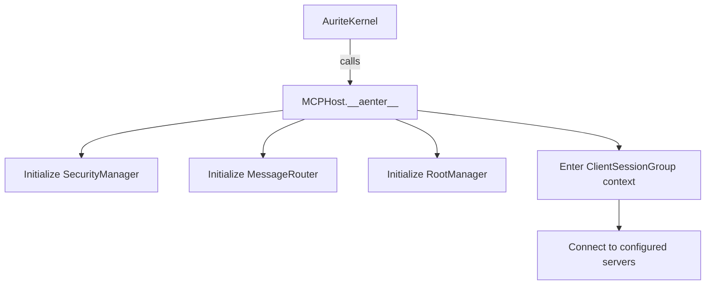
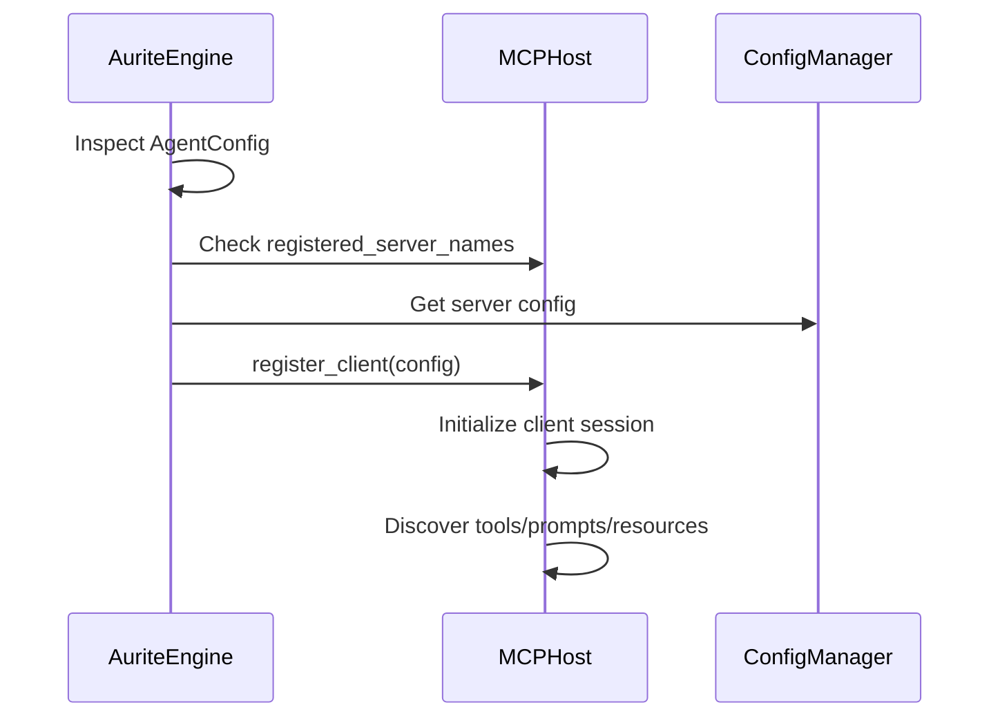
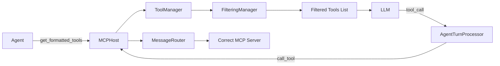

# MCP Host System (Execution Layer Component)

**Version:** 2.0
**Date:** 2025-08-02

## 1. Overview

The MCP Host System is a core component of the Aurite framework's execution layer. Its primary responsibility is to manage connections with external Model Context Protocol (MCP) servers and provide a secure, unified interface for accessing their capabilities (tools, prompts, resources). It acts as the bridge between the higher-level orchestration components and the individual MCP servers.

The lifecycle of the `MCPHost` is managed by the `AuriteKernel` (in `aurite.py`), which ensures that the host is initialized on-demand and shut down gracefully. During runtime, the primary consumer of the Host's services is the `AuriteEngine`, which brokers requests from agents and workflows.

Key responsibilities include:

- Managing the lifecycle of client connections via the `mcp.client.ClientSessionGroup`.
- Discovering and registering components (tools, prompts, resources) offered by connected MCP servers.
- Providing dedicated managers (`ToolManager`, `PromptManager`, `ResourceManager`) for interacting with specific component types.
- Implementing filtering mechanisms based on `ClientConfig` (global exclusions) and `AgentConfig` (agent-specific access).
- Handling credential management and security via the `SecurityManager`.
- Routing requests to the appropriate MCP server based on component availability and configuration (`MessageRouter`).
- Enforcing access control based on defined MCP roots (`RootManager`).

The Host System is structured internally into two sub-layers:

- **Foundation Layer:** Provides core services like security, routing, and root management.
- **Resource Layer:** Builds upon the foundation to manage specific MCP component types.

## 2. Relevant Files

| File Path                                              | Primary Class(es)  | Core Responsibility                                                                 |
| :----------------------------------------------------- | :----------------- | :---------------------------------------------------------------------------------- |
| `src/aurite/execution/mcp_host/mcp_host.py`            | `MCPHost`          | Main entrypoint, orchestrates managers, and manages client sessions.                |
| `src/aurite/lib/models/config/components.py`           | Config Models      | Pydantic models for `HostConfig`, `ClientConfig`, `AgentConfig`, `RootConfig`, etc. |
| `src/aurite/execution/mcp_host/filtering.py`           | `FilteringManager` | Centralized logic for applying `ClientConfig` and `AgentConfig` filtering rules.    |
| **Foundation Layer**                                   |                    |                                                                                     |
| `src/aurite/execution/mcp_host/foundation/security.py` | `SecurityManager`  | Manages encryption and credential resolution (e.g., from environment or GCP).       |
| `src/aurite/execution/mcp_host/foundation/routing.py`  | `MessageRouter`    | Maps components to clients and routes requests accordingly.                         |
| `src/aurite/execution/mcp_host/foundation/roots.py`    | `RootManager`      | Manages MCP root definitions for client access control.                             |
| **Resource Layer**                                     |                    |                                                                                     |
| `src/aurite/execution/mcp_host/resources/prompts.py`   | `PromptManager`    | Manages prompt definitions discovered from clients.                                 |
| `src/aurite/execution/mcp_host/resources/resources.py` | `ResourceManager`  | Manages resource definitions discovered from clients.                               |
| `src/aurite/execution/mcp_host/resources/tools.py`     | `ToolManager`      | Manages tool definitions, formats them for LLMs, and handles execution.             |

## 3. Functionality

This layer provides the core infrastructure for interacting with MCP servers.

**3.1. Multi-File Interactions & Core Flows:**

### Initialization Flow



!!! info "Initialization Process"
**Initialization (`MCPHost.__aenter__`):**

    - Triggered by `AuriteKernel` (in `aurite.py`) when the framework is first used
    - Initializes all managers (`SecurityManager`, `MessageRouter`, etc.)
    - Enters the `ClientSessionGroup` context, preparing for client connections
    - Connects to all servers defined in the `HostConfig`

### Just-in-Time Server Registration



!!! tip "JIT Registration Benefits"
**Just-in-Time (JIT) Server Registration (`AuriteEngine` → `MCPHost.register_client`):**

    - When an agent run begins, the `AuriteEngine` inspects the `AgentConfig`
    - If the `AgentConfig` specifies `mcp_servers` that are not yet active, the `AuriteEngine` retrieves their configurations
    - It then calls `MCPHost.register_client` for each required server, making them available for the agent's use
    - This approach minimizes resource usage by only connecting to servers when needed

### Tool Execution Flow



!!! note "Security & Filtering"
**Tool Formatting & Execution:**

    1. **Tool Formatting (`Agent` → `MCPHost.get_formatted_tools`):**
        - Before an agent turn, the `Agent` class calls `MCPHost.get_formatted_tools`, passing its `AgentConfig`
        - The `MCPHost` delegates to the `ToolManager`, which uses the `FilteringManager` to produce a list of tools that respects the agent's specific permissions
        - This filtered list is then provided to the LLM

    2. **Tool Execution (`AgentTurnProcessor` → `MCPHost.call_tool`):**
        - After the LLM indicates a tool call, the `AgentTurnProcessor` is responsible for fulfilling the request
        - It calls `MCPHost.call_tool` with the tool name and arguments
        - The `MCPHost` uses the `MessageRouter` to find which client provides the tool
        - It applies filtering based on the agent's configuration to ensure access is permitted
        - Finally, it delegates the execution to the `ToolManager`, which sends the request to the correct MCP server via its `ClientSession`

**3.2. Individual File Functionality:**

### Core Host Implementation

??? abstract "Source code in `execution/mcp_host/mcp_host.py`"

    **`MCPHost` Class:**

    - Acts as the central facade for the MCP Host system, managed by `AuriteKernel`
    - Orchestrates the initialization and shutdown of all managers
    - Delegates client lifecycle management to `ClientSessionGroup`
    - Provides the public API (`get_formatted_tools`, `call_tool`, `register_client`) for orchestration layer components

    **Key Methods:**

    ```python
    async def call_tool(self, name: str, args: dict[str, Any], agent_config: Optional[AgentConfig] = None) -> types.CallToolResult
    async def register_client(self, config: ClientConfig)
    def get_formatted_tools(self, agent_config: Optional[AgentConfig] = None, tool_names: Optional[List[str]] = None) -> List[Dict[str, Any]]
    ```

??? abstract "Source code in `execution/mcp_host/filtering.py`"

    **`FilteringManager` Class:**

    - Contains stateless methods for applying filtering logic based on `ClientConfig` (global rules) and `AgentConfig` (agent-specific rules)
    - Ensures agents only access tools and resources they're permitted to use
    - Applies both server-level and component-level filtering rules

### Foundation Layer

??? abstract "Source code in `execution/mcp_host/foundation/security.py`"

    **`SecurityManager` Class:**

    - Manages the encryption key (`AURITE_MCP_ENCRYPTION_KEY`)
    - Resolves and decrypts credentials from various sources (environment variables, GCP Secret Manager)
    - Handles credential masking for logging and debugging

    !!! warning "Production Security"
        It is crucial for production to set the `AURITE_MCP_ENCRYPTION_KEY` environment variable for persistent, secure encryption.

??? abstract "Source code in `execution/mcp_host/foundation/routing.py`"

    **`MessageRouter` Class:**

    - Maintains a mapping of components (tools, prompts, resources) to the client IDs that provide them
    - Used by `MCPHost` to determine where to send execution requests
    - Enables efficient routing of requests to the correct MCP server

??? abstract "Source code in `execution/mcp_host/foundation/roots.py`"

    **`RootManager` Class:**

    - Stores `RootConfig` definitions to enforce access control for resources based on their URIs
    - Validates resource access permissions before allowing operations
    - Manages hierarchical access control for MCP resources

### Resource Layer

??? abstract "Source code in `execution/mcp_host/resources/prompts.py`"

    **`PromptManager` Class:**

    - Stores and manages discovered `mcp.types.Prompt` definitions from each client
    - Handles prompt registration, retrieval, and lifecycle management
    - Applies filtering rules for agent-specific prompt access

??? abstract "Source code in `execution/mcp_host/resources/resources.py`"

    **`ResourceManager` Class:**

    - Stores and manages discovered `mcp.types.Resource` definitions
    - Checks access permissions against the `RootManager` before allowing resource operations
    - Handles resource discovery, registration, and access control

??? abstract "Source code in `execution/mcp_host/resources/tools.py`"

    **`ToolManager` Class:**

    - Stores discovered `mcp.types.Tool` definitions from connected MCP servers
    - Handles tool registration, execution requests, and formatting tools for LLM consumption
    - Applies filtering logic to ensure agents only access permitted tools
    - Manages tool timeouts and error handling during execution

## 4. Testing

**4.A. Testing Overview:**

- **Execution:** Tests for this layer are marked with `host`, `host_unit`, or `host_integration` and run via `pytest -m host`.
- **Location:** Tests reside within the `tests/host/` directory, organized into subdirectories mirroring the `src/host/` structure (e.g., `tests/host/foundation/`, `tests/host/resources/`).
- **Approach:** Testing focuses on verifying the core responsibilities of the Host System through:
  - **Unit Tests:** Isolating and testing specific methods within `MCPHost` and each Manager (`FilteringManager`, `SecurityManager`, `MessageRouter`, `RootManager`, `PromptManager`, `ResourceManager`, `ToolManager`). Mocks are used for dependencies.
  - **Integration Tests:** Verifying interactions _between_ components within this layer (e.g., `MCPHost` -> `FilteringManager` -> `ToolManager` -> `MessageRouter`) using the `aurite` fixture (which provides a real `MCPHost` connected to dummy servers). These tests validate the end-to-end flow for initialization, component registration, filtering, and execution requests within the Host layer.

**4.B. Testing Infrastructure:**

- **`tests/conftest.py`:** (Global) Contains global pytest configuration, markers (`host`, `host_unit`, `host_integration`, etc.), `anyio_backend` setting.
- **`tests/conftest.py`:** (Global) Contains shared fixtures available to all tests, including:
  - `host_config`: A default `HostConfig` instance.
  - `mock_client_session_group`: A mocked `ClientSessionGroup`.
- **`tests/unit/host/conftest.py`:** (Host Layer Specific) Provides shared mock fixtures used across unit tests in `tests/unit/host/`:
  - `mock_message_router`: Mocked `MessageRouter`.
  - `mock_filtering_manager`: Mocked `FilteringManager`.
  - `mock_root_manager`: Mocked `RootManager`.
- **`tests/fixtures/host_fixtures.py`:**
  - `aurite`: Crucial **function-scoped** integration fixture initializing `HostManager` -> `MCPHost` with `testing_config.json` and dummy servers. Essential for integration tests.
  - `mock_mcp_host`: Mock `MCPHost` for Layer 2 unit tests.
  - `mock_host_config`: Basic `HostConfig` mock.
- **`tests/fixtures/agent_fixtures.py`:** Provides various `AgentConfig` instances needed for testing filtering logic (e.g., `minimal_agent_config`, `agent_config_filtered`).
- **`tests/fixtures/servers/`:** Contains dummy MCP server implementations (`weather_mcp_server.py`, `planning_server.py`, `env_check_server.py`) used by the `aurite` fixture.
- **`tests/mocks/`:** Contains mocks like `mock_gcp_secret_client` (used within `test_security_manager.py`) and potentially others.
- **`pytestmark = pytest.mark.anyio`:** Used at the module level for async tests.

**4.C. Testing Coverage (Completed):**

| Functionality                                        | Relevant File(s)                    | Test File(s) / Status                                                                                                                                                                                                                                                   |
| :--------------------------------------------------- | :---------------------------------- | :---------------------------------------------------------------------------------------------------------------------------------------------------------------------------------------------------------------------------------------------------------------------- |
| **MCPHost: `__init__` & Basic State**                | `host.py`                           | `tests/host/test_host_basic.py`. **Coverage: Good.**                                                                                                                                                                                                                    |
| **MCPHost: `initialize()` (Success)**                | `host.py`, Managers, `mcp` lib      | `tests/host/test_host_basic_e2e.py` (via `aurite`). **Coverage: Good (E2E).**                                                                                                                                                                                           |
| **MCPHost: `initialize()` (Error Handling)**         | `host.py`, Managers                 | `tests/host/test_host_lifecycle.py` (Client connection error, Manager init error). **Coverage: Good.**                                                                                                                                                                  |
| **MCPHost: `_initialize_client` (Secret Injection)** | `host.py`, `security.py`            | `tests/host/foundation/test_security_manager.py` (Mocked GCP), `tests/host/test_host_basic_e2e.py` (Implicit E2E via `aurite` if secrets were in `testing_config.json`). **Coverage: Good (Mechanism).**                                                                |
| **MCPHost: `shutdown()`**                            | `host.py`, Managers                 | `tests/host/test_host_lifecycle.py`. **Coverage: Good.**                                                                                                                                                                                                                |
| **MCPHost: `register_client()` (Dynamic)**           | `host.py`                           | `tests/host/test_host_dynamic_registration.py` (Integration via `aurite`). **Coverage: Good.**                                                                                                                                                                          |
| **MCPHost: Filtering Application**                   | `host.py`, `filtering.py`, Managers | `tests/host/filtering/test_filtering.py` (Integration tests for `get_formatted_tools`, `execute_tool`, `get_prompt`, `read_resource`). **Coverage: Good.**                                                                                                              |
| **FilteringManager: Logic**                          | `filtering.py`                      | `tests/host/filtering/test_filtering.py` (Unit tests). **Coverage: Excellent.**                                                                                                                                                                                         |
| **SecurityManager: GCP Secret Resolution**           | `security.py`                       | `tests/host/foundation/test_security_manager.py` (Unit tests mocking GCP client). **Coverage: Good.**                                                                                                                                                                   |
| **SecurityManager: Encryption/Tokens/Masking**       | `security.py`                       | `tests/host/foundation/test_security_manager.py` (Unit tests). **Coverage: Good.**                                                                                                                                                                                      |
| **MessageRouter: Logic**                             | `routing.py`                        | `tests/host/foundation/test_message_router.py` (Unit tests). **Coverage: Excellent.**                                                                                                                                                                                   |
| **RootManager: Logic**                               | `roots.py`                          | `tests/host/foundation/test_root_manager.py` (Unit tests - registration, retrieval, shutdown). `tests/host/resources/test_resource_manager.py` (Unit tests - `validate_access`). **Coverage: Good.**                                                                    |
| **PromptManager: Logic**                             | `prompts.py`                        | `tests/host/resources/test_prompt_manager.py` (Unit tests - registration, retrieval, listing, shutdown). **Coverage: Excellent.**                                                                                                                                       |
| **ResourceManager: Logic**                           | `resources.py`                      | `tests/host/resources/test_resource_manager.py` (Unit tests - registration, retrieval, listing, validation, shutdown). **Coverage: Excellent.**                                                                                                                         |
| **ToolManager: Logic**                               | `tools.py`                          | `tests/host/resources/test_tool_manager.py` (Unit tests - registration, discovery, execution, formatting, shutdown). `tests/host/filtering/test_filtering.py` (Partial integration). `tests/host/test_host_basic_e2e.py` (Partial E2E). **Coverage: Excellent (Unit).** |
