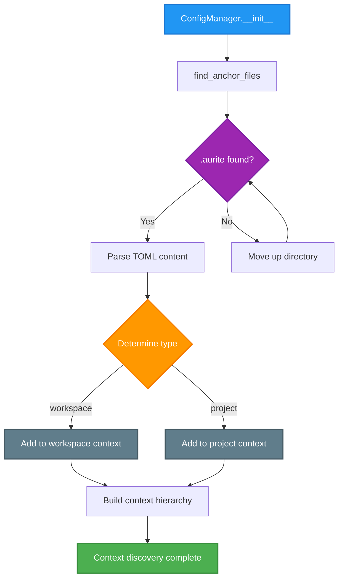
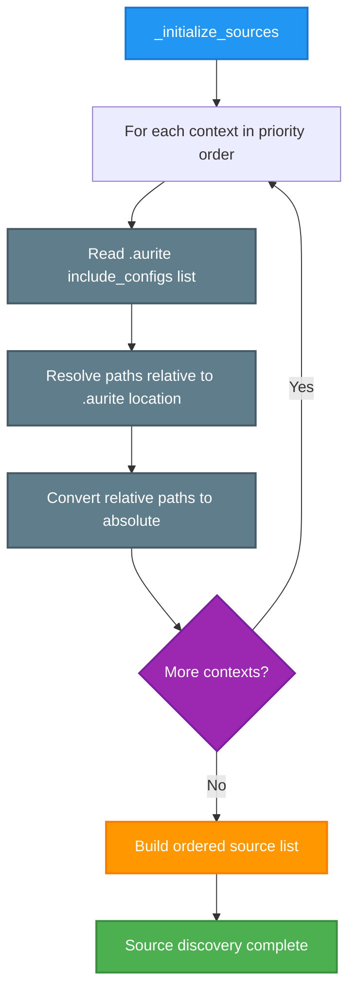
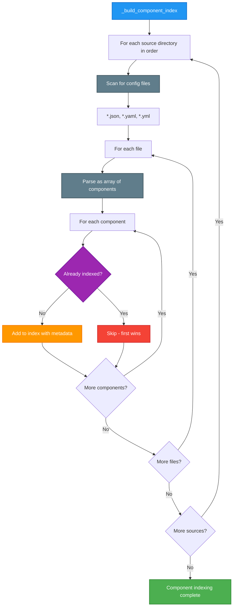

# Configuration Index Building Flow

This document explains how the Aurite Framework builds its configuration index by discovering and processing `.aurite` files throughout the project hierarchy.

## Overview

The configuration system uses a three-phase process to build a comprehensive index of all available components (agents, LLMs, MCP servers, workflows). The system respects a priority hierarchy where the current context (project or workspace) takes precedence.

## Core Concepts

### Priority Principle

**Priority order from highest to lowest:**

1. **In-Memory Registrations** (programmatic components for testing/notebooks)
2. **Current Context** (project if in project, workspace if in workspace)
3. **Shared Configurations** (workspace-level shared configs)
4. **Other Projects** (other projects in workspace, in order)
5. **User Global** (~/.aurite directory)

### File Structure Example

```tree
my_workspace/
├── .aurite
|   # type="workspace"
│   # projects: ["project_alpha", "project_bravo"]
│   # include_configs: ["config"]
│
├── config/
│   ├── agents/
│   │   └── shared_agents.json
│   ├── mcp_servers/
│   │   └── shared_servers.json
│   └── llms/
│       └── company_llms.json
│
├── project_alpha/
│   ├── .aurite
|   |   # type="project"
│   │   # include_configs: ["config", "shared_config"]
│   ├── config/
│   │   ├── agents/
│   │   │   └── alpha_agents.json
│   │   └── workflows/
│   │       └── alpha_workflows.json
│   └── shared_config/
│       └── alpha_shared.json
│
└── project_bravo/
    ├── .aurite
    |   # type="project"
    │   # include_configs: ["config"]
    └── config/
        ├── agents/
        │   └── bravo_agents.json
        └── mcp_servers/
            └── bravo_servers.json
```

## Three-Phase Index Building Process

### Process Overview

The ConfigManager builds its index through three distinct phases, each with specific responsibilities and outcomes. This ensures reliable configuration discovery and proper priority resolution.

### Phase 1: Context Discovery and Ordering

**Objective**: Find all `.aurite` files and establish the configuration hierarchy with proper priority ordering.



=== "Step 1: Search for .aurite files"

    ```python
    def find_anchor_files(start_path: Path) -> List[Path]:
        anchor_files = []
        current_path = start_path.resolve()

        while True:
            anchor_file = current_path / ".aurite"
            if anchor_file.is_file():
                anchor_files.append(anchor_file)

            if current_path.parent == current_path:  # Filesystem root
                break
            current_path = current_path.parent

        return anchor_files  # Ordered from closest to furthest
    ```

=== "Step 2: Parse and categorize"

    ```python
    # Parse each .aurite file to determine context type
    for anchor_path in anchor_files:
        with open(anchor_path, "rb") as f:
            settings = tomllib.load(f).get("aurite", {})

        context_type = settings.get("type")
        if context_type == "project":
            self.project_root = anchor_path.parent
        elif context_type == "workspace":
            self.workspace_root = anchor_path.parent
    ```

=== "Step 3: Build priority hierarchy"

    **Priority Order:**

    **When in PROJECT context:**

    ```
    1. In-Memory (highest)
    2. Current Project
    3. Workspace
    4. Other Projects
    5. User Global (lowest)
    ```

    **When in WORKSPACE context:**

    ```
    1. In-Memory (highest)
    2. Workspace
    3. All Projects
    4. User Global (lowest)
    ```

**Priority Rules:**

=== "When in PROJECT context"

    ```
    1. In-Memory Registrations (highest priority)
    2. Current Project
    3. Workspace (shared configs)
    4. Other Projects (in workspace order)
    5. User Global (~/.aurite)
    ```

=== "When in WORKSPACE context"

    ```
    1. In-Memory Registrations (highest priority)
    2. Workspace
    3. All Projects (in workspace order)
    4. User Global (~/.aurite)
    ```

<!-- prettier-ignore -->
!!! note "In-Memory Registration Priority"
    In-memory registrations always have the highest priority regardless of context. This supports:

    - **Testing Environments**: Override configurations for unit tests
    - **Jupyter Notebooks**: Programmatic component registration for experimentation
    - **Development Workflows**: Temporary configuration overrides without file modifications

**Example Results:**

=== "Running from project_bravo/"

    ```
    Context Order:
    project_bravo → /path/to/my_workspace/project_bravo
    my_workspace → /path/to/my_workspace
    project_alpha → /path/to/my_workspace/project_alpha
    ```

=== "Running from project_alpha/"

    ```
    Context Order:
    project_alpha → /path/to/my_workspace/project_alpha
    my_workspace → /path/to/my_workspace
    project_bravo → /path/to/my_workspace/project_bravo
    ```

=== "Running from my_workspace/"

    ```
    Context Order:
    my_workspace → /path/to/my_workspace
    project_alpha → /path/to/my_workspace/project_alpha
    project_bravo → /path/to/my_workspace/project_bravo
    ```

### Phase 2: Configuration Source Discovery

**Objective**: Extract `include_configs` paths from each `.aurite` file in priority order and build the ordered source list.



**Example Configuration Sources (from project_bravo):**

```
1. /path/to/my_workspace/project_bravo/config        (current project - highest)
2. /path/to/my_workspace/config                      (workspace shared)
3. /path/to/my_workspace/project_alpha/config        (other project)
4. /path/to/my_workspace/project_alpha/shared_config (other project)
5. ~/.aurite                                         (user global - lowest)
```

### Phase 3: Component Indexing

**Objective**: Scan configuration directories and build the final component index with proper conflict resolution.



**Component Metadata:**
Each indexed component includes:

- `_source_file`: Full path to the configuration file
- `_context_path`: Root directory of the context (project/workspace)
- `_context_level`: "project", "workspace", or "user"
- `_project_name`: Name of the project (if applicable)
- `_workspace_name`: Name of the workspace (if applicable)

## Conflict Resolution

When the same component name exists in multiple locations, the **first occurrence wins** based on the priority order.

**Example:**
If "Weather Agent" exists in:

1. `project_bravo/config/agents/agents.json` (when running from project_bravo)
2. `my_workspace/config/agents/shared_agents.json`
3. `project_alpha/config/agents/agents.json`

The version from `project_bravo` will be used because it has the highest priority.

## Use Cases

### Workspace-Level Development

When running commands from the workspace root, workspace configurations take precedence. This is useful for:

- Testing shared components
- Managing workspace-wide settings
- Running administrative tasks

### Project-Level Development

When running commands from a project directory, that project's configurations take precedence. This ensures:

- Project-specific overrides work correctly
- Development is isolated from other projects
- Shared resources are still accessible

## Implementation Details

### Key Methods

1. **`find_anchor_files(start_path)`** - Searches upward for `.aurite` files
2. **`_initialize_sources()`** - Builds the ordered list of configuration sources
3. **`_build_component_index()`** - Scans sources and builds the component index
4. **`_parse_and_index_file()`** - Processes individual configuration files

### Code References

The implementation can be found in:

- `src/aurite/config/config_manager.py` - Main ConfigManager class
- `src/aurite/config/config_utils.py` - Utility functions like `find_anchor_files`

## Best Practices

1. **Organize by Context**: Keep project-specific configs in project directories, shared configs in workspace
2. **Use Descriptive Names**: Avoid naming conflicts by using descriptive component names
3. **Document Overrides**: When overriding a shared component, document why in the component description
4. **Test from Different Contexts**: Verify behavior by running from both project and workspace directories

## Special Features

### In-Memory Registration

In-memory registrations bypass the file system and have the highest priority in the configuration hierarchy.

```python
# Register component with highest priority
config_manager.register_component_in_memory("agent", {
    "name": "test_agent",
    "type": "agent",
    "llm_config_id": "test_llm",
    "system_prompt": "Test agent for unit testing"
})

# This component will override any file-based component with the same name
agent_config = config_manager.get_config("agent", "test_agent")
assert agent_config["_source_file"] == "in-memory"
assert agent_config["_context_level"] == "programmatic"
```

**Use Cases:**

- **Unit Testing**: Override configurations for isolated tests
- **Jupyter Notebooks**: Experiment with configurations interactively
- **Development**: Temporary overrides without file modifications

### LLM Validation Tracking

The system tracks successful LLM operations to provide reliability insights and validation status.

```python
# After successful LLM operation
config_manager.validate_llm("gpt4")

# Check validation status
validation_time = config_manager.get_llm_validation("gpt4")
if validation_time:
    print(f"LLM last validated: {validation_time}")
else:
    print("LLM not yet validated")

# LLM configs include validation status automatically
llm_config = config_manager.get_config("llm", "gpt4")
status = "Validated" if llm_config.get("validated_at") else "Unvalidated"
print(f"Status: {status}")
```

**Important**: When an LLM configuration is updated, its validation timestamp is automatically reset to `None` to ensure accuracy.

### Force Refresh Control

Control when the configuration index is rebuilt for optimal performance in different environments.

```bash
# Development: Force refresh on every operation (default)
export AURITE_CONFIG_FORCE_REFRESH=true

# Production: Disable for performance
export AURITE_CONFIG_FORCE_REFRESH=false
```

```python
def get_config(self, component_type: str, component_id: str):
    if self._force_refresh:
        self.refresh()  # Rebuild entire index

    return self._component_index.get(component_type, {}).get(component_id)
```

**Performance Impact:**

- **Development**: ~10-50ms overhead per operation (acceptable for development)
- **Production**: ~1ms cached lookups (optimal for production workloads)

## Component Operations

The ConfigManager provides comprehensive interfaces for component management, validation, project operations, and file management. Key operation categories include:

- **Configuration Operations**: Component retrieval, listing, and CRUD operations with automatic path resolution
- **Validation System**: Component validation against Pydantic models with detailed error reporting
- **Project Management**: Full project lifecycle management within workspace contexts
- **LLM Validation Tracking**: Reliability monitoring with timestamp-based validation tracking
- **In-Memory Registration**: Programmatic component registration for testing and notebook environments

> 📋 **Method Signatures**: See the ConfigManager source code in `src/aurite/lib/config/config_manager.py` for complete method signatures and implementation details.

## Validation Workflows

The ConfigManager integrates with Pydantic models for comprehensive validation, supporting all component types with detailed error reporting and field-level validation messages.

**Key Validation Features:**

- Automatic model mapping for each component type
- Internal field filtering (removes `_` prefixed metadata fields)
- Detailed error path reporting for nested validation failures
- Duplicate name detection across component types

> 🔧 **Validation Implementation**: See the `_validate_component_config` method in the ConfigManager source code for detailed validation logic.

## Path Resolution

The ConfigManager implements context-aware path resolution for component configurations:

**Resolution Strategy:**

- **MCP Servers**: Resolves `server_path` relative to component's context directory
- **Custom Workflows**: Handles both dot-notation module paths and direct file paths
- **LLM Components**: Injects validation timestamps during resolution
- **Lazy Resolution**: Paths resolved only when configurations are retrieved

> 🔧 **Path Resolution Details**: See the `_resolve_paths_in_config` method in the ConfigManager source code for complete resolution algorithms.

## Development and Testing

### Usage Examples

```python
# Basic component operations
result = config_manager.create_component("agent", new_agent_config, project="target_project")
is_valid, errors = config_manager.validate_component("llm", "my_llm")

# In-memory registration for testing
config_manager.register_component_in_memory("agent", test_agent_config)
agent_config = config_manager.get_config("agent", "test_agent")
```

### Testing Approach

**Key Test Areas**: Hierarchical resolution, component CRUD operations, LLM validation tracking, project management, in-memory registration, and file system integration.

**Performance Targets**: Index building < 100ms, component retrieval < 1ms, file operations < 10ms, memory usage < 5MB.

> 🔧 **Implementation Details**: See ConfigManager source code in `src/aurite/lib/config/config_manager.py` and test files in `tests/unit/config/` for complete examples and patterns.

## Future Considerations

As we implement the file operations API, we'll need to ensure that:

- New files are created in the appropriate context
- The priority system is respected when creating components
- Users can explicitly choose where to place new configurations
- In-memory registrations are properly handled in testing scenarios
- LLM validation states are preserved across configuration refreshes
