# Configuration Index Building Flow

This document explains how the Aurite Framework builds its configuration index by discovering and processing `.aurite` files throughout the project hierarchy.

## Overview

The configuration system uses a three-phase process to build a comprehensive index of all available components (agents, LLMs, MCP servers, workflows). The system respects a priority hierarchy where the current context (project or workspace) takes precedence.

## Core Concepts

### Priority Principle

**Priority order from highest to lowest:**

1. **In-Memory Registrations** (programmatic components for testing/notebooks)
2. **Current Context** (project if in project, workspace if in workspace)
3. **Shared Configurations** (workspace-level shared configs)
4. **Other Projects** (other projects in workspace, in order)
5. **User Global** (~/.aurite directory)

### File Structure Example

```
my_workspace/
├── .aurite                          # type="workspace"
│   # projects: ["project_alpha", "project_bravo"]
│   # include_configs: ["config"]
│
├── config/                          # Workspace-level shared configs
│   ├── agents/
│   │   └── shared_agents.json
│   ├── mcp_servers/
│   │   └── shared_servers.json
│   └── llms/
│       └── company_llms.json
│
├── project_alpha/
│   ├── .aurite                      # type="project"
│   │   # include_configs: ["config", "shared_config"]
│   ├── config/
│   │   ├── agents/
│   │   │   └── alpha_agents.json
│   │   └── workflows/
│   │       └── alpha_workflows.json
│   └── shared_config/
│       └── alpha_shared.json
│
└── project_bravo/
    ├── .aurite                      # type="project"
    │   # include_configs: ["config"]
    └── config/
        ├── agents/
        │   └── bravo_agents.json
        └── mcp_servers/
            └── bravo_servers.json
```

## Three-Phase Index Building Process

<!-- prettier-ignore -->
??? abstract "Process Overview"
    The ConfigManager builds its index through three distinct phases, each with specific responsibilities and outcomes. This ensures reliable configuration discovery and proper priority resolution.

### Phase 1: Context Discovery and Ordering

<!-- prettier-ignore -->
!!! info "Phase 1 Goal"
    🎯 **Objective**: Find all `.aurite` files and establish the configuration hierarchy with proper priority ordering.

```mermaid
flowchart TD
    A[🚀 ConfigManager.__init__] --> B[🔍 find_anchor_files]
    B --> C{📁 .aurite found?}
    C -->|Yes| D[📋 Parse TOML content]
    C -->|No| E[⬆️ Move up directory]
    E --> C
    D --> F{🏷️ Determine type}
    F -->|workspace| G[🏢 Add to workspace context]
    F -->|project| H[📦 Add to project context]
    G --> I[🗂️ Build context hierarchy]
    H --> I
    I --> J[✅ Context discovery complete]

    style A fill:#e1f5fe
    style J fill:#c8e6c9
    style F fill:#fff3e0
```



=== "Step 1: Search for .aurite files"

    ```python
    def find_anchor_files(start_path: Path) -> List[Path]: # (1)
        anchor_files = []
        current_path = start_path.resolve()

        while True:
            anchor_file = current_path / ".aurite" # (2)
            if anchor_file.is_file():
                anchor_files.append(anchor_file) # (3)

            if current_path.parent == current_path: # (4)
                break
            current_path = current_path.parent

        return anchor_files # (5)
    ```

    1. :material-magnify: Searches upward from starting directory
    2. :material-file-search: Looks for `.aurite` file in current directory
    3. :material-plus-circle: Adds found files to collection
    4. :material-stop-circle: Stops at filesystem root
    5. :material-check-all: Returns ordered list (closest to furthest)

=== "Step 2: Parse and categorize"

    ```python
    # Parse each .aurite file to determine context type
    for anchor_path in anchor_files:
        with open(anchor_path, "rb") as f:
            settings = tomllib.load(f).get("aurite", {}) # (1)

        context_type = settings.get("type") # (2)
        if context_type == "project":
            self.project_root = anchor_path.parent # (3)
        elif context_type == "workspace":
            self.workspace_root = anchor_path.parent # (4)
    ```

    1. :material-file-code: Parse TOML configuration
    2. :material-tag: Extract context type
    3. :material-folder: Set project root directory
    4. :material-domain: Set workspace root directory

=== "Step 3: Build priority hierarchy"

<!-- prettier-ignore -->
!!! success "Priority Order Established"

        **When in PROJECT context:**
        ```
        1. 🥇 In-Memory (highest)
        2. 🥈 Current Project
        3. 🥉 Workspace
        4. 🏅 Other Projects
        5. 🎖️ User Global (lowest)
        ```

        **When in WORKSPACE context:**
        ```
        1. 🥇 In-Memory (highest)
        2. 🥈 Workspace
        3. 🥉 All Projects
        4. 🎖️ User Global (lowest)
        ```

**Priority Rules:**

When CWD is a **PROJECT**:

```
1. In-Memory Registrations (highest priority)
2. Current Project
3. Workspace (shared configs)
4. Other Projects (in workspace order)
5. User Global (~/.aurite)
```

When CWD is the **WORKSPACE**:

```
1. In-Memory Registrations (highest priority)
2. Workspace
3. All Projects (in workspace order)
4. User Global (~/.aurite)
```

<!-- prettier-ignore -->
!!! note "In-Memory Registration Priority"
    In-memory registrations always have the highest priority regardless of context. This supports:

    - **Testing Environments**: Override configurations for unit tests
    - **Jupyter Notebooks**: Programmatic component registration for experimentation
    - **Development Workflows**: Temporary configuration overrides without file modifications

**Example Results:**

_Scenario 1: Running from `project_bravo/`_

```
Context Order:
project_bravo → /path/to/my_workspace/project_bravo
my_workspace → /path/to/my_workspace
project_alpha → /path/to/my_workspace/project_alpha
```

_Scenario 2: Running from `my_workspace/`_

```
Context Order:
my_workspace → /path/to/my_workspace
project_alpha → /path/to/my_workspace/project_alpha
project_bravo → /path/to/my_workspace/project_bravo
```

### Phase 2: Configuration Source Discovery

**Goal:** Extract `include_configs` paths from each `.aurite` file in priority order.

```
┌─────────────────┐
│ _initialize_    │
│ sources()       │
└────────┬────────┘
         │
         ▼
┌─────────────────┐     ┌──────────────────┐
│ For each        │────▶│ Read .aurite     │
│ context in      │     │ include_configs  │
│ priority order  │     │ list             │
└────────┬────────┘     └──────────────────┘
         │
         ▼
┌─────────────────┐     ┌──────────────────┐
│ Resolve paths   │────▶│ Convert relative │
│ relative to     │     │ paths to         │
│ .aurite location│     │ absolute         │
└────────┬────────┘     └──────────────────┘
         │
         ▼
┌─────────────────┐
│ Build ordered   │
│ source list     │
└─────────────────┘
```

**Example Configuration Sources (from project_bravo):**

```
1. /path/to/my_workspace/project_bravo/config        (current project - highest)
2. /path/to/my_workspace/config                      (workspace shared)
3. /path/to/my_workspace/project_alpha/config        (other project)
4. /path/to/my_workspace/project_alpha/shared_config (other project)
5. ~/.aurite                                         (user global - lowest)
```

### Phase 3: Component Indexing

**Goal:** Scan configuration directories and build the final component index.

```
┌─────────────────┐
│ _build_         │
│ component_      │
│ index()         │
└────────┬────────┘
         │
         ▼
┌─────────────────┐     ┌──────────────────┐
│ For each source │────▶│ Scan for:        │
│ directory       │     │ - *.json         │
│ (in order)      │     │ - *.yaml/*.yml   │
└────────┬────────┘     └──────────────────┘
         │
         ▼
┌─────────────────┐     ┌──────────────────┐
│ For each file   │────▶│ Parse as array   │
│                 │     │ of components    │
└────────┬────────┘     └──────────────────┘
         │
         ▼
┌─────────────────┐     ┌──────────────────┐
│ For each        │────▶│ Check if already │
│ component       │     │ indexed (first   │
│                 │     │ wins)            │
└────────┬────────┘     └──────────────────┘
         │
         ▼
┌─────────────────┐
│ Add to index    │
│ with metadata   │
└─────────────────┘
```

**Component Metadata:**
Each indexed component includes:

- `_source_file`: Full path to the configuration file
- `_context_path`: Root directory of the context (project/workspace)
- `_context_level`: "project", "workspace", or "user"
- `_project_name`: Name of the project (if applicable)
- `_workspace_name`: Name of the workspace (if applicable)

## Conflict Resolution

When the same component name exists in multiple locations, the **first occurrence wins** based on the priority order.

**Example:**
If "Weather Agent" exists in:

1. `project_bravo/config/agents/agents.json` (when running from project_bravo)
2. `my_workspace/config/agents/shared_agents.json`
3. `project_alpha/config/agents/agents.json`

The version from `project_bravo` will be used because it has the highest priority.

## Use Cases

### Workspace-Level Development

When running commands from the workspace root, workspace configurations take precedence. This is useful for:

- Testing shared components
- Managing workspace-wide settings
- Running administrative tasks

### Project-Level Development

When running commands from a project directory, that project's configurations take precedence. This ensures:

- Project-specific overrides work correctly
- Development is isolated from other projects
- Shared resources are still accessible

## Implementation Details

### Key Methods

1. **`find_anchor_files(start_path)`** - Searches upward for `.aurite` files
2. **`_initialize_sources()`** - Builds the ordered list of configuration sources
3. **`_build_component_index()`** - Scans sources and builds the component index
4. **`_parse_and_index_file()`** - Processes individual configuration files

### Code References

The implementation can be found in:

- `src/aurite/config/config_manager.py` - Main ConfigManager class
- `src/aurite/config/config_utils.py` - Utility functions like `find_anchor_files`

## Best Practices

1. **Organize by Context**: Keep project-specific configs in project directories, shared configs in workspace
2. **Use Descriptive Names**: Avoid naming conflicts by using descriptive component names
3. **Document Overrides**: When overriding a shared component, document why in the component description
4. **Test from Different Contexts**: Verify behavior by running from both project and workspace directories

## Special Features

### Advanced Configuration Features

=== "🧠 In-Memory Registration"

<!-- prettier-ignore -->
!!! tip "Highest Priority Override"
        In-memory registrations bypass the file system and have the highest priority in the configuration hierarchy.

    ```python
    # Register component with highest priority
    config_manager.register_component_in_memory("agent", { # (1)
        "name": "test_agent",
        "type": "agent",
        "llm_config_id": "test_llm",
        "system_prompt": "Test agent for unit testing"
    })

    # This component will override any file-based component with the same name
    agent_config = config_manager.get_config("agent", "test_agent") # (2)
    assert agent_config["_source_file"] == "in-memory" # (3)
    assert agent_config["_context_level"] == "programmatic" # (4)
    ```

    1. :material-memory: Registers component directly in memory
    2. :material-arrow-right: Retrieval returns in-memory version
    3. :material-tag: Special source marker for in-memory components
    4. :material-code-tags: Context level indicates programmatic registration

<!-- prettier-ignore -->
!!! example "Use Cases"
        - **🧪 Unit Testing**: Override configurations for isolated tests
        - **📓 Jupyter Notebooks**: Experiment with configurations interactively
        - **🔧 Development**: Temporary overrides without file modifications

=== "✅ LLM Validation Tracking"

<!-- prettier-ignore -->
!!! info "Reliability Monitoring"
        The system tracks successful LLM operations to provide reliability insights and validation status.

    ```python
    # After successful LLM operation
    config_manager.validate_llm("gpt4") # (1)

    # Check validation status
    validation_time = config_manager.get_llm_validation("gpt4") # (2)
    if validation_time:
        print(f"🟢 LLM last validated: {validation_time}")
    else:
        print("🔴 LLM not yet validated")

    # LLM configs include validation status automatically
    llm_config = config_manager.get_config("llm", "gpt4") # (3)
    status = "✅ Validated" if llm_config.get("validated_at") else "⚠️ Unvalidated"
    print(f"Status: {status}")
    ```

    1. :material-check-circle: Mark LLM as successfully validated
    2. :material-clock: Get last validation timestamp
    3. :material-auto-fix: Validation status automatically injected

<!-- prettier-ignore -->
!!! warning "Automatic Reset"
        When an LLM configuration is updated, its validation timestamp is automatically reset to `None` to ensure accuracy.

=== "🔄 Force Refresh Control"

<!-- prettier-ignore -->
!!! gear "Development vs Production"
        Control when the configuration index is rebuilt for optimal performance in different environments.

    ```bash title="Environment Configuration"
    # Development: Force refresh on every operation (default)
    export AURITE_CONFIG_FORCE_REFRESH=true # (1)

    # Production: Disable for performance
    export AURITE_CONFIG_FORCE_REFRESH=false # (2)
    ```

    1. :material-refresh: Rebuilds index on every `get_config()` call
    2. :material-speedometer: Uses cached index for better performance

    ```python title="Runtime Behavior"
    def get_config(self, component_type: str, component_id: str):
        if self._force_refresh: # (1)
            self.refresh()  # Rebuild entire index

        return self._component_index.get(component_type, {}).get(component_id) # (2)
    ```

    1. :material-sync: Check environment variable setting
    2. :material-database: Return from cached or refreshed index

<!-- prettier-ignore -->
!!! performance "Performance Impact"
        - **Development**: ~10-50ms overhead per operation (acceptable for development)
        - **Production**: ~1ms cached lookups (optimal for production workloads)

## Future Considerations

As we implement the file operations API, we'll need to ensure that:

- New files are created in the appropriate context
- The priority system is respected when creating components
- Users can explicitly choose where to place new configurations
- In-memory registrations are properly handled in testing scenarios
- LLM validation states are preserved across configuration refreshes
