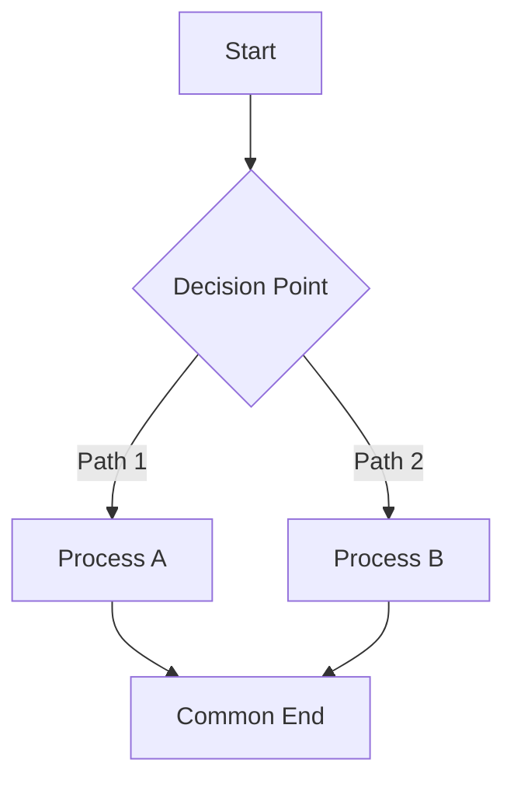
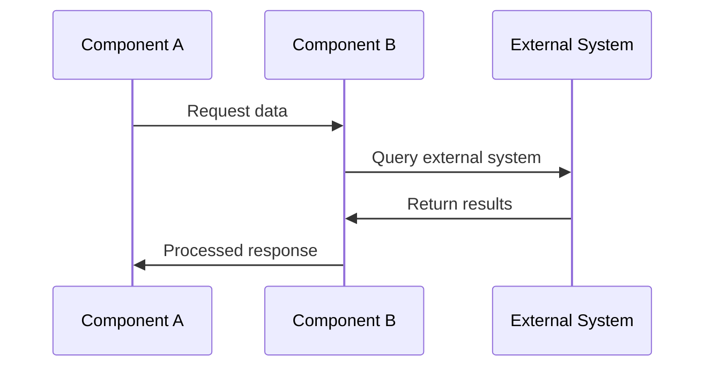
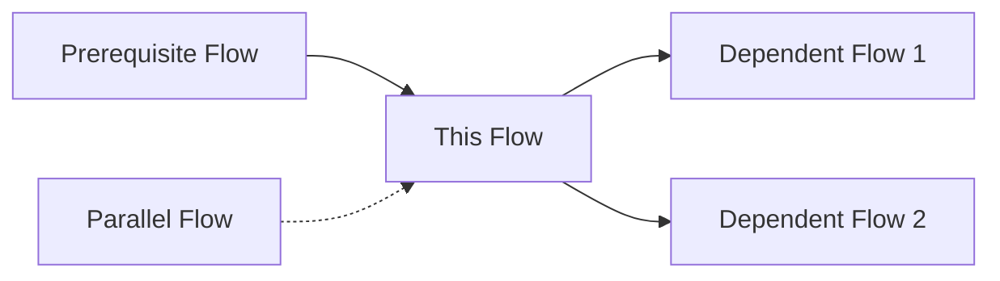

# [Flow Name] Flow

**Version:** 1.0
**Date:** YYYY-MM-DD

## 1. Overview

What process/flow this document describes and why it's important. Explain the business value and technical necessity of this flow.

## 2. Components Involved

- **[Component 1](../design/component1_design.md)** - Brief description of its role in this flow
- **[Component 2](../design/component2_design.md)** - Another component's role
- **[Component 3](../design/component3_design.md)** - Additional component involvement

## 3. Flow Diagram



## 4. Detailed Steps

### Phase 1: [Phase Name]

**What happens:** Brief description of what occurs in this phase.

**Components responsible:**

- **[Component Name]**: Specific responsibility in this phase
- **[Another Component]**: What it contributes

**Key data transformations:**

```python
# Example of data transformation
input_data = {
    "field1": "value1",
    "field2": "value2"
}

# Processing step
processed_data = component.transform(input_data)

# Output format
output = {
    "result": processed_data,
    "metadata": {...}
}
```

### Phase 2: [Another Phase Name]

**What happens:** Description of the second phase.

**Components responsible:**

- **[Component Name]**: Role in this phase
- **[Supporting Component]**: Supporting functionality

**Flow sequence:**



## 5. Error Handling

### Common Error Scenarios

**Configuration Errors:**

- **Missing configuration**: How the system handles missing config
- **Invalid parameters**: Validation and error responses
- **Permission issues**: Access control error handling

**Runtime Errors:**

- **Network failures**: Retry logic and fallback mechanisms
- **Timeout handling**: How timeouts are managed
- **Resource exhaustion**: Graceful degradation strategies

**Error recovery patterns:**

```python
# Example error handling
try:
    result = await component.process_flow(input_data)
except ConfigurationError as e:
    logger.error(f"Configuration issue: {e}")
    return fallback_response()
except TimeoutError as e:
    logger.warning(f"Operation timed out: {e}")
    return retry_with_backoff()
```

## 6. Performance Considerations

### Optimization Strategies

<!-- prettier-ignore -->
!!! tip "Performance Optimizations"
    - **Caching**: What data is cached and for how long
    - **Parallel processing**: Which operations can run concurrently
    - **Resource pooling**: How connections/resources are reused

### Scalability Factors

- **Bottlenecks**: Known performance bottlenecks and mitigation strategies
- **Load handling**: How the flow scales with increased load
- **Memory usage**: Memory consumption patterns and optimization

### Monitoring Points

```python
# Example performance monitoring
with performance_monitor.timer("flow_execution"):
    result = await execute_flow(input_data)

performance_monitor.gauge("active_flows", current_flow_count)
performance_monitor.counter("flow_completions").increment()
```

## 7. Examples

### Basic Flow Example

```python
# Simple flow execution
flow_manager = FlowManager(config)

# Input data
request_data = {
    "user_id": "12345",
    "operation": "process_request",
    "parameters": {...}
}

# Execute flow
result = await flow_manager.execute_flow(
    flow_name="example_flow",
    input_data=request_data
)

# Handle result
if result.success:
    process_success(result.data)
else:
    handle_error(result.error)
```

### Advanced Flow Example

```python
# Complex flow with custom configuration
advanced_config = {
    "retry_policy": {
        "max_attempts": 3,
        "backoff_factor": 2.0
    },
    "timeout_settings": {
        "phase1_timeout": 30,
        "phase2_timeout": 60
    }
}

flow_manager = FlowManager(advanced_config)

# Execute with monitoring
async with flow_manager.execution_context() as ctx:
    ctx.add_middleware(LoggingMiddleware())
    ctx.add_middleware(MetricsMiddleware())

    result = await ctx.execute_flow(
        flow_name="complex_flow",
        input_data=request_data,
        options={
            "enable_caching": True,
            "parallel_execution": True
        }
    )
```

### Error Handling Example

```python
# Comprehensive error handling
try:
    async with flow_manager.transaction() as tx:
        # Phase 1
        intermediate_result = await tx.execute_phase(
            "phase1",
            input_data
        )

        # Phase 2
        final_result = await tx.execute_phase(
            "phase2",
            intermediate_result
        )

        await tx.commit()
        return final_result

except FlowExecutionError as e:
    await tx.rollback()
    logger.error(f"Flow execution failed: {e}")

    # Attempt recovery
    if e.is_recoverable:
        return await execute_recovery_flow(e.context)
    else:
        raise
```

## 8. Integration with Other Flows

This flow integrates with several other framework flows:

- **[Related Flow 1](related_flow1.md)**: How they interact and share data
- **[Related Flow 2](related_flow2.md)**: Dependencies and sequencing
- **[Related Flow 3](related_flow3.md)**: Common components and resources

### Flow Dependencies



## 9. Testing

### Test Strategy

<!-- prettier-ignore -->
!!! info "Testing Approach"
    - **Unit Tests**: Testing individual flow phases
    - **Integration Tests**: End-to-end flow validation
    - **Performance Tests**: Load and stress testing
    - **Error Scenario Tests**: Failure mode validation

### Key Test Scenarios

```python
# Example test case
async def test_successful_flow_execution():
    flow_manager = FlowManager(test_config)

    # Setup test data
    test_input = create_test_input()

    # Execute flow
    result = await flow_manager.execute_flow(
        "test_flow",
        test_input
    )

    # Validate results
    assert result.success
    assert result.data.matches_expected_format()
    assert result.execution_time < expected_max_time

async def test_error_recovery():
    flow_manager = FlowManager(test_config)

    # Simulate error condition
    with mock_component_failure("component1"):
        result = await flow_manager.execute_flow(
            "test_flow",
            test_input
        )

    # Verify graceful handling
    assert result.error_handled
    assert result.fallback_executed
```

### Performance Benchmarks

- **Throughput**: Expected requests per second
- **Latency**: 95th percentile response times
- **Resource usage**: Memory and CPU consumption limits
