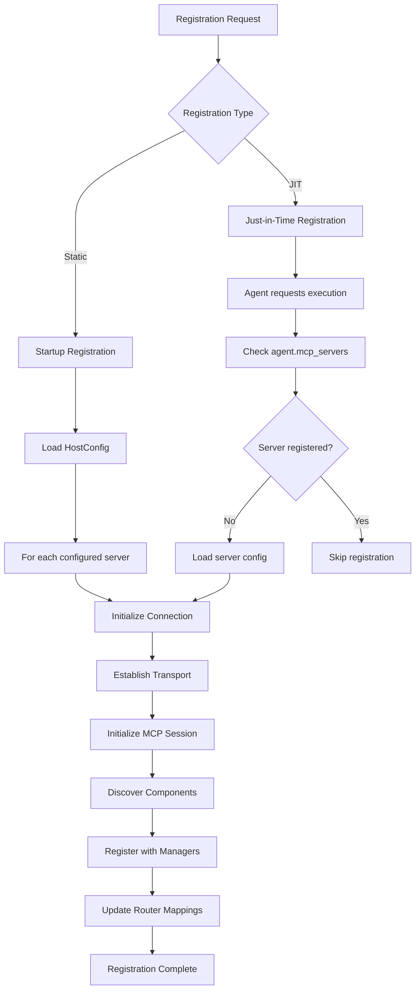

# MCP Server Registration Flow

**Version:** 1.0
**Date:** 2025-08-02

## 1. Overview

This document describes the process of registering MCP (Model Context Protocol) servers with the Aurite framework. Server registration establishes connections to external MCP servers and makes their tools, prompts, and resources available to agents and workflows. The registration process supports both static (startup) and Just-in-Time (JIT) registration patterns.

## 2. Components Involved

- **[MCPHost](../design/mcp_host_design.md)** - Manages server connections and component discovery
- **ConfigManager** - Provides server configuration data
- **AuriteEngine** - Triggers JIT registration during agent execution
- **SecurityManager** - Handles credential resolution and encryption
- **MessageRouter** - Maps discovered components to their source servers

## 3. Flow Diagram



## 4. Detailed Steps

### Phase 1: Configuration Resolution

**What happens:** The system retrieves the server configuration and resolves any credentials or environment variables.

**Components responsible:**

- **ConfigManager**: Provides server configuration from the component index
- **SecurityManager**: Resolves encrypted credentials and environment variables

**Key data transformations:**

```python
# Input: Server name or ClientConfig object
server_name = "weather_server"

# ConfigManager retrieval
server_config_dict = config_manager.get_config("mcp_server", server_name)

# Pydantic model creation
server_config = ClientConfig(**server_config_dict)

# SecurityManager credential resolution
resolved_config = security_manager.resolve_credentials(server_config)
```

### Phase 2: Transport Establishment

**What happens:** The system establishes the appropriate transport connection based on the server's configuration.

**Components responsible:**

- **MCPHost**: Orchestrates the connection process
- **mcp.client libraries**: Handle the actual transport protocols

**Supported transport types:**

1. **STDIO Transport** (`transport_type: "stdio"`)

   - Launches a Python subprocess with the specified `server_path`
   - Communicates via stdin/stdout pipes
   - Used for local MCP server implementations

2. **Local Command Transport** (`transport_type: "local"`)

   - Executes a local command with specified arguments
   - Supports environment variable substitution in arguments
   - Used for executable MCP servers

3. **HTTP Stream Transport** (`transport_type: "http_stream"`)
   - Establishes HTTP connection to remote MCP server
   - Supports custom headers and timeout configuration
   - Used for remote MCP server deployments

**Connection flow:**

```python
# Transport-specific connection establishment
if transport_type == "stdio":
    params = StdioServerParameters(
        command="python",
        args=[str(server_path)],
        env=environment
    )
    client = stdio_client(params)
    read, write = await session_stack.enter_async_context(client)

elif transport_type == "http_stream":
    params = StreamableHttpParameters(
        url=endpoint_url,
        headers=headers,
        timeout=timedelta(seconds=timeout)
    )
    client = streamablehttp_client(**params)
    read, write, _ = await session_stack.enter_async_context(client)
```

### Phase 3: MCP Session Initialization

**What happens:** The system creates an MCP client session and performs the protocol handshake.

**Components responsible:**

- **mcp.ClientSession**: Handles MCP protocol communication
- **MCPHost**: Manages session lifecycle with AsyncExitStack

**Session initialization:**

```python
# Create MCP session
session = await session_stack.enter_async_context(
    mcp.ClientSession(read, write)
)

# Perform MCP protocol initialization
await session.initialize()
```

### Phase 4: Component Discovery

**What happens:** The system queries the MCP server for available tools, prompts, and resources.

**Components responsible:**

- **MCPHost**: Orchestrates discovery process
- **MCP Session**: Executes discovery requests
- **Resource Managers**: Process discovered components

**Discovery process:**

```python
# Discover tools
try:
    tools_response = await session.list_tools()
    for tool in tools_response.tools:
        # Prefix tool name with server name for uniqueness
        tool.title = tool.name  # Preserve original name
        tool.name = f"{server_name}-{tool.name}"

        # Add timeout metadata
        if not tool.meta:
            tool.meta = {}
        tool.meta["timeout"] = server_config.timeout

        # Register with ToolManager
        self._tools[tool.name] = tool
        self._tool_to_session[tool.name] = session

except Exception as e:
    logger.warning(f"Could not fetch tools from '{server_name}': {e}")

# Similar discovery for prompts and resources...
```

### Phase 5: Component Registration

**What happens:** Discovered components are registered with their respective managers and routing tables are updated.

**Components responsible:**

- **ToolManager, PromptManager, ResourceManager**: Store component definitions
- **MessageRouter**: Maps component names to client sessions
- **FilteringManager**: Applies access control rules

**Registration mappings:**

```python
# Tool registration creates multiple mappings:
{
    # Component storage
    "weather_server-get_weather": Tool(name="weather_server-get_weather", ...),

    # Session routing
    "weather_server-get_weather": <ClientSession object>,

    # Filtering metadata
    "weather_server-get_weather": {
        "server_name": "weather_server",
        "original_name": "get_weather",
        "access_rules": [...]
    }
}
```

## 5. Error Handling

### Configuration Errors

- **Missing server config**: Clear error message with server name
- **Invalid transport type**: Validation error with supported types
- **Credential resolution failure**: Security error with masked details

### Connection Errors

- **Server startup failure**: Process execution error with command details
- **Network connection failure**: Transport error with endpoint information
- **MCP protocol errors**: Session initialization error with protocol details

### Timeout Handling

- **Registration timeout**: Configurable via `registration_timeout` setting
- **Tool execution timeout**: Per-tool timeout via `timeout` setting
- **Connection timeout**: Transport-specific timeout configuration

**Error recovery:**

```python
try:
    await asyncio.wait_for(
        _registration_process(),
        timeout=config.registration_timeout
    )
except asyncio.TimeoutError:
    logger.error(f"Registration of '{server_name}' timed out")
    await session_stack.aclose()  # Clean up resources
    raise MCPServerTimeoutError(
        server_name=server_name,
        timeout_seconds=config.registration_timeout,
        operation="registration"
    )
```

## 6. Performance Considerations

### Lazy Registration Benefits

- **Reduced startup time**: Only essential servers loaded at framework startup
- **Memory efficiency**: Server connections created only when needed
- **Resource optimization**: Unused servers don't consume system resources

### Connection Persistence

- **Session reuse**: Registered servers remain active for subsequent requests
- **Connection pooling**: Multiple agents can share the same server connection
- **Graceful cleanup**: AsyncExitStack ensures proper resource cleanup

### Concurrent Registration

- **Parallel processing**: Multiple servers can register simultaneously
- **Timeout isolation**: One slow server doesn't block others
- **Error isolation**: Registration failures don't affect other servers

## 7. Examples

### Static Registration Example

```python
# During framework startup
aurite_kernel = AuriteKernel()
await aurite_kernel.initialize()  # Triggers MCPHost.__aenter__()

# MCPHost automatically registers servers from HostConfig
# No additional code required
```

### JIT Registration Example

```python
# Agent configuration specifies required servers
agent_config = {
    "name": "weather_agent",
    "mcp_servers": ["weather_server", "location_server"],
    # ... other config
}

# During agent execution
engine = AuriteEngine(...)
result = await engine.run_agent("weather_agent", "What's the weather?")

# AuriteEngine automatically:
# 1. Checks if weather_server is registered
# 2. If not, loads config and calls MCPHost.register_client()
# 3. Proceeds with agent execution once tools are available
```

### Manual Registration Example

```python
# Programmatic server registration
server_config = ClientConfig(
    name="custom_server",
    transport_type="stdio",
    server_path="/path/to/server.py",
    timeout=30.0
)

mcp_host = MCPHost()
await mcp_host.register_client(server_config)

# Server tools now available for use
tools = mcp_host.get_formatted_tools()
```

## 8. Integration with Other Flows

This registration flow integrates with several other framework flows:

- **[Agent Execution Flow](agent_execution_flow.md)**: JIT registration occurs during agent preparation
- **[Tool Execution Flow](../design/mcp_host_design.md#tool-execution-flow)**: Registered tools become available for agent use
- **[Session Management Flow](session_management_flow.md)**: Server connections persist across multiple agent sessions

For detailed information about the MCPHost architecture and component management, see the [MCP Host Design](../design/mcp_host_design.md) document.
