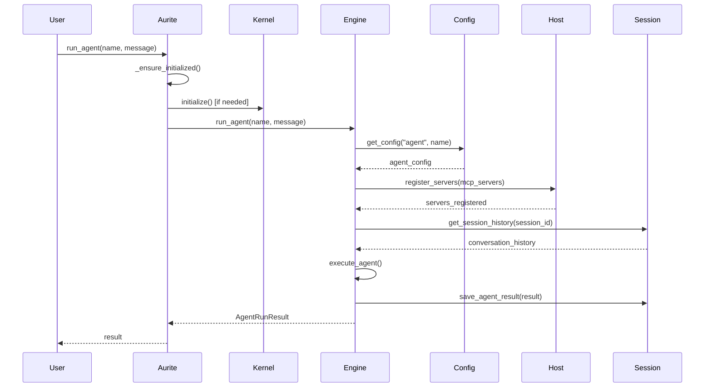
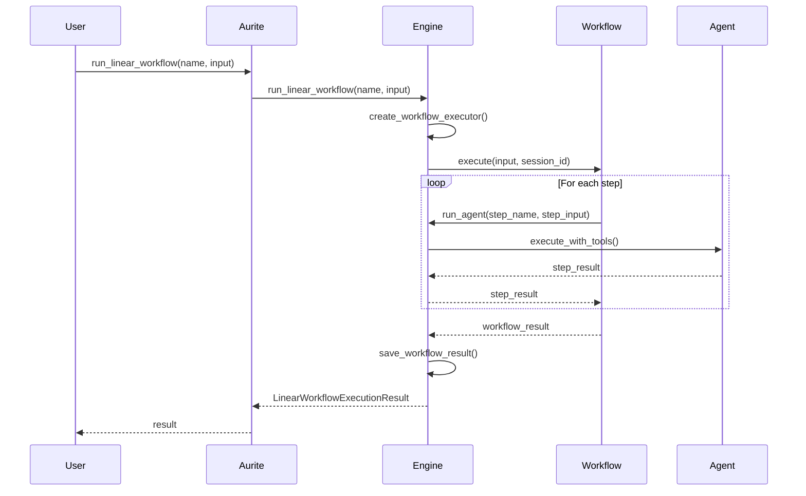

# Aurite Framework Architecture Overview

**Version:** 1.0
**Date:** 2025-08-02

## Overview

The Aurite Framework is a comprehensive system for building and executing AI agents and workflows with distributed tool access through the Model Context Protocol (MCP). The framework provides a unified interface for orchestrating complex AI interactions while maintaining clean separation of concerns through a layered architecture centered around the `Aurite` class and its internal `AuriteKernel`.

**Key Problem Solved**: Unified AI agent and workflow orchestration with distributed tool access, persistent session management, and comprehensive configuration management across complex project hierarchies.

## Framework Architecture

```mermaid
graph TD
    A[Aurite Framework] --> B[Public API Layer]
    A --> C[Kernel Layer]
    A --> D[Execution Layer]
    A --> E[Infrastructure Layer]

    B --> F[Aurite Class]
    B --> G[CLI Interface]
    B --> H[REST API]
    B --> I[TUI Interface]

    C --> J[AuriteKernel]
    C --> K[Lazy Initialization]
    C --> L[Lifecycle Management]

    D --> M[AuriteEngine]
    D --> N[Agent Execution]
    D --> O[Workflow Execution]
    D --> P[Streaming Support]

    E --> Q[ConfigManager]
    E --> R[MCPHost]
    E --> S[SessionManager]
    E --> T[Storage Systems]

    style A fill:#2196F3,stroke:#1976D2,stroke-width:2px,color:#fff
    style B fill:#FF9800,stroke:#F57C00,stroke-width:2px,color:#fff
    style C fill:#FF9800,stroke:#F57C00,stroke-width:2px,color:#fff
    style D fill:#FF9800,stroke:#F57C00,stroke-width:2px,color:#fff
    style E fill:#FF9800,stroke:#F57C00,stroke-width:2px,color:#fff
    style F fill:#4CAF50,stroke:#388E3C,stroke-width:2px,color:#fff
    style J fill:#4CAF50,stroke:#388E3C,stroke-width:2px,color:#fff
    style M fill:#4CAF50,stroke:#388E3C,stroke-width:2px,color:#fff
```



## Core Framework Components

The Aurite Framework is built around a two-tier architecture that separates public interfaces from internal implementation details while providing comprehensive AI orchestration capabilities.

### Public Interface Layer

=== "Aurite Class"

    **Purpose**: Main framework entrypoint providing a clean, async-native API for AI agent and workflow execution.

    **Key Responsibilities**:
    - **Lazy Initialization**: Components initialized only when first used for optimal performance
    - **Lifecycle Management**: Automatic resource cleanup and graceful shutdown handling
    - **Public API**: Simple, intuitive methods for agent and workflow execution
    - **Programmatic Registration**: Runtime component registration for testing and notebooks
    - **Context Management**: Async context manager support for explicit resource control

    **Core API Methods**:
    ```python
    # Agent execution
    async def run_agent(self, agent_name: str, user_message: str,
                       system_prompt: Optional[str] = None,
                       session_id: Optional[str] = None) -> AgentRunResult

    # Streaming agent execution
    async def stream_agent(self, agent_name: str, user_message: str,
                          system_prompt: Optional[str] = None,
                          session_id: Optional[str] = None) -> AsyncGenerator[Dict[str, Any], None]

    # Workflow execution
    async def run_linear_workflow(self, workflow_name: str,
                                 initial_input: Any) -> LinearWorkflowExecutionResult
    async def run_custom_workflow(self, workflow_name: str, initial_input: Any,
                                 session_id: Optional[str] = None) -> Any

    # Component registration
    async def register_agent(self, config: AgentConfig)
    async def register_llm(self, config: LLMConfig)
    async def register_mcp_server(self, config: ClientConfig)
    ```

    **Design Patterns**:
    - **Wrapper Pattern**: Encapsulates complex async lifecycle management
    - **Lazy Initialization**: Services started only when needed
    - **Graceful Degradation**: Continues operation even with partial component failures

=== "Interface Diversity"

    **CLI Interface**: Command-line tools for development and operations
    - Component management (list, create, update, delete)
    - Execution commands for agents and workflows
    - Configuration validation and testing
    - Session management and cleanup

    **REST API**: HTTP endpoints for web applications and integrations
    - RESTful component CRUD operations
    - Execution endpoints with streaming support
    - Session history and management APIs
    - Real-time execution monitoring

    **TUI Interface**: Terminal-based interactive interface
    - Visual component browsing and management
    - Interactive execution with real-time feedback
    - Session exploration and debugging tools
    - Configuration editing and validation

    **Python API**: Direct programmatic access
    - Jupyter notebook integration
    - Testing framework support
    - Custom application embedding
    - Programmatic component registration

### Kernel Layer

=== "AuriteKernel"

    **Purpose**: Internal framework kernel managing core component lifecycle and coordination.

    **Architecture Responsibilities**:
    - **Component Initialization**: Manages startup sequence and dependencies
    - **Resource Coordination**: Coordinates between ConfigManager, MCPHost, and storage systems
    - **Environment Configuration**: Handles environment-based feature toggles and settings
    - **Cleanup Management**: Ensures proper resource cleanup including external library cleanup

    **Component Initialization Flow**:
    ```python
    # AuriteKernel.__init__
    self.config_manager = ConfigManager(start_dir=start_dir)
    self.project_root = self.config_manager.project_root
    self.host = MCPHost()

    # Conditional storage initialization
    if os.getenv("AURITE_ENABLE_DB", "false").lower() == "true":
        self._db_engine = create_db_engine()
        self.storage_manager = StorageManager(engine=self._db_engine)

    # Session management setup
    cache_dir = self.project_root / ".aurite_cache" if self.project_root else Path(".aurite_cache")
    self.cache_manager = CacheManager(cache_dir=cache_dir)

    # Observability integration
    if os.getenv("LANGFUSE_ENABLED", "false").lower() == "true":
        self.langfuse = Langfuse(...)

    # Central execution engine
    self.execution = AuriteEngine(
        config_manager=self.config_manager,
        host_instance=self.host,
        storage_manager=self.storage_manager,
        cache_manager=self.cache_manager,
        langfuse=self.langfuse,
    )
    ```

    **Async Lifecycle Management**:
    ```python
    async def initialize(self):
        # Database initialization
        if self.storage_manager:
            self.storage_manager.init_db()

        # MCP Host startup
        if self.host:
            await self.host.__aenter__()

    async def shutdown(self):
        # External library cleanup (litellm)
        # MCP Host cleanup
        # Database connection cleanup
        # Resource disposal
    ```

    **Key Design Decisions**:
    - **Environment-Driven Configuration**: Features enabled through environment variables
    - **Graceful Degradation**: Optional components (DB, Langfuse) don't prevent startup
    - **Project-Aware Caching**: Cache directory based on detected project structure
    - **Comprehensive Cleanup**: Handles cleanup of external libraries and resources

### Execution Layer

=== "AuriteEngine Integration"

    **Purpose**: Central execution orchestrator coordinating all framework components for unified AI operations.

    **Integration Architecture**:
    ```mermaid
    graph TD
        A[AuriteEngine] --> B[ConfigManager Integration]
        A --> C[MCPHost Integration]
        A --> D[SessionManager Integration]
        A --> E[Component Execution]

        B --> F[Component Resolution]
        B --> G[Configuration Validation]
        B --> H[Path Resolution]

        C --> I[JIT Server Registration]
        C --> J[Tool Execution]
        C --> K[Resource Access]

        D --> L[History Management]
        D --> M[Result Persistence]
        D --> N[Session Lifecycle]

        E --> O[Agent Orchestration]
        E --> P[Workflow Coordination]
        E --> Q[Streaming Management]

        style A fill:#2196F3,stroke:#1976D2,stroke-width:2px,color:#fff
        style B fill:#4CAF50,stroke:#388E3C,stroke-width:2px,color:#fff
        style C fill:#4CAF50,stroke:#388E3C,stroke-width:2px,color:#fff
        style D fill:#4CAF50,stroke:#388E3C,stroke-width:2px,color:#fff
        style E fill:#4CAF50,stroke:#388E3C,stroke-width:2px,color:#fff
    ```

    **Orchestration Capabilities**:
    - **Unified Execution Interface**: Single API for agents, linear workflows, and custom workflows
    - **JIT Resource Provisioning**: Dynamic MCP server registration based on component requirements
    - **Session Coordination**: Automatic session management with history persistence
    - **Streaming Support**: Real-time event streaming for interactive applications
    - **Error Handling**: Comprehensive error management with context preservation

    > 📋 **Detailed Architecture**: See [AuriteEngine Design](design/aurite_engine_design.md) for complete design patterns and integration details.

### Infrastructure Layer

=== "Configuration Management"

    **ConfigManager**: Hierarchical configuration discovery and management system.

    **Key Capabilities**:
    - **Project/Workspace Discovery**: Automatic detection of project boundaries and hierarchies
    - **Priority-Based Resolution**: Context-aware configuration with proper precedence handling
    - **Component Indexing**: Comprehensive indexing of agents, LLMs, MCP servers, and workflows
    - **CRUD Operations**: Full component lifecycle management with validation
    - **Path Resolution**: Context-aware path resolution for relative configurations

    **Integration Points**:
    - **AuriteEngine**: Primary configuration provider for all component resolution
    - **API Endpoints**: Configuration management through REST API
    - **CLI Tools**: Command-line configuration management and validation

    > 📋 **Detailed Architecture**: See [ConfigManager Design](design/config_manager_design.md) for complete configuration patterns and indexing flows.

=== "Distributed Tool Management"

    **MCPHost**: Model Context Protocol server management and tool orchestration.

    **Key Capabilities**:
    - **Multi-Transport Support**: STDIO, local command, and HTTP stream transports
    - **JIT Registration**: Dynamic server registration based on agent requirements
    - **Component Discovery**: Automatic tool, prompt, and resource discovery
    - **Security & Filtering**: Comprehensive access control and filtering systems
    - **Session Management**: Robust session lifecycle with proper cleanup

    **Integration Points**:
    - **AuriteEngine**: Tool execution and resource access during agent/workflow execution
    - **Agent Components**: Direct tool access through unified interface
    - **Configuration System**: Server configuration resolution and validation

    > 📋 **Detailed Architecture**: See [MCP Host Design](design/mcp_host_design.md) for complete server management and security patterns.

=== "Session & Storage Management"

    **SessionManager + CacheManager**: Persistent conversation and execution result management.

    **Key Capabilities**:
    - **Two-Tier Storage**: High-level session operations with low-level file management
    - **Metadata Tracking**: Comprehensive session metadata with validation
    - **Relationship Management**: Parent-child relationships for workflow sessions
    - **Retention Policies**: Automatic cleanup with age and count-based policies
    - **Partial ID Matching**: Flexible session retrieval with ambiguity resolution

    **Storage Options**:
    - **File-Based (CacheManager)**: JSON files with in-memory caching for development
    - **Database (StorageManager)**: PostgreSQL/SQLite for production environments

    > 📋 **Detailed Architecture**: See [Session Management Flow](flow/session_management_flow.md) for complete session lifecycle and storage patterns.

## Framework Integration Patterns

### Lazy Initialization Pattern

The framework implements comprehensive lazy initialization to optimize startup performance and resource usage:

```python
# Aurite class initialization
def __init__(self, start_dir: Optional[Path] = None, disable_logging: bool = False):
    # Only create kernel, don't initialize services
    self.kernel = AuriteKernel(start_dir=start_dir, disable_logging=disable_logging)
    self._initialized = False

async def _ensure_initialized(self):
    # Services initialized only on first use
    if not self._initialized:
        await self.kernel.initialize()
        self._initialized = True
```

**Benefits**:

- **Fast Startup**: Framework ready immediately without waiting for service initialization
- **Resource Efficiency**: Only needed services are started
- **Error Isolation**: Initialization failures don't prevent framework instantiation
- **Development Friendly**: Quick iteration cycles during development

### Component Coordination Pattern

The framework coordinates between multiple specialized components through the AuriteEngine:

```python
# Component coordination in AuriteEngine
async def run_agent(self, agent_name: str, user_message: str, ...):
    # 1. Configuration resolution through ConfigManager
    agent_config = self._config_manager.get_config("agent", agent_name)

    # 2. JIT server registration through MCPHost
    for server_name in agent_config.mcp_servers:
        if server_name not in self._host.registered_server_names:
            await self._host.register_client(server_config)

    # 3. Session management through SessionManager
    if session_id and self._session_manager:
        history = self._session_manager.get_session_history(session_id)

    # 4. Agent execution with coordinated resources
    agent_instance = Agent(config, llm_config, host, initial_messages)
    result = await agent_instance.run_conversation()

    # 5. Result persistence
    self._session_manager.save_agent_result(session_id, result)
```

### Environment-Driven Configuration

The framework uses environment variables to enable optional features and integrations:

```python
# Optional database integration
if os.getenv("AURITE_ENABLE_DB", "false").lower() == "true":
    self._db_engine = create_db_engine()
    self.storage_manager = StorageManager(engine=self._db_engine)

# Optional observability integration
if os.getenv("LANGFUSE_ENABLED", "false").lower() == "true":
    self.langfuse = Langfuse(
        secret_key=os.getenv("LANGFUSE_SECRET_KEY"),
        public_key=os.getenv("LANGFUSE_PUBLIC_KEY"),
        host=os.getenv("LANGFUSE_HOST"),
    )

# Development vs production configuration
AURITE_CONFIG_FORCE_REFRESH = os.getenv("AURITE_CONFIG_FORCE_REFRESH", "true")
```

**Configuration Variables**:

- `AURITE_ENABLE_DB`: Enable database storage backend
- `LANGFUSE_ENABLED`: Enable Langfuse observability integration
- `AURITE_CONFIG_FORCE_REFRESH`: Force configuration refresh on every operation
- `LANGFUSE_USER_ID`: User ID for trace grouping
- Database connection variables for StorageManager

## Framework Execution Flows

### Agent Execution Flow



### Workflow Execution Flow



## Framework Extension Points

### Programmatic Component Registration

The framework supports runtime component registration for testing and dynamic scenarios:

```python
# Register components programmatically
await aurite.register_agent(AgentConfig(
    name="dynamic_agent",
    llm_config_id="gpt4",
    system_prompt="Dynamic agent for testing"
))

await aurite.register_mcp_server(ClientConfig(
    name="test_server",
    server_path="./test_server.py"
))
```

### Custom Workflow Integration

Custom workflows can leverage the full framework through the execution engine:

```python
class CustomWorkflow:
    async def execute(self, initial_input: Any, executor: AuriteEngine, session_id: str):
        # Access full framework capabilities
        agent_result = await executor.run_agent("analyzer", initial_input)
        processed_data = self.process_result(agent_result)
        final_result = await executor.run_agent("summarizer", processed_data)
        return final_result
```

### Interface Extensions

The framework supports multiple interface types through consistent internal APIs:

- **CLI Extensions**: New commands through the CLI router
- **API Extensions**: Additional REST endpoints through FastAPI routers
- **TUI Extensions**: New screens and components through the TUI framework
- **Custom Interfaces**: Direct integration through the Aurite class API

## Performance & Scalability

### Optimization Strategies

**Lazy Initialization**: Components initialized only when needed
**JIT Resource Management**: MCP servers registered dynamically based on requirements
**In-Memory Caching**: Configuration and session data cached for fast access
**Connection Pooling**: Reuse of LLM and database connections where possible
**Streaming Support**: Real-time event streaming for interactive applications

### Scalability Considerations

**Horizontal Scaling**: Multiple framework instances can share database storage
**Resource Isolation**: Each framework instance manages its own MCP server connections
**Session Distribution**: Sessions can be distributed across instances through shared storage
**Configuration Sharing**: Shared configuration repositories across development teams

## References

- **Core Implementation**: `src/aurite/aurite.py` - Main Aurite class and AuriteKernel
- **Execution Orchestration**: [AuriteEngine Design](design/aurite_engine_design.md) - Central execution coordination
- **Configuration Management**: [ConfigManager Design](design/config_manager_design.md) - Hierarchical configuration system
- **Tool Management**: [MCP Host Design](design/mcp_host_design.md) - Distributed tool orchestration
- **Session Management**: [Session Management Flow](flow/session_management_flow.md) - Persistent conversation management
- **Execution Flows**: [AuriteEngine Execution Flow](flow/aurite_engine_execution_flow.md) - Detailed execution patterns
- **Configuration Examples**: [Configuration Examples Reference](reference/config_examples.md) - Comprehensive usage examples
