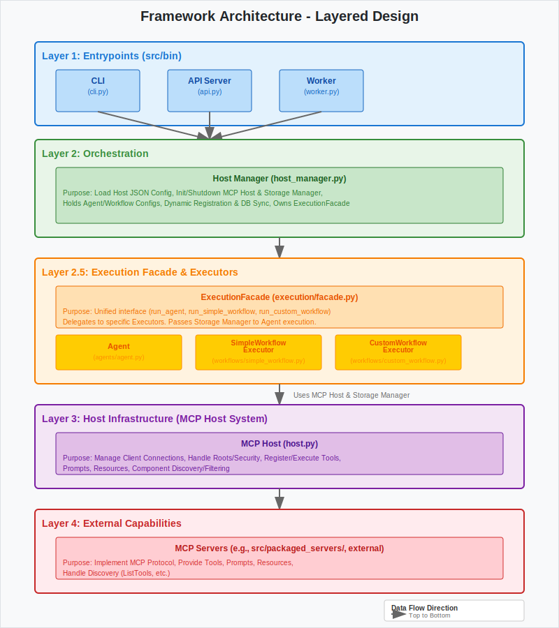

# Framework Overview

This document provides a detailed overview of the Aurite Agents framework architecture.

## Architecture

The framework follows a layered architecture:

*   **Layer 1: Entrypoints:** This layer provides the external interfaces for interacting with the Aurite Agents framework. It includes:
    *   A **FastAPI Server** (`src/aurite/bin/api/api.py`): Offers a RESTful API for programmatic interaction. It manages the application lifecycle (initializing and shutting down the `Aurite` instance from `host_manager.py`), includes modularized API routers (from `src/aurite/bin/api/routes/`) for different functionalities (configurations, components, projects), handles global middleware (like CORS and request logging), and defines global exception handlers. It also serves the frontend application.
    *   A **Command-Line Interface (CLI)** (`src/aurite/bin/cli.py`): Provides terminal-based access for development and scripting, typically interacting with the running API server.
    *   A **Redis Worker** (`src/aurite/bin/worker.py`): Listens to a Redis stream for asynchronous task processing, such as component registration or execution requests.
    All entrypoints primarily interact with the `Aurite` class (formerly `HostManager`) in Layer 2 to access configuration, registration methods, and the `ExecutionFacade` for running components.

*   **Layer 2: Orchestration:** The `Aurite` class (`src/aurite/host_manager.py`) is the central orchestrator. Its key responsibilities include:
    *   **Configuration Management:** Loading project configurations using `ProjectManager` (which in turn uses `ComponentManager` to resolve default and project-specific component definitions).
    *   **Lifecycle Management:** Initializing and managing the lifecycle of the underlying `MCPHost` (Layer 3), the `ExecutionFacade` (Layer 2.5), and the optional `StorageManager` (if database persistence is enabled).
    *   **Dynamic Registration:** Handling dynamic registration of clients, agents, LLM configurations, and workflows. If database persistence is enabled, it syncs these configurations via the `StorageManager`.
    *   **Execution Hub:** Owning and providing access to the `ExecutionFacade` for all component execution requests.

*   **Layer 2.5: Execution Facade & Executors:** This sub-layer is responsible for the actual execution of agentic components.
    *   The **`ExecutionFacade`** (`src/aurite/execution/facade.py`) provides a unified and simplified interface (`run_agent`, `stream_agent_run`, `run_simple_workflow`, `run_custom_workflow`) for Layer 1 entrypoints to execute any configured component.
    *   It looks up component configurations from the active project (managed by `ProjectManager`).
    *   It resolves the base `LLMConfig` for a run but no longer manages a cache of LLM clients directly.
    *   It instantiates and delegates tasks to specific **Executors**:
        *   **`Agent`** (`src/aurite/components/agents/agent.py`): Resolves its final LLM configuration, creates its own `LiteLLMClient`, handles the core interaction loop, and returns a structured `AgentRunResult`. It also manages tool use (via `MCPHost`) and optionally handles conversation history with the `StorageManager`.
        *   **`SimpleWorkflowExecutor`** (`src/aurite/components/workflows/simple_workflow.py`): Executes a defined sequence of agents or other workflows.
        *   **`CustomWorkflowExecutor`** (`src/aurite/components/workflows/custom_workflow.py`): Dynamically loads and executes user-defined Python classes for complex orchestration logic.
    *   The `ExecutionFacade` also passes the `StorageManager` instance (if available) to the `Agent` during its instantiation, enabling history persistence.

*   **Layer 3: Host Infrastructure:** The `MCPHost` (`src/aurite/host/host.py`) is the core infrastructure layer responsible for direct interaction with external MCP servers.
    *   **Client Management:** It delegates all client connection and session management to `mcp.client.ClientSessionGroup`.
    *   **Component Discovery & Registration:** It discovers tools, prompts, and resources offered by connected clients and registers them with its internal managers (`ToolManager`, `PromptManager`, `ResourceManager`).
    *   **Filtering and Routing:** It applies filtering rules based on `ClientConfig` (global exclusions) and `AgentConfig` (agent-specific access) via the `FilteringManager`. The `MessageRouter` helps route requests to the appropriate client based on component availability and configuration.
    *   **Security and Access Control:** The `SecurityManager` handles aspects like credential encryption. The `RootManager` manages MCP root definitions for access control.
    *   **Interface for Layer 2.5:** Provides methods (`call_tool`, `get_formatted_tools`) that are used by the `Agent` (via `ExecutionFacade`) to interact with MCP server capabilities.

*   **Layer 4: External Capabilities:** This layer consists of the external MCP Servers themselves. These are separate processes that provide tools, prompts, or resources according to the Model Context Protocol. The Aurite framework (specifically Layer 3) connects to these servers as clients to leverage their functionalities.
