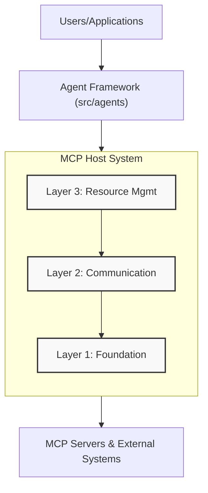
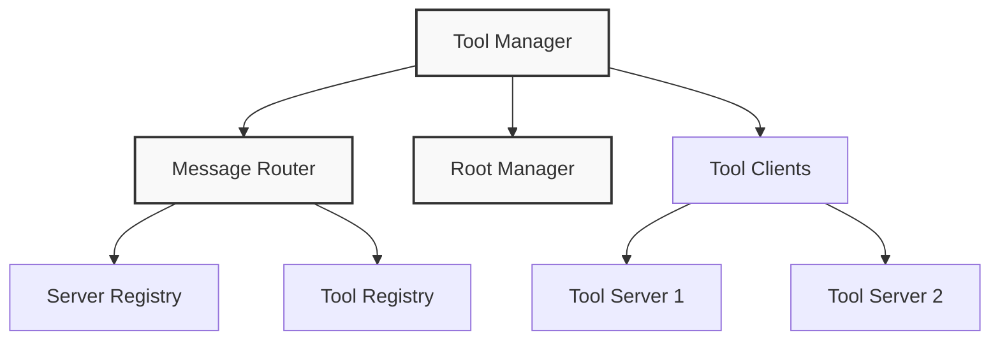
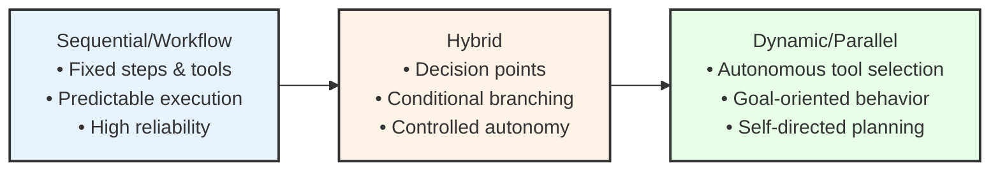

# Aurite Architecture Overview

This document provides a high-level overview of the Aurite architecture, focusing on the relationship between the MCP Host system and the Agent Framework.

## System Architecture

Aurite consists of two primary components: the **MCP Host System** (handling server interactions) and the **Agent Framework** (handling LLM interactions and task execution). Applications interact with the Agent Framework, which utilizes the MCP Host.

The **MCP Host System** itself is built on a layered architecture:

### Layer 1: Security and Foundation

The foundation layer establishes security boundaries and access control:

- **Security Manager**: Manages credentials, authentication, and authorization
- **Root Manager**: Controls access to URI roots and resources

### Layer 2: Communication

The communication layer handles message routing:

- **Message Router** (`routing.py`): Maps tools/prompts to clients and selects servers for execution based on registration and capabilities.

### Layer 3: Resource Management

The resource management layer provides access to capabilities offered by connected MCP servers:

- **Tool Manager**: Manages tool registration, discovery, execution, and formatting for LLMs across servers.
- **Prompt Manager**: Manages system prompt registration and retrieval.
- **Resource Manager**: Manages MCP resource registration and retrieval.

The Tool Manager provides a unified interface for:
- Tool registration and discovery
- Tool execution with routing
- Capability-based tool selection
- Access control validation through the Root Manager

### Agent Framework (`src/agents/`)

The agent framework provides the logic for AI agents to interact with users and accomplish tasks using the MCP Host.

- **`Agent` Class (`agent.py`)**: The core implementation for agents.
  - Initializes with an `AgentConfig`.
  - Contains the primary `execute_agent` method which:
    - Takes user input and an initialized `MCPHost` instance.
    - Manages the conversation loop with an LLM (e.g., Anthropic).
    - Formats available tools from the `MCPHost` for the LLM.
    - Calls the LLM API.
    - Handles tool use requests from the LLM by executing tools via the `MCPHost`.
    - Formats tool results and continues the loop until completion.
  - Can be configured with specific LLM parameters (model, temperature, system prompt).
  - Can potentially be extended or subclassed for more specialized agent behaviors (like the Agency Spectrum describes).

*(Note: Previous components like WorkflowManager and BaseWorkflow have been removed from the host system and are superseded by the `Agent` class logic).*

## The Agency Spectrum

A central concept in Aurite is the Agency Spectrum, which describes the level of autonomy given to AI agents:

Each type of agent serves different use cases:

- **Workflow Agents**: For predictable, repeatable processes with high reliability needs
- **Hybrid Agents**: For processes with decision points that benefit from some autonomy
- **Dynamic Agents**: For complex, open-ended tasks requiring adaptive behavior

## Core Components

The Aurite system is organized around two main components:

### 1. MCP Host System (`src/host/host.py`)

The core orchestration layer for MCP server interaction:
- Manages connections to configured MCP servers (clients).
- Initializes and coordinates managers for Foundation (Security, Roots), Communication (Routing), and Resource Management (Tools, Prompts, Resources).
- Provides convenience methods (`execute_tool`, `get_prompt`, `read_resource`, `list_tools`, etc.) to interact with client capabilities, including discovery and filtering based on `ClientConfig.exclude`. *(Filtering by a list of client IDs is planned)*.
- Enforces security policies (via `SecurityManager`) and resource access boundaries (via `RootManager`).
- Does **not** directly handle agent execution logic or workflow management.

### 2. Agent Framework (`src/agents/agent.py`)

The agent implementation layer built on top of the MCP Host:
- Provides the `Agent` class for implementing agent behavior.
- Handles interaction with LLMs (e.g., Anthropic API calls).
- Manages the conversation loop, including state and history (if configured).
- Uses an injected `MCPHost` instance to discover and execute tools, retrieve prompts, and access resources provided by connected MCP servers.
- Implements the logic for different agent types (fitting the Agency Spectrum) within or extending the `Agent` class.

## Implementation Status

Current implementation status:

- **MCP Host System (`src/host/`)**
  - **Layer 1 (Foundation)**: ✅ Implemented (Security Manager, Root Manager)
  - **Layer 2 (Communication)**: ✅ Implemented (Message Router)
  - **Layer 3 (Resource Mgmt)**: ✅ Implemented (Tool Manager, Prompt Manager, Resource Manager)
  - **Host Convenience Methods**: ✅ Implemented (Basic discovery, `ClientConfig.exclude` filtering)
- **Agent Framework (`src/agents/`)**
  - ✅ `Agent` Class (`agent.py`): Implemented (Handles LLM loop, uses Host for tools)
  - ⏳ Specialized Agent Types (Hybrid/Dynamic): Planned

## Roadmap

Future development plans:

### Short-term
1.  **Implement Host Filtering Feature**: Allow `MCPHost` methods to filter by a list of client IDs (Phase 4 of current plan).
2.  **Code Cleanup & Test Refinement**: Complete Phases 2 & 3 of the current plan.
3.  **Enhance `Agent` Class**:
    *   Add robust conversation history management.
    *   Explore strategies for error handling and retries within the agent loop.
    *   Consider adding hooks or middleware points.
4.  **Develop Agent Examples**: Create concrete examples using the `Agent` class and `MCPHost` (e.g., document processor, research assistant).
5.  **Refine `main.py` API**: Add endpoints relevant to the `Agent` class if needed (e.g., endpoint to trigger `execute_agent`).

### Medium-term
1.  **Implement Hybrid/Dynamic Agent Capabilities**: Extend the `Agent` class or create subclasses to support more autonomous behaviors (decision points, planning loops).
2.  **Integrate Memory Solutions**: Re-integrate memory capabilities (like Mem0) potentially via dedicated MCP servers accessed by the `Agent` through the `MCPHost`.
3.  **Improve Planning Capabilities**: Develop more sophisticated planning agents/strategies.

### Long-term
1. **Multi-agent coordination**
   - Agent-to-agent communication
   - Task delegation and collaboration
   - Shared knowledge and resources

2. **Specialized agent types**
   - Task-specific agent implementations
   - Domain-specific knowledge integration
   - Custom tool development

## Development Approach

When developing within the Aurite architecture:

1.  **Respect Component Boundaries**: Maintain a clear separation between the `MCPHost` (server interaction) and the `Agent` framework (LLM interaction, task logic). Agents *use* the Host.
2.  **Host Layer Boundaries**: Within the `MCPHost`, respect the layered structure (Foundation -> Communication -> Resource Management).
3.  **Follow the Manager Pattern**: Within the `MCPHost`, encapsulate specific functionalities (tools, prompts, roots, security, routing) in dedicated managers.
4.  **Dependency Injection**: Inject dependencies (like `MCPHost` into `Agent`, managers into `MCPHost`).
5.  **Validate Security**: Ensure security checks (`SecurityManager`, `RootManager`) are applied appropriately within the Host.
6.  **Maintain Asyncio Consistency**: Use `async/await` throughout.
7.  **Design for Extensibility**: Build components with potential extension in mind.
8.  **Configuration Driven**: Use configuration files (`HostConfig`, `AgentConfig`) to define system setup.

## Conclusion

The Aurite architecture provides a comprehensive framework for building AI agents with varying levels of autonomy. By organizing functionality into clear layers and providing specialized components for different concerns, it enables the development of powerful, secure, and reliable agent systems.
