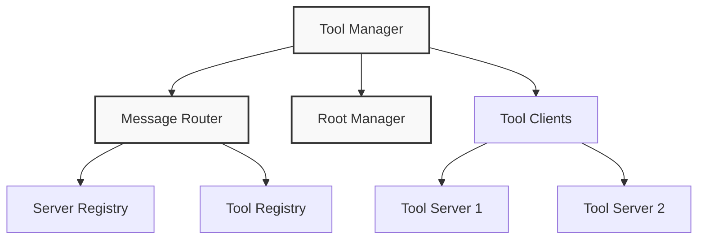
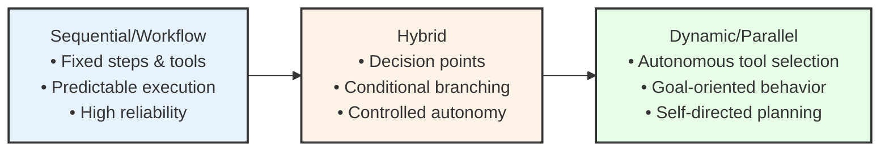

# Aurite Architecture Overview

This document provides a high-level overview of the Aurite architecture, focusing on the relationship between the MCP Host system and the Agent Framework.

## System Architecture

The framework provides multiple entrypoints (`src/bin/`) that utilize the **Host Manager** (`src/host_manager.py`) to orchestrate the **MCP Host** (`src/host/host.py`) and component execution. The MCP Host, in turn, interacts with external **MCP Servers**.

```text
+-----------------------------------------------------------------+
| Layer 1: Entrypoints (src/bin)                                  |
| +--------------+   +----------------+   +---------------------+ |
| | CLI          |   | API Server     |   | Worker              | |
| | (cli.py)     |   | (api.py)       |   | (worker.py)         | |
| +--------------+   +----------------+   +---------------------+ |
|        |                 |                  |                   |
|        +-------+---------+--------+---------+                   |
|                v                  v                             |
+----------------|------------------|-----------------------------+
                 |                  |
                 v                  v
+----------------+------------------+-----------------------------+
| Layer 2: Orchestration                                          |
| +-------------------------------------------------------------+ |
| | Host Manager (host_manager.py)                              | |
| |-------------------------------------------------------------| |
| | Purpose:                                                    | |
| | - Load Host JSON Config                                     | |
| | - Init/Shutdown MCP Host                                    | |
| | - Holds Agent/Workflow Configs                              | |
| | - Dynamic Registration                                      | |
| | - Owns ExecutionFacade                                      | |
| +-------------------------------------------------------------+ |
|                       |                                         |
|                       v                                         |
+-----------------------+-----------------------------------------+
                        |
                        v
+-----------------------+-----------------------------------------+
| Layer 2.5: Execution Facade & Executors                       |
| +-------------------------------------------------------------+ |
| | ExecutionFacade (execution/facade.py)                       | |
| |-------------------------------------------------------------| |
| | Purpose: Unified interface (run_agent, run_simple_workflow, | |
| |          run_custom_workflow) for execution.                | |
| | Delegates to specific Executors.                            | |
| +-------------------------------------------------------------+ |
| | Agent (agents/agent.py) - Executes itself                   | |
| | SimpleWorkflowExecutor (workflows/simple_workflow.py)       | |
| | CustomWorkflowExecutor (workflows/custom_workflow.py)       | |
| +-------------------------------------------------------------+ |
|                       |                                         |
|                       v (Uses MCP Host for execution)           |
+-----------------------+-----------------------------------------+
                        |
                        v
+-----------------------+-----------------------------------------+
| Layer 3: Host Infrastructure (MCP Host System)                  |
| +-------------------------------------------------------------+ |
| | MCP Host (host.py)                                          | |
| |-------------------------------------------------------------| |
| | Purpose:                                                    | |
| | - Manage Client Connections                                 | |
| | - Handle Roots/Security                                     | |
| | - Register/Execute Tools, Prompts, Resources                | |
| | - Component Discovery/Filtering                             | |
| +-------------------------------------------------------------+ |
|                       |                                         |
|                       v                                         |
+-----------------------+-----------------------------------------+
                        |
                        v
+-----------------------+-----------------------------------------+
| Layer 4: External Capabilities                                  |
| +-------------------------------------------------------------+ |
| | MCP Servers (e.g., src/packaged_servers/, external)         | |
| |-------------------------------------------------------------| |
| | Purpose:                                                    | |
| | - Implement MCP Protocol                                    | |
| | - Provide Tools, Prompts, Resources                         | |
| | - Handle Discovery (ListTools, etc.)                        | |
| +-------------------------------------------------------------+ |
+-----------------------------------------------------------------+
```

The **MCP Host System** (`src/host/host.py`) itself is built on further internal layers (Foundation, Communication, Resource Management, Filtering) as detailed below:

### Layer 1: Foundation & Security

The foundation layer establishes security boundaries and access control:

- **Security Manager**: Manages credentials, authentication, and authorization
- **Root Manager**: Controls access to URI roots and resources

### Layer 2: Communication

The communication layer handles message routing:

- **Message Router** (`routing.py`): Maps tools/prompts to clients and selects servers for execution based on registration and capabilities.

### Layer 3: Resource Management

The resource management layer provides access to capabilities offered by connected MCP servers:

- **Tool Manager**: Manages tool registration, discovery, execution, and formatting for LLMs across servers.
- **Prompt Manager**: Manages system prompt registration and retrieval.
- **Resource Manager**: Manages MCP resource registration and retrieval.
- **Filtering Manager** (`src/host/filtering.py`): Centralizes logic for filtering components based on `ClientConfig` and `AgentConfig`.

The `MCPHost` class orchestrates these managers. The Tool Manager, for example, provides a unified interface for:
- Tool registration and discovery (respecting filters)
- Tool execution with routing
- Capability-based tool selection
- Access control validation through the Root Manager



### Agent Framework (`src/agents/`)

The agent framework provides the logic for AI agents to interact with users and accomplish tasks using the MCP Host.

- **`Agent` Class (`agent.py`)**: The core implementation for agents.
  - Initializes with an `AgentConfig`.
  - Contains the primary `execute_agent` method which:
    - Takes user input and an initialized `MCPHost` instance.
    - Manages the conversation loop with an LLM (e.g., Anthropic).
    - Formats available tools from the `MCPHost` for the LLM.
    - Calls the LLM API.
    - Handles tool use requests from the LLM by executing tools via the `MCPHost`.
    - Formats tool results and continues the loop until completion.
  - Can be configured with specific LLM parameters (model, temperature, system prompt).
  - Can potentially be extended or subclassed for more specialized agent behaviors (like the Agency Spectrum describes).

## The Agency Spectrum

A central concept in Aurite is the Agency Spectrum, which describes the level of autonomy given to AI agents:



Each type of agent serves different use cases:

- **Workflow Agents**: For predictable, repeatable processes with high reliability needs
- **Hybrid Agents**: For processes with decision points that benefit from some autonomy
- **Dynamic Agents**: For complex, open-ended tasks requiring adaptive behavior

## Core Components

The Aurite system is organized around three main components, reflecting the architectural layers:

### 1. MCP Host System (`src/host/host.py`)

The core infrastructure layer for MCP server interaction:
- Manages connections to configured MCP servers (clients).
- Initializes and coordinates internal managers: Foundation (Security, Roots), Communication (Routing), Resource Management (Tools, Prompts, Resources), and Filtering.
- Provides methods (`execute_tool`, `get_prompt`, `read_resource`, `get_formatted_tools`, etc.) to interact with client capabilities.
- Handles component discovery across clients.
- Implements multi-level filtering via the `FilteringManager`:
    - `ClientConfig.exclude` (Global client component exclusion)
    - `AgentConfig.client_ids` (Agent-specific client selection)
    - `AgentConfig.exclude_components` (Agent-specific component exclusion)
- Enforces security policies (via `SecurityManager`) and resource access boundaries (via `RootManager`).
- Does **not** directly handle agent/workflow execution logic.

### 2. Host Manager (`src/host_manager.py`)

The orchestration layer sitting above the `MCPHost`:
- Loads the complete system configuration (Host, Clients, Agents, Workflows) from a JSON file.
- Manages the lifecycle (initialization, shutdown) of the `MCPHost` instance.
- Instantiates and owns the `ExecutionFacade`.
- Holds the configurations for Agents, Simple Workflows, and Custom Workflows.
- Handles dynamic registration of components (Clients, Agents, Workflows) via API/Worker/CLI, updating its own config state and informing the `MCPHost` as needed (e.g., for new clients).
- Does **not** directly handle component execution logic anymore; execution requests from entrypoints are directed to its `ExecutionFacade` instance.

### 3. Agent Framework (`src/agents/agent.py`) and Executors (`src/workflows/`, `src/execution/`)

This layer contains the logic for executing specific component types:
- **`Agent` Class (`src/agents/agent.py`)**:
    - Provides the core logic for agent behavior (LLM interaction, tool use).
    - Handles the conversation loop with the LLM.
    - Executes tools via the `MCPHost` instance.
    - Is invoked by the `ExecutionFacade` when an agent needs to be run.
- **`SimpleWorkflowExecutor` (`src/workflows/simple_workflow.py`)**:
    - Executes a sequence of Agents defined in a `WorkflowConfig`.
    - Instantiates and calls `Agent.execute_agent` for each step.
    - Is invoked by the `ExecutionFacade`.
- **`CustomWorkflowExecutor` (`src/workflows/custom_workflow.py`)**:
    - Dynamically loads and executes a Python class defined in `CustomWorkflowConfig`.
    - Passes the `ExecutionFacade` instance to the custom workflow's `execute_workflow` method, enabling composition.
    - Is invoked by the `ExecutionFacade`.
- **`ExecutionFacade` (`src/execution/facade.py`)**:
    - Provides the unified `run_agent`, `run_simple_workflow`, `run_custom_workflow` interface.
    - Owned by the `HostManager`.
    - Looks up configurations via the `HostManager`.
    - Instantiates and calls the appropriate Agent or Executor.

## Implementation Status

Current implementation status:

- **MCP Host System (`src/host/`)**: ✅ Implemented
  - Foundation/Security Managers: ✅
  - Message Router: ✅
  - Resource Managers (Tool, Prompt, Resource): ✅
  - Filtering Manager & Logic: ✅ (`ClientConfig.exclude`, `AgentConfig.client_ids`, `AgentConfig.exclude_components`)
- **Host Manager (`src/host_manager.py`)**: ✅ Implemented
  - JSON Configuration Loading: ✅
  - Host Lifecycle Management: ✅
  - Agent/Workflow Registration & Execution: ✅
  - Dynamic Registration Support: ✅
- **Agent Framework (`src/agents/`)**: ✅ Implemented
  - `Agent` Class (LLM loop, tool use via Host): ✅
- **Entrypoints (`src/bin/`)**: ✅ Implemented
  - API Server (FastAPI): ✅
  - CLI: ✅
  - Redis Worker: ✅
- **Testing (`tests/`)**: ✅ Implemented
  - Unit, Integration, E2E Tests: ✅
  - Prompt Validation System: ✅

## Roadmap (Potential Next Steps)

Based on the v1 completion, potential future development includes:

*   **Develop More Examples:** Create concrete examples of agents and workflows for specific use cases (e.g., document processing, research).
*   **Monitoring & Observability:** Add structured logging, tracing, and metrics collection.
*   **UI/Frontend:** Develop a user interface for interaction and management.
*   **Expand Tooling:** Create more packaged MCP servers for common enterprise tools/APIs.
*   **Refine Agent Capabilities:** Enhance `Agent` class (history management, error handling, planning).
*   **Integrate Memory:** Explore integrating persistent memory solutions (e.g., Mem0 server).
*   **Advanced Agency:** Implement more dynamic/hybrid agent types (Agency Spectrum).
*   **Multi-agent Coordination:** Explore agent-to-agent communication and task delegation.

## Development Approach

When developing within the Aurite architecture:

1.  **Respect Component Boundaries**: Maintain separation between `MCPHost` (infrastructure), `HostManager` (orchestration), and `Agent` (LLM/task logic).
2.  **Host Layer Boundaries**: Within the `MCPHost`, respect the internal manager structure.
3.  **Follow the Manager Pattern**: Use dedicated managers within the `MCPHost` for specific functionalities.
4.  **Dependency Injection**: Inject dependencies (`MCPHost` into `HostManager`, `HostManager` into entrypoints, `MCPHost` into `Agent`/Custom Workflows).
5.  **Validate Security**: Ensure security checks are applied appropriately within the Host.
6.  **Maintain Asyncio Consistency**: Use `async/await` throughout.
7.  **Design for Extensibility**: Build components with potential extension in mind.
8.  **Configuration Driven**: Define system setup via JSON configuration loaded by the `HostManager`.

## Conclusion

The Aurite architecture provides a comprehensive framework for building AI agents with varying levels of autonomy. By organizing functionality into clear layers and providing specialized components for different concerns, it enables the development of powerful, secure, and reliable agent systems.
