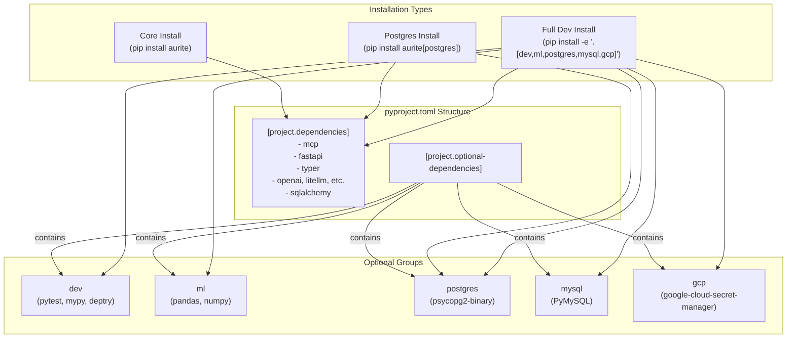

# Dependency Management Improvement Plan

Hello! You're right to suspect that the dependency list in `pyproject.toml` could be the source of installation issues. Explicitly listing transitive dependencies (dependencies of your dependencies) often creates a "dependency hell" scenario where `pip` struggles to find a version combination that satisfies all constraints.

This document outlines a strategy to simplify your dependencies, making them more robust and easier for `pip` to resolve.

## 1. The Core Problem: Transitive Dependencies

The fundamental principle of modern Python packaging is to **only specify your direct dependencies**.

For example, your project uses `fastapi`. `fastapi` itself depends on `starlette` and `pydantic`. By listing `fastapi` in your `pyproject.toml`, `pip` knows it also needs to install `starlette` and `pydantic`.

When you *also* list `starlette` and `pydantic` explicitly, you create a potential conflict. If `fastapi` requires `starlette==0.30.0` but you've listed `starlette>=0.46.1`, `pip` might have trouble resolving this. By letting `fastapi` manage its own dependencies, you simplify the process.

## 2. Using `deptry` for a Dependency Audit

You mentioned you have `deptry` installed. This is the perfect tool for this job. It can automatically detect many of the issues in your `pyproject.toml`.

### How to Use It

1.  **Ensure it's installed and configured:** It's best to add it to your `dev` dependencies.
2.  **Run the audit:** From the root of your project, run:
    ```bash
    deptry .
    ```
3.  **Interpret the Output:** `deptry` will give you a report, likely highlighting:
    *   **Transitive dependencies:** Packages that are in your list but are also dependencies of your other direct dependencies (e.g., `httpx`, `click`, `pydantic_core`). These are the primary candidates for removal.
    *   **Unused dependencies:** Packages that are listed but not imported anywhere in your `src` code.
    *   **Misplaced dev dependencies:** Packages that are only used in tests but are listed in the main dependencies.

## 3. Strategy: Refactor with Optional Dependency Groups

A clean `pyproject.toml` has a minimal list of core dependencies and uses `[project.optional-dependencies]` for everything else. This allows users (and developers) to install only what they need.

Here's a proposed structure:



## 4. Proposed `pyproject.toml` Refactor

Here is a refactored version of your `pyproject.toml` based on these principles. It significantly reduces the number of direct dependencies and groups optional features logically.

```toml
[build-system]
requires = ["setuptools>=61.0"]
build-backend = "setuptools.build_meta"
[project]
name = "aurite"
version = "0.3.21"
description = "Aurite Agent Development and Runtime Framework"
readme = "README.md"
requires-python = ">=3.11"

authors = [
    { name = "Ryan W", email = "ryan@aurite.ai" },
    { name = "Blake R", email = "blake@aurite.ai" },
    { name = "Patrick W", email = "patrick@aurite.ai" },
    { name = "Jiten O", email = "jiten@aurite.ai" },
]

license-files = ["LICENSE"]

keywords = ["ai", "agent", "mcp", "framework", "llm", "anthropic"]
classifiers = [
    "Development Status :: 3 - Alpha",
    "Intended Audience :: Developers",
    "Programming Language :: Python :: 3",
    "Programming Language :: Python :: 3.11",
    "Topic :: Scientific/Engineering :: Artificial Intelligence",
    "Topic :: Software Development :: Libraries :: Application Frameworks",
]
dependencies = [
    # --- Core Framework Dependencies ---
    # Foundational packages required for the framework to function at a basic level.
    "mcp>=1.8.1",
    "pydantic>=2.10.6",
    "pydantic-settings>=2.8.1",
    "pyyaml>=6.0.2",
    "python-dotenv>=1.0.1",
    "colorlog>=6.0.0",
    "jsonschema",

    # --- Core Entrypoints (API & CLI) ---
    # The framework's primary interfaces. These are included in the base install.
    "fastapi",
    "typer[all]>=0.9.0", # Using [all] pulls in shell completion support
    "uvicorn>=0.34.0",   # Server for FastAPI
    "sse-starlette>=2.2.1",
    "httpx-sse>=0.4.0",

    # --- Core LLM & Agent Dependencies ---
    # Essential clients for interacting with LLMs.
    "openai>=1.80.0",
    "anthropic>=0.49.0",
    "google-genai>=1.11.0",
    "litellm>=1.72.6",
    "openai-agents-mcp",

    # --- Core Database ORM & Migrations ---
    # SQLAlchemy is central to the DB storage layer. Drivers are optional.
    "sqlalchemy>=2.0.39",
    "alembic>=1.13.1",

    # --- Miscellaneous Dependencies ---
    "cryptography>=41.0.5,<44", # Pinned for Colab compatibility
    "pydub>=0.25.1",
]

[project.urls]
Homepage = "https://github.com/Aurite-ai/aurite-agents"
Repository = "https://github.com/Aurite-ai/aurite-agents"

[project.optional-dependencies]
# --- Development & Testing ---
dev = [
    "pytest>=8.3.5",
    "pytest-timeout>=2.3.1",
    "mypy>=1.15.0",
    "types-PyYAML",
    "types-pytz",
    "jupyter>=1.0.0",
    "pre-commit",
    "deptry", # Add deptry to your dev dependencies!
]

# --- Machine Learning & Data ---
ml = [
    "pandas>=2.2.3",
    "numpy>=1.26.2,<2.1", # Pinned for Colab/mem0ai compatibility
]

# --- Optional Tools ---
tools = [
    "mem0ai>=0.1.67",
]

# --- Optional Database Drivers ---
# Install with: pip install aurite[postgres,mysql,redis]
postgres = ["psycopg2-binary>=2.9.10"]
mysql = ["PyMySQL>=1.1.1"]
redis = ["redis>=5.0.0"]

# --- Optional Cloud Integrations ---
# Install with: pip install aurite[gcp]
gcp = ["google-cloud-secret-manager>=2.19.0"]
```

## Next Steps

1.  Run `deptry .` and analyze its report.
2.  Use the report to validate the proposed changes above.
3.  Gradually refactor your `pyproject.toml`, testing installation in a clean virtual environment after each major change.

This approach will lead to a much cleaner, more maintainable, and user-friendly package.
