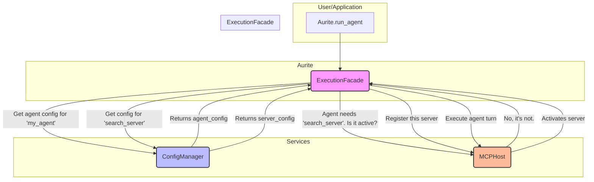

# Design Document: Aura Configuration & Lifecycle System

**Version:** 1.0
**Date:** 2025-07-02
**Author(s):** Gemini, Ryan
**Status:** Draft

## 1. Overview & Goals

This document outlines a complete architectural redesign of the Aurite framework's configuration and application lifecycle management systems. The current implementation is rigid, monolithic, and tightly coupled, hindering flexibility and efficiency.

The primary goals of this new "Aura" architecture are:

1.  **Flexibility & Extensibility:** Support for hierarchical configuration loading (e.g., global, user, project), multiple file formats (JSON, YAML), and future sources like a cloud registry.
2.  **Single Responsibility Principle (SRP):** Decompose the monolithic `Aurite` class into smaller, focused services, each with a single, clear purpose.
3.  **Efficiency & Performance:** Implement Lazy / Just-in-Time (JIT) component registration to avoid costly upfront loading and to activate components only when they are needed.

## 2. Proposed Architecture

The new architecture is composed of three distinct, loosely coupled services, orchestrated by a redesigned `ExecutionFacade`.

### 2.1. The `ConfigService`

*   **Responsibility:** To be the single source of truth for discovering, loading, parsing, and providing access to raw configuration data. It does not understand component relationships or the runtime state; it only serves validated configuration dictionaries.
*   **Key Features:**
    *   **Hierarchical Loading:** Searches for configuration files in a defined order of precedence (e.g., `~/.aurite/config` -> `PROJECT_ROOT/config`). This allows for global user defaults to be overridden by project-specific settings.
    *   **Content-Driven Discovery:** The manager scans all `.json` and `.yaml` files in the source directories. It intelligently parses them to identify all defined components (e.g., `agents`, `llms`) regardless of the file they are in, allowing for both monolithic project files and modular, single-component files.
    *   **Hybrid Caching:** To balance performance and dynamism, the manager caches parsed configurations in memory after the first read. Subsequent requests for components from the same file are served from the cache.
    *   **Dynamic Reloading:** A feature flag, `AURITE_CONFIG_FORCE_REFRESH=true` (default), can be set. When true, the configuration index is rebuilt on every `get_config` call, ensuring the latest version is always used, which is ideal for development and rapid iteration. When false, the cache is used, providing maximum performance for production environments.
*   **Proposed API:**
    *   `get_config(component_type: str, component_id: str) -> Dict[str, Any]`
    *   `list_configs(component_type: str) -> List[Dict[str, Any]]`
    *   `refresh()`

### 2.2. The `HostService` (Existing `MCPHost`)

*   **Responsibility:** To manage the lifecycle and interaction of **active** MCP servers and their runtime components (tools, prompts, resources). It is the core runtime engine.
*   **Key Features:**
    *   **Dynamic Registration:** Exposes a clear API to register and unregister clients (MCP servers) on the fly.
    *   **Decoupled from Configuration:** It will have no knowledge of configuration files, paths, or loading logic. It will only accept fully-formed `ClientConfig` objects for registration.
*   **Proposed API:**
    *   `register_client(client_config: ClientConfig)`
    *   `unregister_client(client_id: str)`
    *   `execute_tool(...)` (existing)
    *   `get_prompt(...)` (existing)
    *   `read_resource(...)` (existing)

### 2.3. The `Aurite` Class (The Lifecycle Service)

*   **Responsibility:** To be the primary, simplified, and user-facing entrypoint for the application. It initializes and holds references to the other services and delegates all complex operations. The class name `Aurite` is retained for a consistent public API for the PyPI package.
*   **Key Features:**
    *   **Service Initialization:** Its primary constructor role is to instantiate the `ConfigService`, `HostService`, and `ExecutionFacade`.
    *   **Execution Delegation:** It will expose the main user-facing methods (`run_agent`, `run_workflow`) but will immediately pass these calls to the `ExecutionFacade`.
    *   **Minimal Logic:** It will contain almost no business logic itself, acting as a clean composition root for the framework's services.
*   **Proposed API:**
    *   `run_agent(...)`
    *   `run_workflow(...)`
    *   `shutdown()`

## 3. The `ExecutionFacade`: The JIT Engine

The `ExecutionFacade` is repurposed to become the central hub for implementing Just-in-Time (JIT) registration, bridging the gap between configuration and runtime.

*   **New Responsibility:** Before executing a component (e.g., an Agent), the facade is responsible for ensuring all of that component's dependencies (e.g., its required MCP servers) are actively registered with the `HostService`.
*   **Execution Workflow:**
    1.  A call to `LifecycleService.run_agent("my_agent", ...)` is made.
    2.  The call is immediately delegated to `ExecutionFacade.run_agent("my_agent", ...)`.
    3.  The `ExecutionFacade` uses the `ConfigService` to fetch the raw configuration for the component with ID `"my_agent"`.
    4.  It inspects the agent's configuration to identify its list of required MCP servers (e.g., `["search_server", "database_server"]`).
    5.  For each required server ID, it queries the `HostService` to check if that server is already registered and active.
    6.  If a server is **not** active, the facade requests the server's configuration from the `ConfigService` and uses it to call `HostService.register_client(...)`, activating it just-in-time.
    7.  Once all dependencies are confirmed to be active in the `HostService`, the `ExecutionFacade` proceeds with the agent execution turn.

## 4. Architectural Flow Diagram

This diagram illustrates the JIT registration and execution flow for an agent run.

