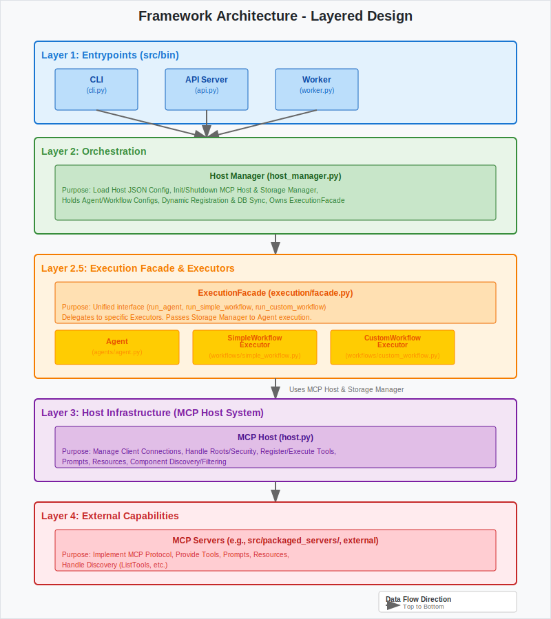

# Framework Overview

This document provides a detailed overview of the Aurite Agents framework architecture.

## Architecture

The framework follows a layered architecture:

*   **Layer 1: Entrypoints:** API (now modularized into `src/bin/api/api.py` and `src/bin/api/routes/`), CLI, and Worker interfaces interact with the `HostManager` (and through it, the `ExecutionFacade`).

*   **Layer 2: Orchestration:** The `HostManager` loads configuration, manages the `MCPHost` and optional `StorageManager` lifecycle, handles dynamic registration (syncing to DB if enabled), and owns the `ExecutionFacade`.

*   **Layer 2.5: Execution Facade & Executors:** The `ExecutionFacade` provides a unified interface for running components, delegating to specific executors (`Agent`, `SimpleWorkflowExecutor`, `CustomWorkflowExecutor`). It also passes the `StorageManager` instance (if available) to the `Agent` during execution.

*   **Layer 3: Host Infrastructure:** The `MCPHost` manages connections and low-level MCP interactions.

*   **Layer 4: External Capabilities:** MCP Servers providing tools/prompts/resources.
