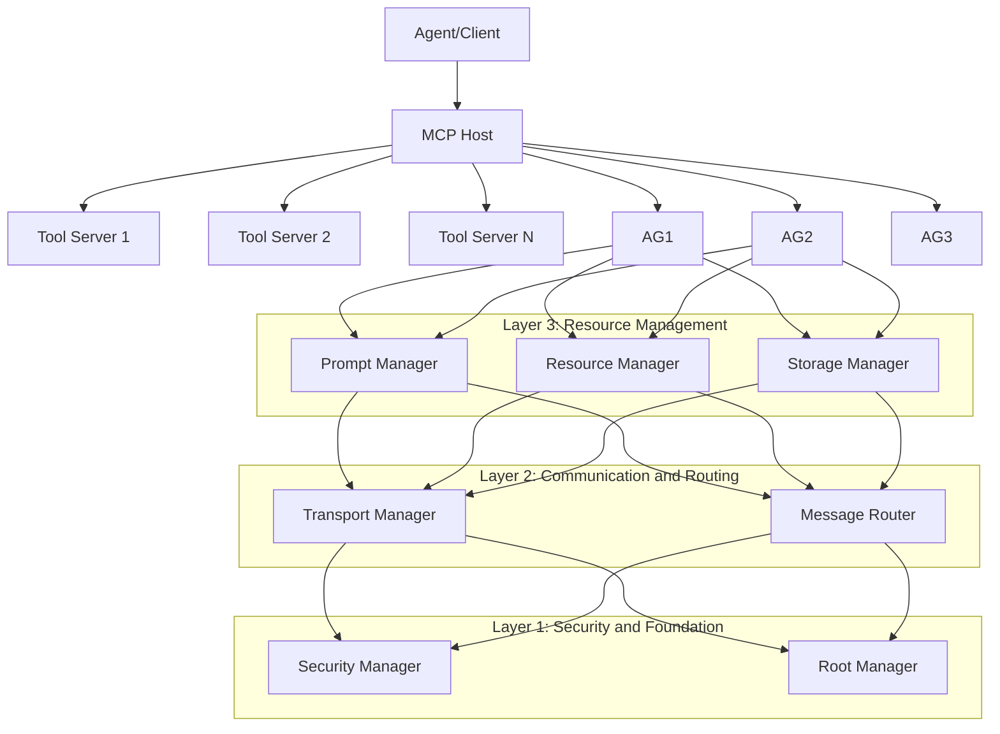
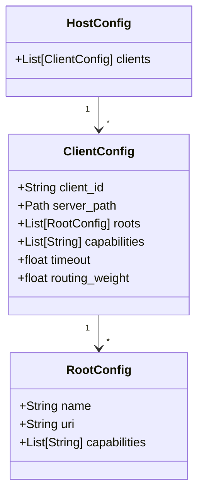

# Aurite MCP Host System Architecture

This document describes the layered architecture and implementation of the host system in the Aurite MCP framework.

## Overview

The MCP Host system serves as the orchestration layer for the Aurite agent framework, enabling communication between agents, tools, and various services. It's built around the Model Context Protocol (MCP) specification, providing a robust framework for managing AI agent interactions.

The architecture follows a layered design where each layer builds upon the capabilities of the layers below it.

## Layered Architecture

The host system is organized into four logical layers, each building on the previous:

### Layer 1: Security and Foundation

The foundation layer establishes security boundaries and access control mechanisms:

#### Security Manager (`security.py`)
- Manages encrypted credentials and sensitive information
- Implements authentication and authorization
- Protects system against unauthorized access
- Provides secure credential storage and retrieval

#### Root Manager (`roots.py`)
- Controls access to URI roots and resources
- Maintains registry of available roots
- Validates access permissions for tools and resources
- Establishes scope boundaries for tool access

### Layer 2: Communication and Routing

The communication layer handles message flow between components:

#### Transport Manager (`transport.py`)
- Creates and manages communication channels
- Supports different transport types (STDIO, SSE)
- Handles lifecycle of connections
- Ensures reliable message delivery

#### Message Router (`routing.py`)
- Directs requests to appropriate tool servers
- Routes tool calls based on capabilities and availability
- Implements weighted routing for load balancing
- Maintains mappings between tools, prompts, and servers

### Layer 3: Resource Management

The resource management layer provides access to data and services:

#### Prompt Manager (`prompts.py`)
- Manages system prompts and their execution
- Validates prompt arguments
- Ensures consistent prompt delivery
- Handles prompt versioning and selection

#### Resource Manager (`resources.py`)
- Manages access to files, data sources, and external resources
- Controls resource subscriptions and updates
- Ensures proper resource allocation and cleanup
- Provides consistent access patterns for resources

## Core Components

### MCPHost (`host.py`)

The central class that coordinates all layers and managers:
- Initializes and manages the lifecycle of all subsystems
- Processes client configurations and connections
- Provides high-level APIs for all layers
- Orchestrates inter-component communication

## Configuration and Initialization

The host is configured through a hierarchical configuration system:

Initialization follows this sequence:
1. Layer 1 managers are initialized (Security, Root)
2. Layer 2 managers are initialized (Transport, Message Router)
3. Layer 3 managers are initialized (Prompt, Resource, Storage)
4. Client configurations are processed
5. Tool servers are started and connected
6. Tools, prompts, and resources are discovered and registered