# Aurite Notion Teamspace: Architecture Guide

## 1. Introduction

This document outlines the architecture of the Aurite Notion Teamspace. Its purpose is to serve as a persistent reference for all team members, explaining the structure of the workspace, the relationships between its components, and the core principles behind its design.

## 2. Core Architecture

The Teamspace is built on a **hybrid database model**. This approach combines a single, high-level **Master Initiatives Database** for global project tracking with several detailed, **Initiative-Specific Databases** for day-to-day management. This provides both a company-wide overview and tailored, context-specific workspaces.

The core principles guiding this architecture are:
*   **Database-Centric:** Using databases over static pages to leverage sorting, filtering, and varied views.
*   **Relational:** Connecting data across the workspace (e.g., linking documents to projects).
*   **Contextual Dashboards:** Embedding live data from integrated tools (like Jira) directly into project dashboards.
*   **Single Source of Truth:** Using a master database for high-level reporting to avoid data duplication.

```mermaid
graph TD
    subgraph "High-Level Tracking (Master DB)"
        A["Master Initiatives DB <br> (Name, Type, Status, Owner)"]
    end

    subgraph "Detailed Project Management (Specific DBs)"
        B["Framework Projects DB <br> (Sprint, Epic, PRs)"]
        C["Copilot Projects DB <br> (Feature Area, Persona)"]
        D["Domain-Specific DB <br> (Client, SOW)"]
    end

    A -- "links to (1-to-1)" --> B
    A -- "links to (1-to-1)" --> C
    A -- "links to (1-to-1)" --> D

    E["📄 Document Hub"] -- "links to" --> A

    style A fill:#a8d8ff,stroke:#333,stroke-width:2px,color:#000
    style B fill:#b0eec0,stroke:#333,stroke-width:1px,color:#000
    style C fill:#b0eec0,stroke:#333,stroke-width:1px,color:#000
    style D fill:#b0eec0,stroke:#333,stroke-width:1px,color:#000
    style E fill:#e0e0e0,stroke:#333,stroke-width:1px,color:#000
```

## 3. Component Deep Dive

This section details the schema and purpose of each core component in the workspace.

### 3.1. The Home Page
The main landing page and team dashboard, providing high-level views and navigation.
*   **Key Views:**
    *   Company Announcements (from Document Hub)
    *   Active Projects (from Master Initiatives DB)

### 3.2. Core Databases

#### A. ✨ Master Initiatives Database (High-Level Tracking)
A lightweight database to provide a company-wide overview of all major initiatives.
*   **Properties (Columns):**
    *   `Name` (Title)
    *   `Type` (Select: Framework, Copilot, Domain-Specific)
    *   `Project Link` (Relation to the specific project databases)
    *   `Related Documents` (Relation to Document Hub)

#### B. 🔩 Initiative-Specific Databases (Project Portfolio)
A set of dedicated databases for managing the portfolio of high-level projects within each initiative. **This is not for granular, day-to-day tasks.**
*   **Framework Projects DB:** Tracks large projects or epics. Contains properties like `Status`, `Owner`, `Timeline`, and `Related PRs`.
*   **Copilot Projects DB:** Contains properties like `Feature Area`, `Target Persona`, `UX/UI Status`.
*   **Domain-Specific DB:** Contains properties like `Client`, `Statement of Work (SOW)`, `Billable Hours`.

#### C. 📚 Document Hub (Master Document Database)
A central repository for all standalone documents like meeting notes, proposals, and specs.
*   **Properties (Columns):**
    *   `Name` (Title)
    *   `Category` (Select: Meeting Notes, Strategy, Proposal, HR, etc.)
    *   `Created Date` (Date)
    *   `Related Initiative` (Relation to the **Master Initiatives DB**)

#### D. 👥 People Directory
A simple database to list team members, their roles, and contact information. This becomes powerful when using the `Owner` property in other databases.

## 4. Integrations

This section outlines the strategy for integrating external services into the Notion Teamspace. The approach is iterative, starting with the most critical tools.

### 4.1. Jira
*   **Objective:** Serve as the single source of truth for all granular, day-to-day tasks.
*   **Implementation:**
    *   Embed live, filtered views of the relevant Jira boards directly onto Notion project pages (e.g., the "API V2" project page in Notion will show the "API V2" epic and its tasks from Jira).
    *   Use a dedicated Notion page or database for "Copilot Feature Requests" for detailed documentation before formal Jira tickets are created.

### 4.2. GitHub
*   **Objective:** Link development work (Pull Requests) directly to project tasks.
*   **Implementation:**
    *   Add a `Related PRs` (URL) property to the `Framework Projects DB` and `Copilot Projects DB`.
    *   Use synced blocks on project pages to display the live status of related PRs.

### 4.3. Slack
*   **Objective:** Automate notifications to keep the team informed of important updates.
*   **Implementation:**
    *   Connect the `Document Hub` to a public channel (e.g., `#announcements`) to notify the team of new "Company Announcement" pages.
    *   Connect the `Master Initiatives DB` to a project channel (e.g., `#project-updates`) to announce changes in project status.

### 4.4. Google Workspace
*   **Status:** Tabled for now.
*   **Future Plan:** When needed, a "Cloud Infrastructure" page will be created to house links to the GCP console and embed relevant Google Drive documents.
