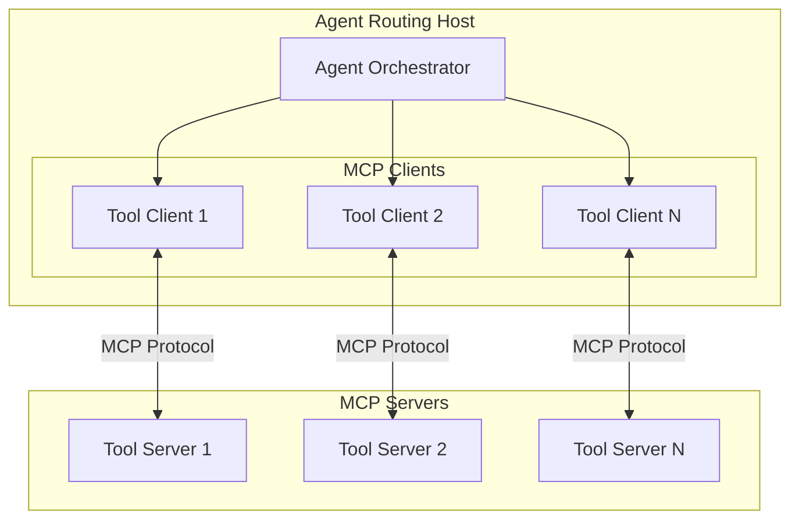
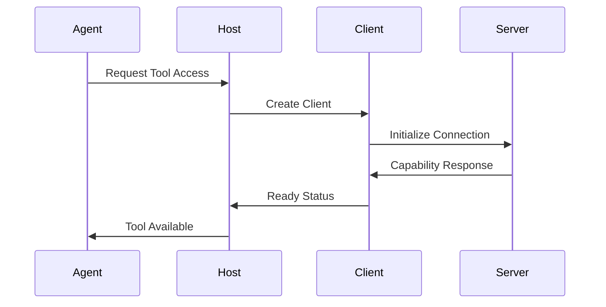
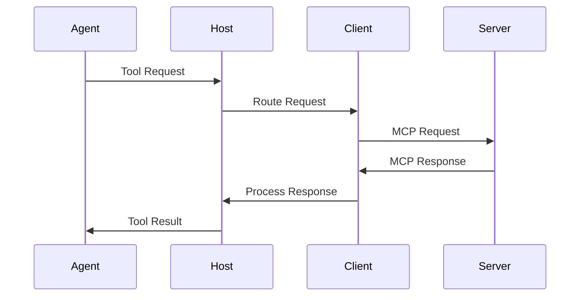

# MCP Architecture for Agent Routing

## Overview

This document outlines the architecture for implementing MCP (Model Context Protocol) in our agent routing system. The implementation will serve as a host that manages multiple MCP clients to connect our agents with various tool servers.



## Core Components

### 1. Agent Routing Host

- Acts as the primary MCP host application
- Manages the lifecycle of MCP clients
- Routes agent requests to appropriate tool servers
- Handles client-server connection management
- Implements security and access control

### 2. MCP Client Manager

- Creates and maintains MCP client instances
- Handles client initialization and connection
- Manages client state and capabilities
- Implements client-side protocol handling
- Provides client discovery and selection

### 3. Tool Server Integration

- Manages connections to MCP tool servers
- Handles server capability discovery
- Implements server health monitoring
- Provides server selection logic
- Manages server connection pools

### 4. Message Router

- Routes agent requests to appropriate clients
- Handles message transformation and validation
- Implements request/response tracking
- Manages notification routing
- Provides error handling and recovery

## Communication Flow

### 1. Initialization Flow



### 2. Request Flow



## Implementation Details

### 1. Protocol Layer

- Implements MCP message types:

  ```typescript
  interface AgentToolRequest {
    toolId: string;
    method: string;
    params: unknown;
  }

  interface ToolResponse {
    result: unknown;
    error?: {
      code: number;
      message: string;
    };
  }
  ```

### 2. Transport Layer

- Primary use of local transports for tool servers
- Support for remote transports when needed
- Transport selection based on server location

### 3. Error Handling

- Comprehensive error mapping between:
  - Agent errors
  - MCP protocol errors
  - Tool server errors
- Recovery strategies for common failures
- Graceful degradation of services

## Security Model

### 1. Access Control

- Tool server authentication
- Agent authorization for tools
- Capability-based security model

### 2. Data Protection

- Secure message handling
- Sensitive data management
- Resource access controls

### 3. Monitoring

- Connection monitoring
- Performance metrics
- Error tracking and alerting
- Resource usage monitoring

## Development Phases

### Phase 1: Core Infrastructure

- [ ] Basic host implementation
- [ ] Client management system
- [ ] Local transport support
- [ ] Basic routing logic

### Phase 2: Enhanced Features

- [ ] Advanced routing capabilities
- [ ] Remote transport support
- [ ] Error recovery systems
- [ ] Monitoring implementation

### Phase 3: Production Readiness

- [ ] Security hardening
- [ ] Performance optimization
- [ ] Comprehensive testing
- [ ] Documentation completion

## Testing Strategy

### 1. Unit Testing

- Protocol layer testing
- Client management testing
- Routing logic verification

### 2. Integration Testing

- End-to-end flow testing
- Tool server integration testing
- Error handling verification

### 3. Performance Testing

- Load testing
- Stress testing
- Resource usage profiling

## References

- [MCP Core Architecture](mcp/concepts/architecture.mdx)
- [MCP Protocol Specification](https://spec.modelcontextprotocol.io)
