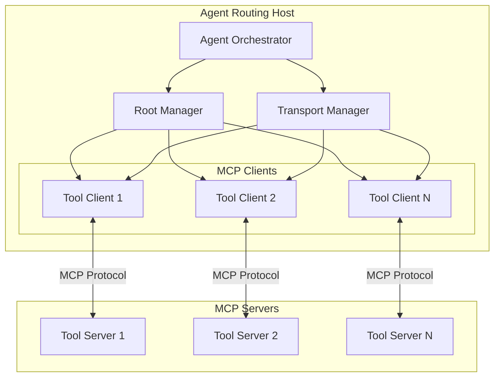
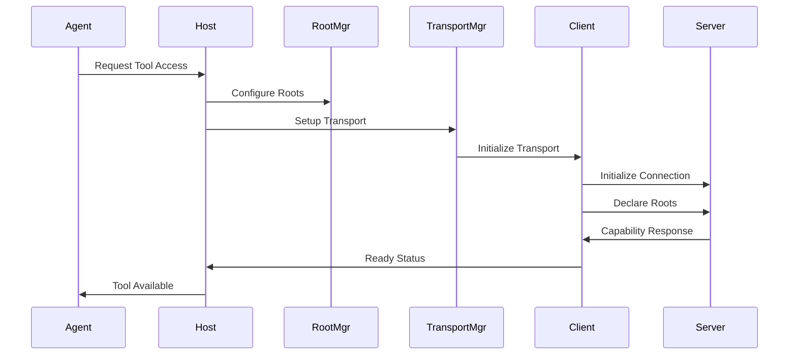
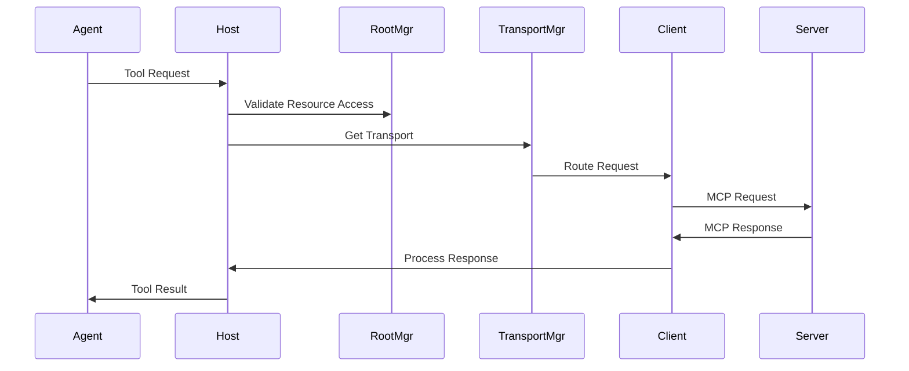

# MCP Architecture for Agent Routing

## Overview

This document outlines the architecture for implementing MCP (Model Context Protocol) in our agent routing system. The implementation will serve as a host that manages multiple MCP clients to connect our agents with various tool servers.



## Core Components

### 1. Agent Routing Host

- Acts as the primary MCP host application
- Manages the lifecycle of MCP clients
- Routes agent requests to appropriate tool servers
- Handles client-server connection management
- Implements security and access control

### 2. Transport Manager

- Manages different transport types (stdio, SSE)
- Handles transport lifecycle:

  ```python
  class TransportManager:
      # Transport pool for each client
      transports: Dict[str, Transport]

      async def create_transport(self, client_id: str, type: TransportType):
          # Initialize appropriate transport
          # Handle connection lifecycle
          # Manage error scenarios
  ```

- Responsibilities:
  - Transport selection based on server location
  - Connection management
  - Error handling and recovery
  - Message routing through appropriate transport
  - Resource cleanup

### 3. Root Manager

- Manages root URIs for each client
- Tracks operational boundaries:

  ```python
  class RootManager:
      # Root configurations for each client
      client_roots: Dict[str, List[RootConfiguration]]

      async def register_roots(self, client_id: str, roots: List[RootConfiguration]):
          # Validate and store root configurations
          # Update capability mappings
          # Notify relevant components
  ```

- Responsibilities:
  - Root declaration during client initialization
  - Root change notifications
  - Resource boundary enforcement
  - Root-based capability mapping

### 4. MCP Client Manager

- Creates and maintains MCP client instances
- Handles client initialization and connection
- Manages client state and capabilities
- Implements client-side protocol handling
- Provides client discovery and selection

### 5. Message Router

- Routes agent requests to appropriate clients
- Handles message transformation and validation
- Implements request/response tracking
- Manages notification routing
- Provides error handling and recovery

## Communication Flow

### 1. Client Initialization Flow



### 2. Request Flow



## Message Types

### 1. JSON-RPC Messages

```python
# Base message types following JSON-RPC 2.0
class Request:
    jsonrpc: str = "2.0"
    id: Union[int, str]
    method: str
    params: Optional[Dict]

class Response:
    jsonrpc: str = "2.0"
    id: Union[int, str]
    result: Optional[Dict]
    error: Optional[ErrorObject]

class Notification:
    jsonrpc: str = "2.0"
    method: str
    params: Optional[Dict]
```

### 2. Transport-Specific Messages

```python
# Transport configuration
class TransportConfig:
    type: TransportType
    options: Dict[str, Any]
    security: SecurityOptions

# Root configuration
class RootConfig:
    uri: str
    name: str
    capabilities: List[str]
```

## Security Model

### 1. Transport Security

- TLS for remote connections
- Process isolation for local transports
- Message validation and sanitization
- Size and rate limiting

### 2. Root Security

- Root access validation
- Resource boundary enforcement
- Capability-based access control
- Root change monitoring

### 3. General Security

- Authentication and authorization
- Secure message handling
- Resource access controls
- Audit logging

## Development Phases

### Phase 1: Core Infrastructure

- [ ] Transport manager implementation
- [ ] Root manager implementation
- [ ] Basic client management
- [ ] Message routing system

### Phase 2: Enhanced Features

- [ ] Advanced transport capabilities
- [ ] Dynamic root management
- [ ] Error recovery systems
- [ ] Monitoring implementation

### Phase 3: Production Readiness

- [ ] Security hardening
- [ ] Performance optimization
- [ ] Comprehensive testing
- [ ] Documentation completion

## Testing Strategy

### 1. Transport Testing

- Transport initialization
- Connection management
- Error scenarios
- Performance metrics

### 2. Root Management Testing

- Root registration
- Boundary enforcement
- Change notifications
- Access control

### 3. Integration Testing

- End-to-end flow testing
- Cross-component interaction
- Error handling verification
- Security validation

## References

- [MCP Core Architecture](mcp/concepts/architecture.mdx)
- [MCP Transports](mcp/concepts/transports.mdx)
- [MCP Roots](mcp/concepts/roots.mdx)
