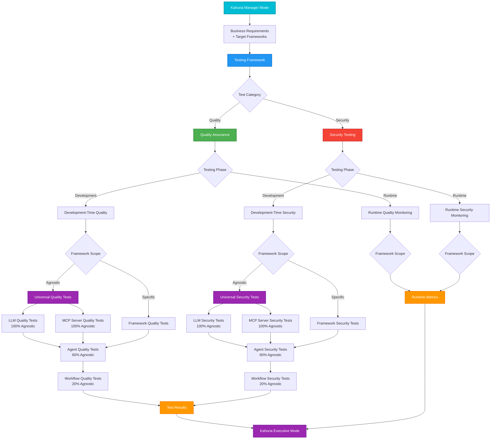
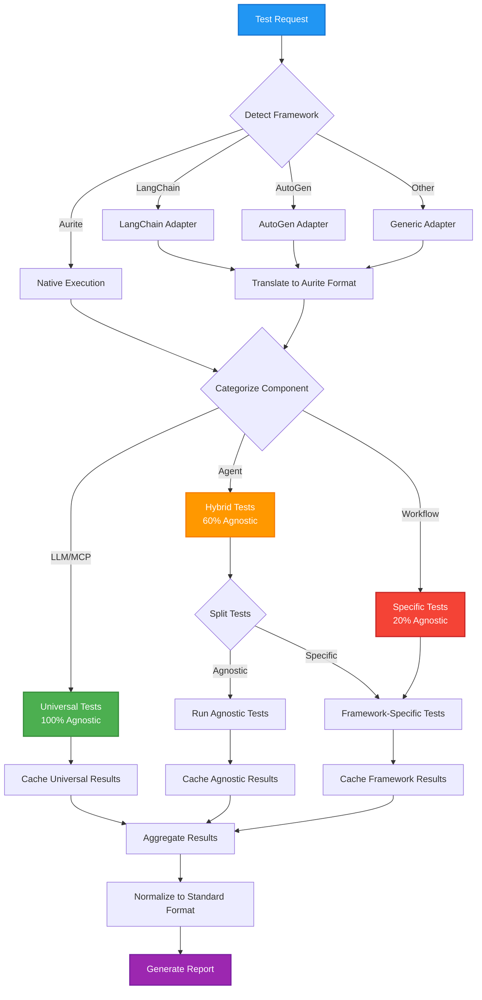
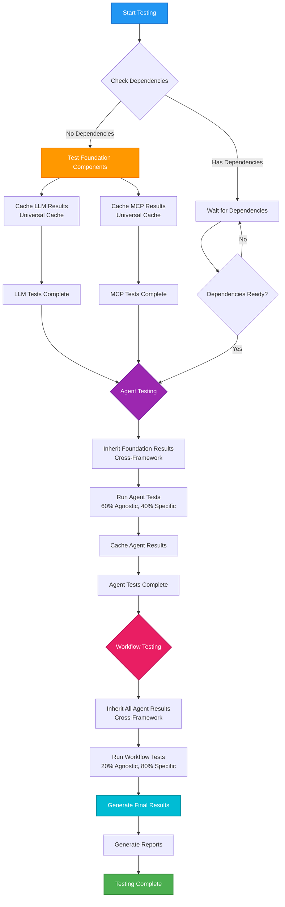
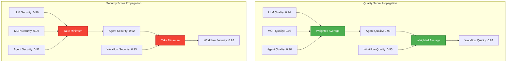
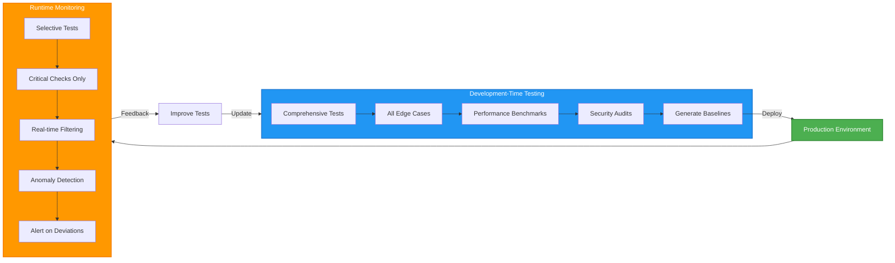
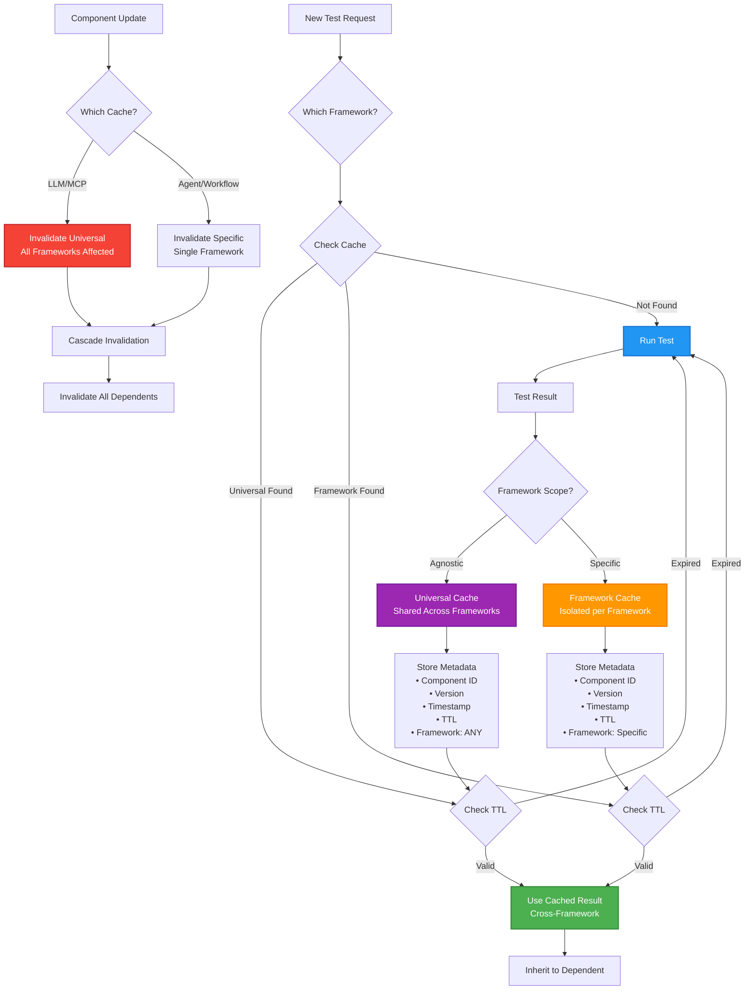
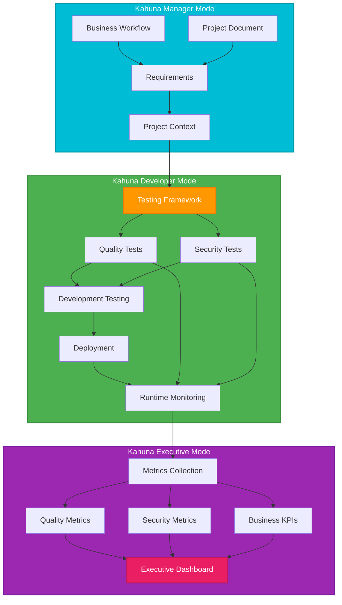

# Testing Hierarchy and Flow

## Overview

This document visualizes the complete testing hierarchy and flow for the Kahuna Testing & Security Framework, showing how components build upon each other and how test results flow through the system across multiple agent frameworks.

The testing hierarchy now operates in three dimensions:

1. **Testing Categories** (Quality vs Security)
2. **Testing Phases** (Development vs Runtime)
3. **Framework Scope** (Framework-Agnostic vs Framework-Specific)

This three-dimensional approach enables testing of AI components independent of specific agent frameworks while also supporting framework-specific validation.

## Complete Testing Hierarchy

## Framework-Agnostic Testing Flow

## Test Execution Flow

## Quality vs Security Score Propagation

## Development vs Runtime Testing Flow

## Test Result Caching Strategy

## Integration with Kahuna Ecosystem

## Tabular Representations

### Component Test Inheritance Matrix

| Component      | Framework Scope | Depends On      | Inherits From                                      | Cross-Framework Inheritance | New Tests                                                        | Inheritance Benefit       |
| -------------- | --------------- | --------------- | -------------------------------------------------- | --------------------------- | ---------------------------------------------------------------- | ------------------------- |
| **LLM**        | 100% Agnostic   | None            | None                                               | All results shared          | • Prompt injection • Content safety • Response quality     | Foundation (0% inherited) |
| **MCP Server** | 100% Agnostic   | None            | None                                               | All results shared          | • API security • Performance • Availability                | Foundation (0% inherited) |
| **Agent**      | 60% Agnostic    | LLM + MCP       | • LLM security scores • MCP performance metrics | 60% cross-framework         | • Tool selection • Goal achievement • Multi-turn coherence | ~60% inherited            |
| **Workflow**   | 20% Agnostic    | Multiple Agents | • All agent scores • All foundation scores      | 20% cross-framework         | • Business logic • End-to-end flow • Data consistency      | ~70% inherited            |

### Quality vs Security Score Calculation

| Aspect                | Quality Scoring  | Security Scoring       | Rationale                                                |
| --------------------- | ---------------- | ---------------------- | -------------------------------------------------------- |
| **Method**            | Weighted Average | Minimum (Weakest Link) | Quality can be averaged; Security fails at weakest point |
| **LLM Score**         | 0.94             | 0.96                   | Foundation scores                                        |
| **MCP Score**         | 0.96             | 0.99                   | Foundation scores                                        |
| **Agent-Specific**    | 0.90             | 0.92                   | New agent tests                                          |
| **Agent Final**       | 0.93 (weighted)  | 0.92 (minimum)         | Combined result                                          |
| **Workflow-Specific** | 0.95             | 0.95                   | New workflow tests                                       |
| **Workflow Final**    | 0.94 (weighted)  | 0.92 (minimum)         | Final scores                                             |

### Development vs Runtime Testing Comparison

| Aspect                | Development Testing                            | Runtime Testing                                                | Time Allocation                       |
| --------------------- | ---------------------------------------------- | -------------------------------------------------------------- | ------------------------------------- |
| **Coverage**          | 100% - All test cases                          | 10-20% - Critical only                                         | Dev: 100%, Runtime: Sampling          |
| **Execution Time**    | Minutes to hours                               | Milliseconds to seconds                                        | Dev: Thorough, Runtime: Fast          |
| **Test Types**        | • Edge cases • Stress tests • Benchmarks | • Security filters • Quality scoring • Anomaly detection | Dev: Comprehensive, Runtime: Targeted |
| **Frequency**         | On-Demand, Per deployment                      | Per request/response                                           | Dev: Once, Runtime: Continuous        |
| **Action on Failure** | Block deployment                               | Log, alert, or block                                           | Dev: Prevent, Runtime: Respond        |

### Test Categories by Component

| Component      | Framework Scope | Quality Tests (Agnostic)                                                           | Quality Tests (Specific)                       | Security Tests (Agnostic)                                                         | Security Tests (Specific)                           | Inherited | New | Total |
| -------------- | --------------- | ---------------------------------------------------------------------------------- | ---------------------------------------------- | --------------------------------------------------------------------------------- | --------------------------------------------------- | --------- | --- | ----- |
| **LLM**        | 100% Agnostic   | • Coherence • Instruction following • Format compliance • Quality scoring | N/A                                            | • Prompt injection • Content safety • Data leakage • Real-time filtering | N/A                                                 | 0         | 8   | 8     |
| **MCP Server** | 100% Agnostic   | • API compliance • Performance • Error handling • Availability            | N/A                                            | • Authentication • Input validation • Rate limiting • Access monitoring  | N/A                                                 | 0         | 8   | 8     |
| **Agent**      | 60% Agnostic    | • Tool selection • Goal achievement                                             | • Memory management • State handling        | • Permission boundaries • Action authorization                                 | • Framework auth • Context isolation             | 16        | 8   | 24    |
| **Workflow**   | 20% Agnostic    | • Business compliance • End-to-end success                                      | • Orchestration • Inter-agent communication | • Data isolation • Audit completeness                                          | • Framework security • State management security | 48        | 8   | 56    |

### Kahuna Integration Points

| Kahuna Mode        | Role                  | Input/Output                                                           | Testing Interaction   |
| ------------------ | --------------------- | ---------------------------------------------------------------------- | --------------------- |
| **Manager Mode**   | Requirements Provider | • Business workflows • Project documents • Quality thresholds    | Defines what to test  |
| **Developer Mode** | Testing Executor      | • Test implementation • Development testing • Runtime monitoring | Executes all testing  |
| **Executive Mode** | Metrics Consumer      | • Quality dashboards • Security reports • Business KPIs          | Receives test results |

### Alert Severity and Response Matrix (Rough Draft - still a WIP)

| Severity     | Quality Threshold | Security Threshold | Response Time | Action                      |
| ------------ | ----------------- | ------------------ | ------------- | --------------------------- |
| **Critical** | < 0.5             | Any breach         | Immediate     | Block + Alert + Investigate |
| **High**     | < 0.7             | Score < 0.8        | < 5 min       | Block + Alert team          |
| **Medium**   | < 0.85            | Score < 0.9        | < 1 hour      | Log + Monitor               |
| **Low**      | < 0.95            | Score < 0.95       | < 24 hours    | Log for analysis            |

### Cache Strategy Parameters

| Parameter                   | Value     | Purpose                        | Impact                       | Framework Scope    |
| --------------------------- | --------- | ------------------------------ | ---------------------------- | ------------------ |
| **TTL (LLM/MCP)**           | 24 hours  | Foundation rarely changes      | High reuse across frameworks | Universal cache    |
| **TTL (Agent - Agnostic)**  | 12 hours  | Core behaviors stable          | Cross-framework reuse        | Universal cache    |
| **TTL (Agent - Specific)**  | 4 hours   | Framework features change      | Framework-isolated           | Framework cache    |
| **TTL (Workflow)**          | 1 hour    | Frequent updates               | Fresh results                | Framework cache    |
| **Cross-Framework Sharing** | Enabled   | Maximize test reuse            | 40-60% reduction in testing  | LLM/MCP/Agent core |
| **Invalidation**            | On update | Maintain consistency           | Cascade to dependents        | Both cache types   |
| **Cache Hit Rate**          | ~85%      | Increased with universal cache | 85% time saved               | Overall            |

## Framework Compatibility Matrix

| Framework     | LLM Support | MCP Support | Agent Support | Workflow Support | Adapter Status | Testing Coverage |
| ------------- | ----------- | ----------- | ------------- | ---------------- | -------------- | ---------------- |
| **Aurite**    | 100%        | 100%        | 100%          | 100%             | Native         | 100%             |
| **LangChain** | 100%        | 100%        | 80%           | 70%              | Available      | 85%              |
| **AutoGen**   | 100%        | 100%        | 75%           | 65%              | Available      | 80%              |
| **CrewAI**    | 100%        | 100%        | 70%           | 60%              | In Development | 75%              |
| **Custom**    | 100%        | 100%        | Varies        | Varies           | Generic        | 60-80%           |

## Summary

This hierarchical testing structure provides:

1. **Three-Dimensional Organization**: Quality/Security × Development/Runtime × Agnostic/Specific
2. **Framework Independence**: LLM and MCP tests work across all frameworks
3. **Cross-Framework Inheritance**: Agnostic test results shared between frameworks
4. **Efficient Execution**: Through enhanced caching and result reuse
5. **Comprehensive Coverage**: All components tested at appropriate levels
6. **Business Integration**: From requirements (Manager) to metrics (Executive)
7. **Significant Time Savings**: 70-85% reduction through compositional and cross-framework approach

The framework ensures that each component is tested appropriately while maximizing test reuse across different agent frameworks through:

- **Universal caching** for framework-agnostic components
- **Intelligent inheritance** of results across framework boundaries
- **Adapter pattern** for framework translation
- **Standardized formats** for cross-framework comparison

The tables and diagrams above provide a structured view that complements the visual representations, making it easy to:

- Compare testing approaches across components and frameworks
- Understand inheritance relationships both within and across frameworks
- Calculate time savings from cross-framework test reuse
- Plan test implementation for multi-framework environments
- Set appropriate thresholds and alerts for each framework

For detailed architecture on framework-agnostic testing, see [Framework-Agnostic Testing Architecture](framework_agnostic_testing.md).
