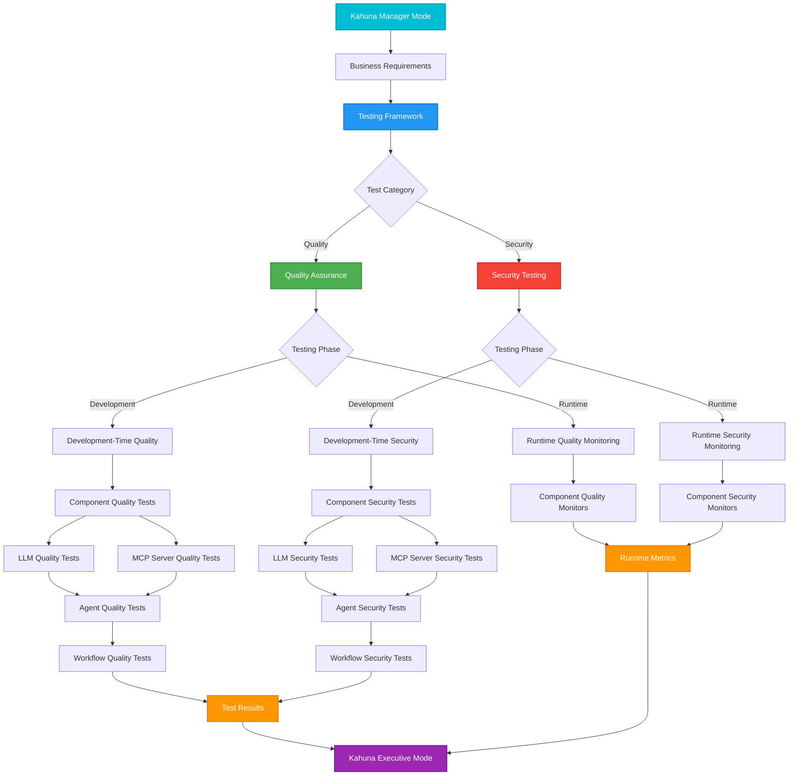
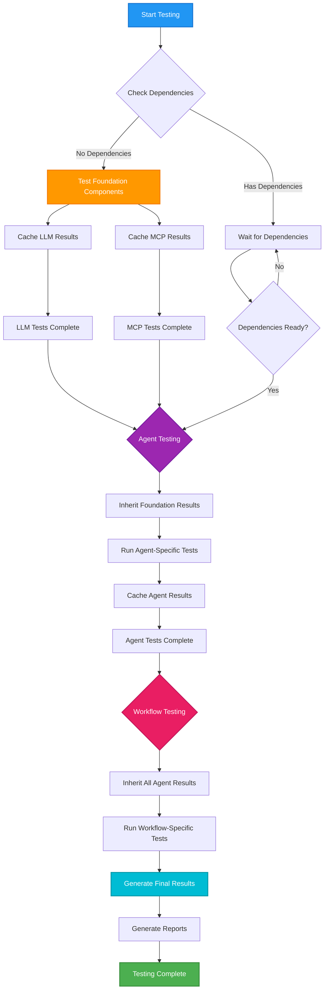
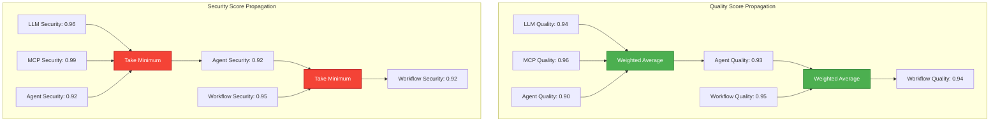
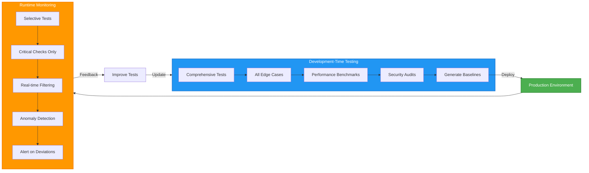
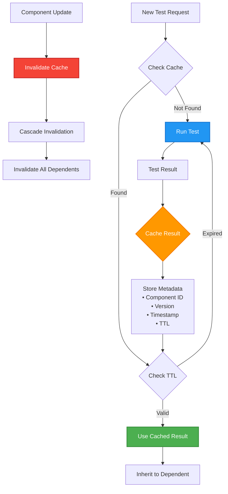
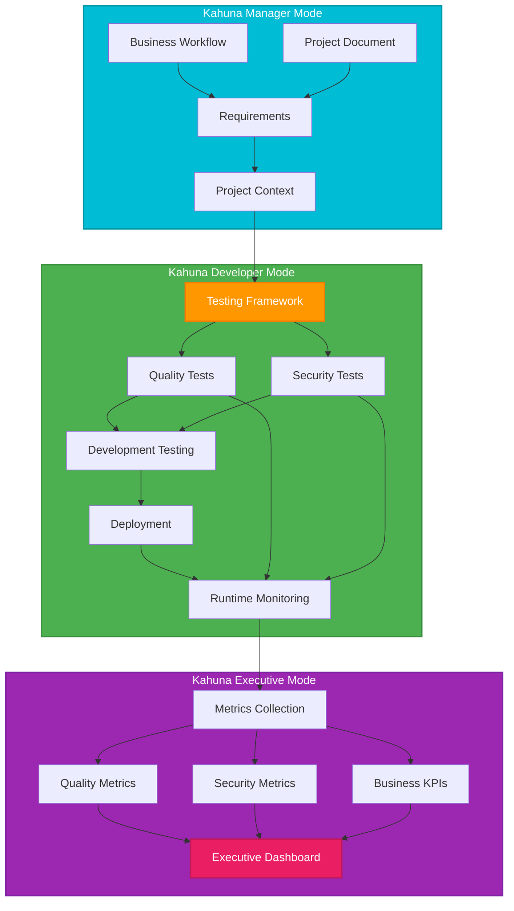

# Testing Hierarchy and Flow

## Overview

This document visualizes the complete testing hierarchy and flow for the Kahuna Testing & Security Framework, showing how components build upon each other and how test results flow through the system.

## Complete Testing Hierarchy

## Test Execution Flow

## Quality vs Security Score Propagation

## Development vs Runtime Testing Flow

## Test Result Caching Strategy

## Integration with Kahuna Ecosystem

## Tabular Representations

### Component Test Inheritance Matrix

| Component      | Depends On      | Inherits From                                      | New Tests                                                        | Inheritance Benefit       |
| -------------- | --------------- | -------------------------------------------------- | ---------------------------------------------------------------- | ------------------------- |
| **LLM**        | None            | None                                               | • Prompt injection • Content safety • Response quality     | Foundation (0% inherited) |
| **MCP Server** | None            | None                                               | • API security • Performance • Availability                | Foundation (0% inherited) |
| **Agent**      | LLM + MCP       | • LLM security scores • MCP performance metrics | • Tool selection • Goal achievement • Multi-turn coherence | ~60% inherited            |
| **Workflow**   | Multiple Agents | • All agent scores • All foundation scores      | • Business logic • End-to-end flow • Data consistency      | ~70% inherited            |

### Quality vs Security Score Calculation

| Aspect                | Quality Scoring  | Security Scoring       | Rationale                                                |
| --------------------- | ---------------- | ---------------------- | -------------------------------------------------------- |
| **Method**            | Weighted Average | Minimum (Weakest Link) | Quality can be averaged; Security fails at weakest point |
| **LLM Score**         | 0.94             | 0.96                   | Foundation scores                                        |
| **MCP Score**         | 0.96             | 0.99                   | Foundation scores                                        |
| **Agent-Specific**    | 0.90             | 0.92                   | New agent tests                                          |
| **Agent Final**       | 0.93 (weighted)  | 0.92 (minimum)         | Combined result                                          |
| **Workflow-Specific** | 0.95             | 0.95                   | New workflow tests                                       |
| **Workflow Final**    | 0.94 (weighted)  | 0.92 (minimum)         | Final scores                                             |

### Development vs Runtime Testing Comparison

| Aspect                | Development Testing                            | Runtime Testing                                                | Time Allocation                       |
| --------------------- | ---------------------------------------------- | -------------------------------------------------------------- | ------------------------------------- |
| **Coverage**          | 100% - All test cases                          | 10-20% - Critical only                                         | Dev: 100%, Runtime: Sampling          |
| **Execution Time**    | Minutes to hours                               | Milliseconds to seconds                                        | Dev: Thorough, Runtime: Fast          |
| **Test Types**        | • Edge cases • Stress tests • Benchmarks | • Security filters • Quality scoring • Anomaly detection | Dev: Comprehensive, Runtime: Targeted |
| **Frequency**         | On-Demand, Per deployment                      | Per request/response                                           | Dev: Once, Runtime: Continuous        |
| **Action on Failure** | Block deployment                               | Log, alert, or block                                           | Dev: Prevent, Runtime: Respond        |

### Test Categories by Component

| Component      | Quality Tests                                                                                                  | Security Tests                                                                                                              | Inherited | New | Total |
| -------------- | -------------------------------------------------------------------------------------------------------------- | --------------------------------------------------------------------------------------------------------------------------- | --------- | --- | ----- |
| **LLM**        | • Coherence (Dev) • Instruction following (Dev) • Format compliance (Dev) • Quality scoring (Runtime) | • Prompt injection (Dev) • Content safety (Dev) • Data leakage (Dev) • Real-time filtering (Runtime)               | 0         | 8   | 8     |
| **MCP Server** | • API compliance (Dev) • Performance (Dev) • Error handling (Dev) • Availability monitoring (Runtime) | • Authentication (Dev) • Input validation (Dev) • Rate limiting (Dev) • Access monitoring (Runtime)                | 0         | 8   | 8     |
| **Agent**      | • Tool selection (Dev) • Goal achievement (Dev) • Efficiency (Dev) • Performance tracking (Runtime)   | • Permission boundaries (Dev) • Action authorization (Dev) • Resource limits (Dev) • Behavior monitoring (Runtime) | 16        | 8   | 24    |
| **Workflow**   | • Business compliance (Dev) • End-to-end success (Dev) • Performance (Dev) • KPI tracking (Runtime)   | • Cross-agent security (Dev) • Data isolation (Dev) • Audit completeness (Dev) • Incident detection (Runtime)      | 48        | 8   | 56    |

### Kahuna Integration Points

| Kahuna Mode        | Role                  | Input/Output                                                           | Testing Interaction   |
| ------------------ | --------------------- | ---------------------------------------------------------------------- | --------------------- |
| **Manager Mode**   | Requirements Provider | • Business workflows • Project documents • Quality thresholds    | Defines what to test  |
| **Developer Mode** | Testing Executor      | • Test implementation • Development testing • Runtime monitoring | Executes all testing  |
| **Executive Mode** | Metrics Consumer      | • Quality dashboards • Security reports • Business KPIs          | Receives test results |

### Alert Severity and Response Matrix (Rough Draft - still a WIP)

| Severity     | Quality Threshold | Security Threshold | Response Time | Action                      |
| ------------ | ----------------- | ------------------ | ------------- | --------------------------- |
| **Critical** | < 0.5             | Any breach         | Immediate     | Block + Alert + Investigate |
| **High**     | < 0.7             | Score < 0.8        | < 5 min       | Block + Alert team          |
| **Medium**   | < 0.85            | Score < 0.9        | < 1 hour      | Log + Monitor               |
| **Low**      | < 0.95            | Score < 0.95       | < 24 hours    | Log for analysis            |

### Cache Strategy Parameters (Also a WIP)

| Parameter            | Value     | Purpose                   | Impact                |
| -------------------- | --------- | ------------------------- | --------------------- |
| **TTL (Foundation)** | 24 hours  | LLM/MCP rarely change     | High reuse            |
| **TTL (Agent)**      | 4 hours   | Moderate change frequency | Balanced              |
| **TTL (Workflow)**   | 1 hour    | Frequent updates          | Fresh results         |
| **Invalidation**     | On update | Maintain consistency      | Cascade to dependents |
| **Cache Hit Rate**   | ~70%      | Reduce redundant testing  | 70% time saved        |

## Summary

This hierarchical testing structure provides:

1. **Clear Organization**: Separation between Quality and Security, Development and Runtime
2. **Efficient Execution**: Through test result inheritance and caching
3. **Comprehensive Coverage**: All components tested at appropriate levels
4. **Business Integration**: From requirements (Manager) to metrics (Executive)
5. **Significant Time Savings**: 50-70% reduction through compositional approach

The framework ensures that each component is tested appropriately while avoiding redundant testing through intelligent inheritance of results from foundation components to higher-level integrations.

The tables above provide a structured view that complements the visual diagrams, making it easy to:

- Compare testing approaches across components
- Understand inheritance relationships
- Calculate time savings
- Plan test implementation
- Set appropriate thresholds and alerts
