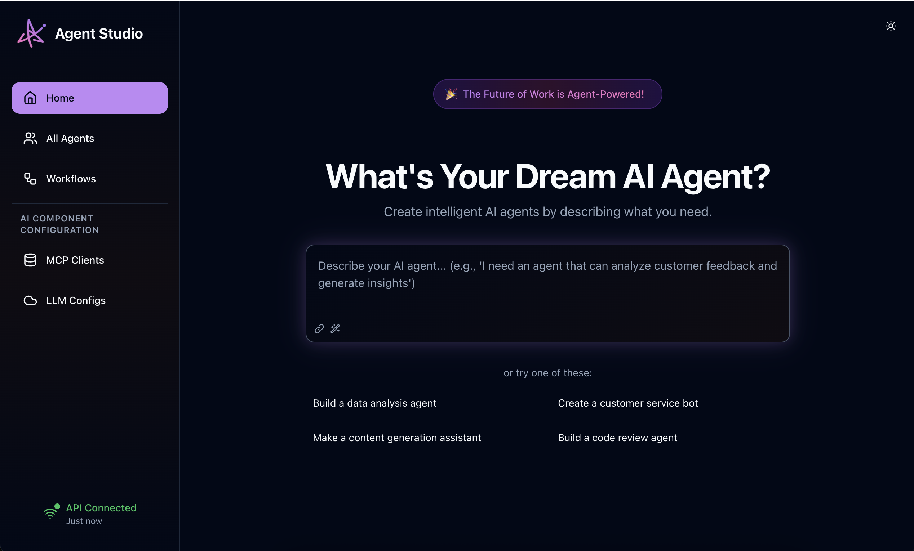

# ✨ Aurite Studio

<p align="center">
  
</p>

A modern, intuitive web interface for managing and executing AI agents, workflows, and configurations in the Aurite Framework. Aurite Studio provides a visual workspace for building, configuring, and running intelligent AI agents with real-time execution monitoring.

## Overview

Aurite Studio is a React-based web application that serves as the primary graphical interface for the Aurite Framework. It transforms complex AI agent management into an intuitive, visual experience, allowing users to create sophisticated AI workflows without deep technical knowledge.

### Key Features

🤖 **Agent Management**

- Create and configure AI agents with custom system prompts
- Manage LLM configurations and parameters
- Real-time agent execution with streaming responses
- Session-based conversation management

🔄 **Workflow Design**

- Build linear sequential workflows by chaining agents
- Create custom Python workflows for complex logic
- Visual workflow editor with drag-and-drop interface
- Execute workflows with progress tracking

🔧 **MCP Server Configuration**

- Manage Model Context Protocol (MCP) servers
- Configure tools, prompts, and resources
- Support for multiple transport types (stdio, HTTP, local)
- Real-time connection status monitoring

⚙️ **LLM Configuration**

- Configure multiple language model providers
- Manage API keys and model parameters
- Support for OpenAI, Anthropic, Google, and more
- Inline parameter overrides for specific use cases

🎨 **Modern Interface**

- Clean, responsive design with dark/light themes
- Smooth animations and transitions
- Real-time updates and streaming responses
- Mobile-friendly responsive layout

## Screenshots

### Home Dashboard

The main landing page provides quick access to create agents and shows recent activity.

### Agent Management

Comprehensive agent configuration with LLM settings, MCP server selection, and execution parameters.

### Workflow Designer

Visual workflow builder for creating complex multi-agent processes.

### Real-time Execution

Live execution monitoring with streaming responses and tool call tracking.

## Getting Started

### Prerequisites

- Node.js >= 18.0.0
- npm >= 8.0.0
- Running Aurite Framework API server

### Installation

#### Option 1: Workspace Setup (Recommended)

1. **Clone the repository**

   ```bash
   git clone https://github.com/aurite-ai/aurite-agents.git
   cd aurite-agents/frontend
   ```

2. **Install dependencies for all packages**

   ```bash
   npm install
   ```

3. **Build all packages (required before starting)**

   ```bash
   npm run build
   ```

4. **Configure environment**

   ```bash
   # Copy environment template
   cp packages/aurite-studio/.env.example packages/aurite-studio/.env

   # Edit packages/aurite-studio/.env with your API configuration
   # REACT_APP_API_BASE_URL=http://localhost:8000
   # REACT_APP_API_KEY=your_api_key_here
   ```

5. **Start Aurite Studio**

   ```bash
   # Option A: From frontend root (recommended)
   npm start

   # Option B: From package directory
   cd packages/aurite-studio
   npm start
   ```

6. **Open in browser**
   Navigate to [http://localhost:3000](http://localhost:3000)

#### Option 2: Package-Only Setup

1. **Clone and navigate to package**

   ```bash
   git clone https://github.com/aurite-ai/aurite-agents.git
   cd aurite-agents/frontend/packages/aurite-studio
   ```

2. **Install dependencies**

   ```bash
   npm install
   ```

3. **Configure environment**

   ```bash
   # Copy environment template
   cp .env.example .env

   # Edit .env with your API configuration
   ```

4. **Start the development server**

   ```bash
   npm start
   ```

5. **Open in browser**
   Navigate to [http://localhost:3000](http://localhost:3000)

### Quick Setup with Docker

```bash
# Build and run with Docker
docker build -t aurite-studio .
docker run -p 3000:3000 -e REACT_APP_API_BASE_URL=http://localhost:8000 aurite-studio
```

## Usage Guide

### Creating Your First Agent

1. **Navigate to the Home page**
2. **Describe your agent** in the main text area
3. **Configure advanced options** (optional):
   - Set a custom agent name
   - Select an LLM model configuration
   - Choose MCP servers for additional capabilities
4. **Click "Create Agent"** to save your configuration

### Managing Agents

- **View all agents**: Navigate to "All Agents" in the sidebar
- **Edit agent**: Click the "Edit" button on any agent card
- **Run agent**: Click the "Run" button to start execution
- **Delete agent**: Use the delete option in the agent edit form

### Building Workflows

#### Linear Workflows

1. Go to "Workflows" → "New Workflow"
2. Add a name and description
3. Add agents in sequence using the dropdown
4. Save and execute your workflow

#### Custom Workflows

1. Create a Python class inheriting from `BaseCustomWorkflow`
2. Configure the module path and class name in Studio
3. Execute with custom parameters

### Configuring MCP Servers

1. Navigate to "MCP Clients" in the configuration section
2. Click "New MCP Client"
3. Configure transport type:
   - **Stdio**: For Python script-based servers
   - **HTTP Stream**: For web-based endpoints
   - **Local**: For command-line executables
4. Set capabilities (tools, prompts, resources)
5. Save and register the server

### Managing LLM Configurations

1. Go to "LLM Configs" in the configuration section
2. Create new configurations with:
   - Provider (OpenAI, Anthropic, etc.)
   - Model name and parameters
   - API key environment variables
   - Default system prompts
3. Use configurations in agents or override inline

## Architecture

### Technology Stack

- **Frontend**: React 19 with TypeScript
- **Styling**: Tailwind CSS with custom design system
- **Animations**: Framer Motion for smooth transitions
- **UI Components**: Radix UI primitives
- **State Management**: TanStack Query for server state
- **API Client**: Custom `@aurite-ai/api-client` package
- **Build Tool**: Create React App with CRACO

### Project Structure

```
src/
├── components/          # Reusable UI components
│   ├── ui/             # Base UI components (buttons, inputs, etc.)
│   ├── execution/      # Agent execution interface
│   └── ...
├── hooks/              # Custom React hooks
│   ├── useAgents.ts    # Agent management hooks
│   ├── useWorkflows.ts # Workflow management hooks
│   └── ...
├── services/           # API service layers
├── types/              # TypeScript type definitions
├── contexts/           # React contexts (theme, etc.)
└── App.tsx            # Main application component
```

### API Integration

Aurite Studio communicates with the Aurite Framework API through the `@aurite/api-client` package, providing:

- **Type-safe API calls** with full TypeScript support
- **Automatic retry logic** for network failures
- **Streaming support** for real-time agent responses
- **Error handling** with user-friendly messages
- **Authentication** via API keys

## Development

### Development Setup

1. **Install dependencies**

   ```bash
   npm install
   ```

2. **Start development server**

   ```bash
   npm start
   ```

3. **Run tests**

   ```bash
   npm test
   ```

4. **Build for production**
   ```bash
   npm run build
   ```

### Available Scripts

- `npm start` - Start development server
- `npm test` - Run test suite
- `npm run build` - Build for production
- `npm run eject` - Eject from Create React App (one-way operation)

### Code Quality

The project uses:

- **ESLint** for code linting
- **Prettier** for code formatting
- **TypeScript** for type safety
- **Husky** for pre-commit hooks

## Configuration

### Environment Variables

Create a `.env` file in the project root:

```bash
# API Configuration
REACT_APP_API_BASE_URL=http://localhost:8000
REACT_APP_API_KEY=your_api_key_here

# Optional Configuration
REACT_APP_ENVIRONMENT=development
REACT_APP_DEBUG_MODE=true
```

### API Server Setup

Ensure the Aurite Framework API server is running:

```bash
# Start the API server (from repository root)
aurite api

OR

python -m aurite.bin.server --host 0.0.0.0 --port 8000
```

## Troubleshooting

### Common Issues

**Connection Refused**

- Ensure the API server is running on the correct port
- Check that `REACT_APP_API_BASE_URL` matches your server configuration
- Verify firewall settings allow connections

**Authentication Errors**

- Verify your API key is correctly set in `.env`
- Check that the API server has authentication enabled
- Ensure the API key has necessary permissions

**Build Failures**

```bash
# Clear cache and reinstall
rm -rf node_modules package-lock.json
npm install
npm run build
```

**Development Server Issues**

```bash
# Reset development environment
npm start -- --reset-cache
```

### Getting Help

- **Documentation**: Check the [Aurite Framework docs](../../docs/)
- **API Reference**: See [API documentation](../../docs/usage/api_reference.md)
- **Issues**: Report bugs on [GitHub Issues](https://github.com/Aurite-ai/aurite-agents/issues)
- **Discussions**: Join [GitHub Discussions](https://github.com/Aurite-ai/aurite-agents/discussions)

## Deployment

### Production Build

```bash
# Build optimized production bundle
npm run build

# Serve static files (example with serve)
npx serve -s build -l 3000
```

### Docker Deployment

```dockerfile
FROM node:18-alpine as build
WORKDIR /app
COPY package*.json ./
RUN npm ci --only=production
COPY . .
RUN npm run build

FROM nginx:alpine
COPY --from=build /app/build /usr/share/nginx/html
EXPOSE 80
CMD ["nginx", "-g", "daemon off;"]
```

### Environment-Specific Configuration

For different environments, create environment-specific `.env` files:

- `.env.development` - Development settings
- `.env.staging` - Staging environment
- `.env.production` - Production configuration

### Contributing

1. Fork the repository
2. Create a feature branch: `git checkout -b feature/amazing-feature`
3. Make your changes with appropriate tests
4. Commit your changes: `git commit -m 'Add amazing feature'`
5. Push to the branch: `git push origin feature/amazing-feature`
6. Open a Pull Request

## 📄 Citation

If you use Aurite Studio in your research or projects, please cite:

```bibtex
@software{aurite_studio_2025,
  title={Aurite Studio: Web Interface for AI Agent Management and Workflow Design},
  author={Jiten Oswal and Ryan W and Blake R},
  year={2025},
  url={https://github.com/Aurite-ai/aurite-agents/tree/main/frontend/packages/aurite-studio},
  note={React-based web application for visual AI agent management and real-time execution monitoring}
}
```

**Dependencies:** This application is built on the Aurite API Client and Core Framework. Please also cite:

**API Client:**

```bibtex
@software{aurite_api_client_2025,
  title={Aurite API Client: Production TypeScript Client for AI Agent Framework},
  author={Jiten Oswal and Ryan W and Blake R},
  year={2025},
  url={https://github.com/Aurite-ai/aurite-agents/tree/main/frontend/packages/api-client},
  note={TypeScript client library with streaming support and comprehensive error handling}
}
```

**Core Framework:**

```bibtex
@software{aurite_agents_2025,
  title={Aurite Agents Framework: A Python Framework for Building and Orchestrating AI Agents},
  author={Ryan W and Blake R and Jiten Oswal},
  year={2025},
  version={0.3.26},
  url={https://github.com/Aurite-ai/aurite-agents},
  note={Configuration-driven AI agent framework with MCP integration and multi-LLM support}
}
```

## License

This project is licensed under the MIT License - see the [LICENSE](../../../LICENSE) file for details.

## Links

- **Repository**: [https://github.com/Aurite-ai/aurite-agents](https://github.com/Aurite-ai/aurite-agents)
- **Documentation**: [Framework Documentation](../../docs/)
- **API Client**: [API Client Package](../api-client/)
- **Issues**: [GitHub Issues](https://github.com/Aurite-ai/aurite-agents/issues)
- **Discussions**: [GitHub Discussions](https://github.com/Aurite-ai/aurite-agents/discussions)
